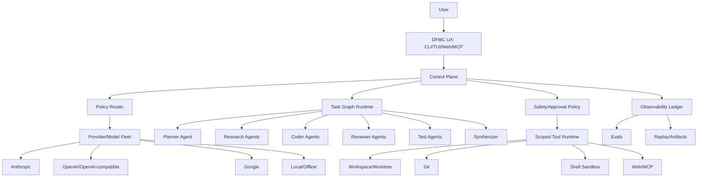

# DFMC Agentic Code Assistant Report

Updated: 2026-05-05

Goal: make DFMC a world-class, multi-provider, multi-model, task/TODO/sub-agent/Drive-based coding agent that can plan, execute, verify, resume, and explain complex engineering work better than ordinary chat-based coding tools.

## Executive Summary

DFMC already has the hard foundations:

- one central engine shared by CLI, TUI, Web, Remote, and MCP
- provider router with fallback, model chains, throttling, circuits, raced completion, and offline mode
- native tool-calling loop with meta tools
- persistent Drive runs with TODO DAGs and sub-agent execution
- task store and supervisor task shapes
- approvals, hooks, mutation guards, path locks, web hardening
- AST, CodeMap, context retrieval, MagicDoc, prompt library, security scans

The next leap is to turn these pieces into a single orchestration brain:

1. a policy router that selects provider/model/tool mode per task
2. a unified task graph runtime owned by Supervisor
3. strict scoped execution for agents and sub-agents
4. verification as a mandatory first-class phase
5. quality/cost/latency observability and evals
6. resilient long-running operation with replay, checkpoints, worktrees, and rollback

## Product North Star

DFMC should feel like a senior engineering team in one binary:

- Planner understands the repo and creates an execution DAG.
- Researcher maps unfamiliar systems cheaply.
- Coder makes focused edits.
- Reviewer finds regressions and security risks.
- Tester runs the right verification.
- Synthesizer writes a final human-grade report.
- Supervisor watches budget, quality gates, dependencies, conflicts, and provider failures.
- User stays in control through approvals, run cockpit, stop/resume, diffs, and transparent logs.

## What Already Exists

### Strong Foundation

- Multi-surface UX: CLI, TUI, Web, Remote, MCP.
- Multi-provider routing: Anthropic, OpenAI-compatible, Google, offline, placeholders.
- Tool calling: provider-native loop with four meta tools.
- Local tool registry: file, search, git, shell, web, planning, task, semantic, refactor, validation.
- Autonomous Drive: planner -> TODO DAG -> scheduler -> sub-agent workers -> persistence.
- Sub-agents: bounded loop, role prompts, provider candidate fallback, concurrency cap.
- Task store: independent task CRUD and optimistic concurrency.
- Supervisor: task shape, execution plan, auto survey/verify, budget pool, worker callback.
- Context stack: AST, CodeMap, symbol-aware retrieval, MagicDoc, prompt blocks.
- Safety: approval gates, web auth hardening, read-before-mutate, per-path locks, hooks, redaction.

### Strategic Advantage

DFMC is not just an LLM wrapper. It already owns the loop, the tools, the state, the task graph, and the UI. That means it can become an autonomous engineering runtime, not merely a chat client.

## Target Architecture

## Core Workstreams

### 1. Unified Policy Router

Problem: provider config, fallback, Drive routing, route rules, profile tags, and sub-agent candidate selection are spread across several layers.

Build:

- `internal/policy` package.
- One decision API:
  - input: task type, worker class, provider tag, verification level, confidence, file scope, risk level, context need, tool need, latency target, cost ceiling
  - output: ordered provider/model candidates, max tokens, tool mode, approval policy, sandbox profile
- Profile capabilities:
  - tool support
  - max context
  - max output
  - latency class
  - cost
  - quality tags: code, review, test, security, planning, reasoning, fast, cheap, local
- Integrate existing `routing.rules`.
- Use provider health/circuit state in policy.
- Add cost-aware and latency-aware modes:
  - `fast`
  - `cheap`
  - `balanced`
  - `best`
  - `offline-first`
  - `private/local`

Deliverables:

- `policy.Decide(req) Decision`
- CLI/TUI/Web route editor writes policy rules, not ad hoc maps.
- Drive and sub-agents call policy instead of bespoke selection.
- Status shows "why this model was chosen".

### 2. Supervisor As The Runtime Kernel

Problem: Drive has the hot loop, Supervisor has richer plan/task semantics. Merge the mental model.

Build:

- Make `internal/supervisor` own execution of task DAGs.
- Drive becomes a user-facing runner over Supervisor.
- Move scheduling, lane caps, budget pool, retries, dependency blocking, and summaries into Supervisor.
- Persist Supervisor run state as canonical state.
- Use `taskstore` as the shared task graph backend.
- Support task expansion from worker output.
- Support pause/resume at task and run level.
- Add run modes:
  - sequential
  - parallel
  - review-only
  - dry-run
  - patch-only
  - auto-verify

Deliverables:

- `supervisor.Runner` production path used by Drive.
- Migration bridge for existing `drive.Run` records.
- TUI/Web task graph views backed by one state model.

### 3. Strict Scoped Agents

Problem: `AllowedTools` is currently guidance in prompts. High-autonomy runs need enforceable boundaries.

Build:

- Tool policy layer:
  - allowed tools
  - denied tools
  - path allowlist
  - path denylist
  - network allowlist
  - shell command allowlist
  - max output size
  - max wall time
  - mutation mode: none, patch-only, edit, full
- Every sub-agent receives a scoped execution token.
- `executeToolWithLifecycle` checks scope before approval.
- Scope violations become tool errors and EventBus events.
- Drive planner emits desired scopes, Supervisor validates/clamps them.

Deliverables:

- `ToolScope` model.
- Enforced scopes in tool execution.
- TUI/Web display per-agent scope.
- Tests for bypass attempts through meta tools and batch calls.

### 4. Worktree-Based Parallelism

Problem: file-scope conflict checks are good, but many large tasks need isolated branches.

Build:

- Worktree manager:
  - allocate temp git worktree per worker or per lane
  - run edits/tests in isolation
  - collect patch
  - merge or reject patch
- Conflict resolver:
  - three-way merge
  - ask reviewer agent to resolve
  - fallback to human approval
- Policy decides when to use shared workspace vs worktree isolation.

Deliverables:

- `internal/workspace` or extend tool git worktree layer.
- Drive option: `--isolate worktree`.
- Web/TUI patch merge cockpit.

### 5. Verification-First Autonomy

Problem: autonomous coding without verification is theater.

Build:

- Mandatory verification strategy per task:
  - no-op for read-only
  - static check for docs/config
  - unit test for code changes
  - package test for shared modules
  - full test/build for high-risk runs
  - security scan for auth/network/deserialization/crypto/files
- Verification planner chooses commands from project signals.
- Test discovery tool should feed verification planner.
- Reviewer agent checks:
  - diffs
  - tests
  - security impact
  - architecture impact
  - user request satisfaction
- Final synthesizer refuses "done" if verification did not run or failed.

Deliverables:

- `VerificationPlan` and `VerificationResult`.
- Auto-verify default on for Drive.
- Final report always includes verification evidence.

### 6. Evals And Quality Gates

Problem: agent quality cannot be improved safely without replayable evals.

Build:

- Eval corpus:
  - bug fix tasks
  - refactors
  - docs updates
  - security findings
  - multi-file feature tasks
  - adversarial tool-use tasks
- Replay harness:
  - scripted providers
  - deterministic tool outputs
  - golden task graph
  - expected patch or invariant checks
- Metrics:
  - success rate
  - tool rounds
  - tokens
  - wall time
  - verification pass rate
  - human approval count
  - rollback count
  - provider fallback count
- CI gate for regressions in prompt/tool behavior.

Deliverables:

- `dfmc eval run`
- `internal/evals`
- benchmark dashboard in Web/TUI.

### 7. Observability, Cost, And Replay

Problem: long agent runs need audit trails.

Build:

- Structured run ledger:
  - every provider request metadata
  - model/provider chosen and why
  - tool call params preview
  - tool result hash/excerpt
  - patches
  - test outputs
  - approvals/denials
  - cost estimate
  - latency
- Replay:
  - reconstruct a run timeline
  - export JSON bundle
  - redact secrets
  - compare runs
- Cost controls:
  - per-run budget
  - per-provider budget
  - ask-before-expensive-model
  - automatic downgrade for low-risk tasks

Deliverables:

- `internal/ledger`
- `dfmc runs show/export/replay`
- TUI/Web run timeline.

### 8. Provider/Model Fleet Management

Problem: model quality changes constantly. Static config is not enough.

Build:

- Provider catalog:
  - models.dev sync
  - user overrides
  - measured latency
  - measured tool reliability
  - context/output caps
  - pricing
  - capabilities
- Continuous calibration:
  - tiny probes
  - tool-call conformance tests
  - JSON reliability tests
  - code review evals
- Profile recommendations:
  - best planner
  - best coder
  - best reviewer
  - best cheap model
  - best local/private model

Deliverables:

- `dfmc provider benchmark`
- `dfmc provider recommend`
- provider panel shows live health and measured quality.

### 9. Memory And Knowledge Layer

Problem: memory exists, but it should become project intelligence.

Build:

- Separate memory types:
  - user preference
  - project convention
  - architecture fact
  - recurring failure
  - verified decision
  - rejected approach
- Memory write policy:
  - only persist high-confidence facts
  - cite source file/run
  - expire stale facts
  - human-editable memory
- MagicDoc auto-refresh:
  - after major Drive run
  - after architecture changes
  - after convention discovery

Deliverables:

- memory inspector/editor.
- source-linked memory entries.
- stale fact detector.

### 10. Extension And Marketplace Layer

Problem: skills/plugins exist but need production boundaries.

Build:

- Plugin permission manifest.
- Tool registration API.
- Skill pack format.
- Signed plugin packages.
- Sandboxed plugin execution.
- Marketplace index.
- Compatibility tests.

Deliverables:

- `dfmc plugin dev`
- plugin capability review.
- versioned marketplace metadata.

## Roadmap

### Phase 0: Stabilize The Current Kernel

Timebox: 1-2 weeks

- Update docs and diagrams.
- Add architecture smoke tests around critical invariants.
- Run full test suite and fix flaky tests.
- Add status report for current provider/tool/Drive health.
- Ensure `ARCHITECTURE.md`, `CLAUDE.md`, README, and MagicDoc tell the same story.

### Phase 1: Policy Router

Timebox: 2-4 weeks

- Create `internal/policy`.
- Normalize provider/model capability metadata.
- Use policy in Drive and sub-agent selection.
- Wire TUI/Web policy explanation.
- Add tests for tag, worker, verification, cost, health, and tool support routing.

### Phase 2: Enforced Tool Scopes

Timebox: 2-3 weeks

- Add scoped execution model.
- Enforce scope in `executeToolWithLifecycle`.
- Pass scopes through sub-agent and Drive paths.
- Make meta tools respect scopes.
- Add bypass tests.

### Phase 3: Supervisor Runtime Unification

Timebox: 4-6 weeks

- Move Drive scheduling to Supervisor.
- Persist canonical task graph.
- Support task expansion, pause, resume, retry, lane caps, budgets.
- Migrate Web/TUI Drive panels to graph model.
- Keep legacy run loading compatible.

### Phase 4: Verification Engine

Timebox: 3-5 weeks

- Build verification plan model.
- Integrate test discovery, package/build detection, security scans.
- Require verification evidence in final Drive reports.
- Add verifier/reviewer worker classes as default.

### Phase 5: Worktree Isolation

Timebox: 3-6 weeks

- Allocate worktrees per worker/lane.
- Merge patches through review and approval.
- Add conflict UI.
- Add rollback and run artifact bundle.

### Phase 6: Evals, Replay, Cost Ledger

Timebox: ongoing, first useful version in 3-4 weeks

- Create eval harness.
- Add run ledger.
- Export/replay traces.
- Add provider benchmark and quality dashboards.
- Gate prompt/tool changes on evals.

### Phase 7: Extension Platform

Timebox: 4-8 weeks

- Harden plugin permissions.
- Build plugin dev workflow.
- Add signed marketplace format.
- Add compatibility checks and example plugins.

## Priority Backlog

P0:

- Policy router package and integration.
- Enforced tool scopes.
- Verification result model.
- Run ledger skeleton.
- Drive/Supervisor state unification design doc.

P1:

- Worktree isolation mode.
- Provider benchmark command.
- Eval harness.
- Cost budgets.
- Memory source citations.
- Web/TUI graph cockpit improvements.

P2:

- Plugin marketplace.
- Advanced patch merge assistant.
- Team collaboration server mode.
- Remote run sharing.
- Local embedding/search for semantic memory.

## Opinionated Defaults For "Best In World" Mode

- Planner: strongest reasoning model available.
- Research: cheap/fast tool-capable model.
- Coder: best code model with strong tool calling.
- Reviewer: independent provider from coder when possible.
- Security: security-tagged model plus local scanners.
- Verifier: deterministic local commands first, LLM second.
- Synthesizer: concise strong model.
- Auto-verify: on.
- Worktree isolation: on for multi-file or parallel mutation.
- Human approval: required for shell, network, git commit, destructive writes, dependency installs, and broad patches.
- Offline/private mode: always available and explicit.

## Risks

- Autonomy without hard scopes can mutate too broadly.
- Provider quality changes can silently degrade behavior.
- Parallelism without worktree isolation can create subtle conflicts.
- Cost can explode without budget ledger and policy routing.
- Evals are necessary before aggressive prompt/tool changes.
- Web/remote surfaces must stay hardened because this agent can mutate code and run commands.

## Definition Of Done

DFMC becomes world-class when it can:

- take a vague engineering task and produce a correct DAG
- choose the right model for every worker
- execute parallel work safely
- verify changes with real commands
- explain exactly what happened and why
- resume after interruption
- stay inside budget and permissions
- recover from provider failures
- show every action in a readable cockpit
- improve through replayable evals
