# DFMC Architecture

**Generated from code inspection:** 2026-05-16  
**Module:** `github.com/dontfuckmycode/dfmc`  
**Primary language:** Go 1.25+ (`go.mod` declares `go 1.25.0`, toolchain `go1.26.2`)  
**Binary entry point:** `cmd/dfmc/main.go`  
**Scope:** This document covers the CLI, TUI, HTTP/Web, remote, MCP, engine, providers, tools, context, memory, conversation, Drive, analysis, hooks, plugins, local state, CI, and release/build surfaces present in the repository.

This file is intentionally grounded in the current source tree. It does not describe planned behavior unless the code itself has a concrete implementation surface for it.

## Source Inventory

The current workspace contains a Go application with generated/local runtime artifacts. Source-oriented counts below exclude `ui/web/**/node_modules/**` and `dfmc.exe`; local ignored state such as `.dfmc/` and `.dfmt/` is described separately.

| Area | Role | Files | Go files | Go tests |
|---|---:|---:|---:|---:|
| `cmd` | Binary entry point and main tests | 3 | 3 | 2 |
| `internal` | Core application packages | 639 | 638 | 237 |
| `pkg` | Shared exported types/utilities | 4 | 4 | 1 |
| `ui` | CLI, Bubble Tea TUI, HTTP/Web surfaces | 511 | 509 | 140 |
| `shell` | Shell completion scripts | 4 | 0 | 0 |
| `docs` | Project design/review notes | 21 | 0 | 0 |
| `assets` | Static project image asset | 1 | 0 | 0 |

Go package count from `go list ./...` includes normal project packages plus local ignored `node_modules` Go examples if those directories are present on disk. The checked build scripts avoid this in the Makefile by filtering `%/node_modules/%`; the CI workflow uses `go test ./...` in a clean checkout, where ignored `node_modules` should not exist.

## Top-Level System

DFMC is a single-binary code intelligence assistant. The binary starts by loading config, optionally starting a Telegram bridge, opening persistent storage, constructing the engine, initializing subsystems, and dispatching into a UI/API surface.

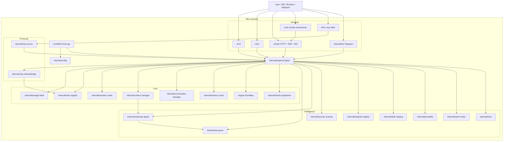

## Runtime Startup

`cmd/dfmc/main.go` owns process startup:

1. `main()` delegates to `run()` and uses a single top-level `os.Exit(run())`, so defers in `run()` can execute.
2. `run()` creates a signal-aware context for `SIGINT` and `SIGTERM`.
3. It pre-scans raw CLI args for `--data-dir`, `--telegram-token`, and `--session-name` before normal flag parsing. This is necessary because config loading needs the data directory before `ui/cli` parses command flags.
4. `config.LoadWithOptions` builds config from defaults, global config, project config, `.env`, encrypted provider keys, environment variables, and models.dev metadata.
5. If Telegram is enabled and has a token, `internal/bot.New` creates a Telegram bot.
6. Hook config file permissions are checked before hooks can run. On insecure config permissions, startup refuses unless `DFMC_UNSAFE_HOOKS=1`.
7. If the data directory has no `dfmc.db`, startup auto-creates `.dfmc/config.yaml`, `.dfmc/knowledge.json`, and `.dfmc/conventions.json` under the project root.
8. `engine.NewWithVersion` allocates the engine skeleton.
9. `eng.Init(ctx)` wires storage, parser, codemap, tools, memory, conversations, providers, intent, hooks, and background indexing.
10. `ui/cli.Run` dispatches to a command or treats unknown non-typo input as an `ask` prompt.
11. Shutdown is deliberately idempotent; `main.go` registers cleanup defers that call `eng.Shutdown()`, cancel context, and stop Telegram.

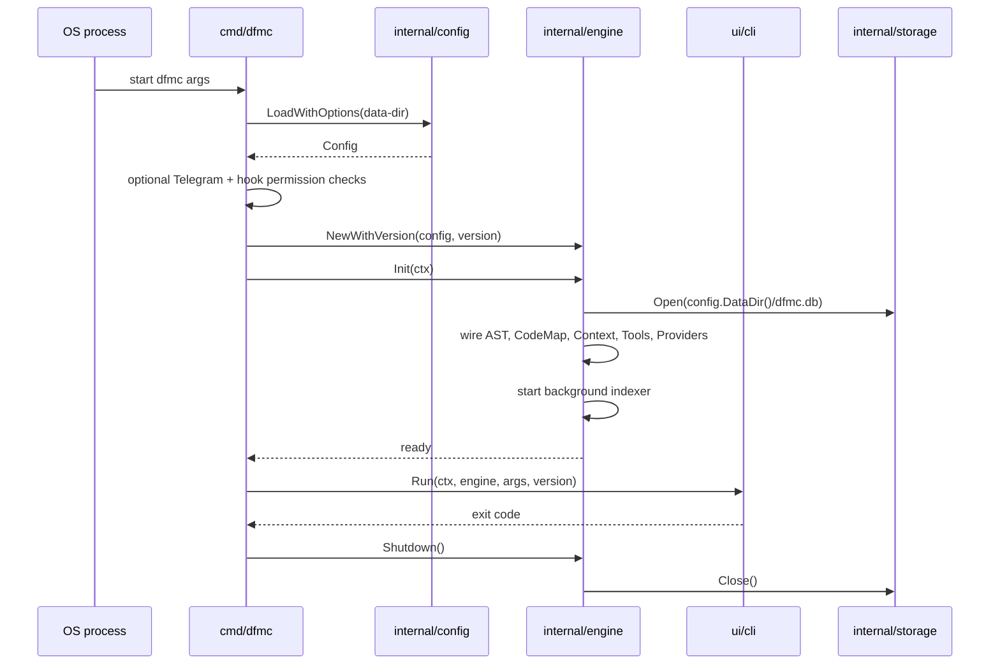

## Configuration Architecture

`internal/config` is the configuration root.

Load order in code:

1. `DefaultConfig()`
2. Global YAML: `~/.dfmc/config.yaml` unless overridden
3. Project YAML: `<project>/.dfmc/config.yaml` if a project root is found
4. Project `.env`, used only as a source for missing process env values
5. Encrypted provider keys
6. Process environment aliases and Telegram env
7. models.dev catalog/cache merge
8. `Validate()`

Important implementation details:

| Concern | Implementation |
|---|---|
| Config format | YAML via `gopkg.in/yaml.v3` |
| Config size cap | `loadYAML` refuses files larger than 1 MiB |
| Project root detection | `.dfmc`, `.git`, `go.mod`, `package.json`, `Cargo.toml`, `pyproject.toml` markers |
| Data directory | explicit `Config.DataDirPath`, otherwise `~/.dfmc/data` |
| Config writes | `Config.Save` writes `0600` after creating parent dirs |
| Project hooks safety | Project hooks are discarded unless global `hooks.allow_project` is true and project config permissions are secure |
| Windows hook safety | Windows ACL logic is split into build-tagged config files |

Default runtime behavior comes from `internal/config/defaults.go`: primary provider defaults to `minimax`; fallbacks default to `openai` and `deepseek`; context defaults are 20 files, 12,000 total context tokens, 2,000 tokens per file, 24,000 history tokens, and 120 history messages. Agent defaults allow 60 tool steps, 250,000 tool tokens, parallel batch size 4, automatic resume, automatic planning, and chat auto-decomposition.

## Engine Core

`internal/engine.Engine` is the central coordinator. `engine.go` contains the struct and state helpers; domain behavior is split into sibling files.

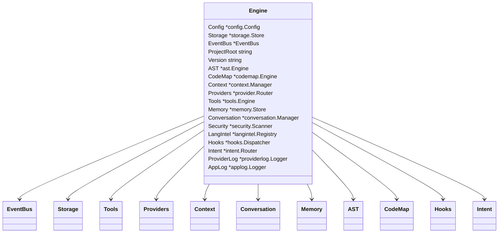

Engine states are `Created`, `Initializing`, `Ready`, `Serving`, `ShuttingDown`, and `Stopped`. `requireReady` permits operations in `Ready`, `Serving`, and `ShuttingDown`; other states return `ErrEngineNotInitialized`.

The engine explicitly documents lock order:

1. `agentMu` for agent lifecycle and parked state
2. `mu` for general state

Approval state has its own `approvalMu`, and tool sequence numbers use an atomic counter to allow event dedupe.

### Engine Initialization

`engine_init.go` is the funnel for initialization:

1. Set state to initializing
2. Initialize app logging and panic observation
3. Publish `engine:initializing`
4. Initialize storage-backed services
5. Initialize tooling stack
6. Initialize memory, conversation, and domain services
7. Initialize provider router
8. Create background context
9. Initialize intent router and hooks
10. Resolve project runtime and start codebase indexing
11. Log completion, set state ready, publish `engine:ready`

### Engine Shutdown

`engine_lifecycle.go` shutdown order is:

1. Ignore repeated shutdown calls if already shutting down/stopped
2. Publish `engine:shutdown`
3. Cancel background context and indexer context
4. Wait for background work through `indexWG`
5. Fire `session_end` hook with a 5 second timeout
6. Close conversation async saves, then `SaveActive`
7. Persist memory
8. Close tools
9. Close storage
10. Publish `engine:stopped`

Errors from shutdown stages are collected with `errors.Join`, published as `engine:shutdown_error`, and printed to stderr.

## User Request Execution

`internal/engine/engine_ask.go` exposes `Ask`, `AskWithMetadata`, `AskRaced`, and `StreamAsk` (streaming lives in a sibling file).

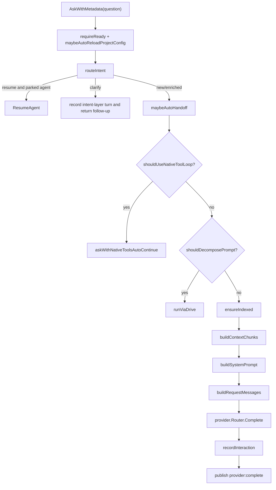

Race mode intentionally avoids the provider-native tool loop. The code comments state the reason: racing multiple tool loops could make concurrent file edits with no coordination. Race mode is for single-shot Q&A latency/reliability.

Chat auto-decomposition is heuristic and config-gated by `Agent.ChatAutoDecompose`. It scores sequential, bulk, complex, and Q&A signals. Scores >= 4 route the request into Drive; lower scores use normal Ask flow.

## Provider System

`internal/provider` defines a single `Provider` interface with completion, streaming, token counting, max context, model list, and capability hints. The interface is intentionally broad because all concrete providers satisfy the full contract.

Provider request model:

| Type | Purpose |
|---|---|
| `CompletionRequest` | Provider/model/system/messages/context/tools/tool choice |
| `CompletionResponse` | Text/model/usage/tool calls/stop reason |
| `StreamEvent` | Start/delta/done/error stream events with optional usage/tool calls |
| `ToolDescriptor` | Provider-agnostic tool schema |
| `ToolCall` | Provider-native tool invocation request |
| `ProviderHints` | Tool style, prompt cache support, latency, best-for tags, max context |

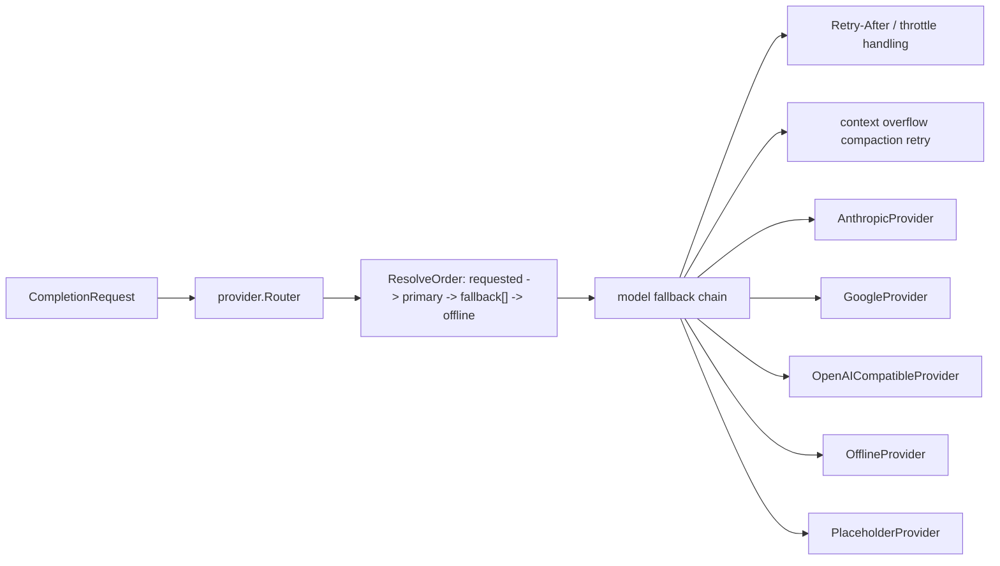

`provider.Router` always registers the offline provider, then registers configured provider profiles. If no primary is configured, it uses `offline`.

Protocol construction goes through `internal/provider/plugins`:

| Protocol | Concrete provider |
|---|---|
| `anthropic` | `AnthropicProvider` |
| `google` | `GoogleProvider` |
| `openai` | `OpenAICompatibleProvider` |
| `openai-compatible` | `OpenAICompatibleProvider` |

Provider names map to protocols through `plugins.NormalizedProtocol`: `anthropic` and `minimax` map to Anthropic protocol; `openai` maps to OpenAI; `google`/`gemini` map to Google; `deepseek`, `generic`, `kimi`, `zai`, `alibaba`, `ollama`, and `groq` map to OpenAI-compatible.

Provider safety and reliability details present in code:

| Mechanism | Code behavior |
|---|---|
| Bounded response bodies | Provider HTTP bodies are capped at 32 MiB by `readBoundedBody` |
| Throttle handling | `ErrProviderThrottled` and `ThrottledError` carry `Retry-After` |
| Status classification | `StatusError.IsTransient()` treats 408 and 5xx as transient |
| Context overflow | `ErrContextOverflow` triggers same-provider compaction retry |
| Fallback telemetry | Router observers publish fallback, throttle, and stream recovery events |
| Tool support gating | Agent code can require providers whose hints report `SupportsTools` |

## Tool System

`internal/tools.Engine` is the registry and execution point for backend and meta tools. Its design is explicitly split by concern:

| File family | Responsibility |
|---|---|
| `engine.go` | Engine type and `Execute` entrypoint |
| `engine_register_defaults.go` | Constructor and default tool registration |
| `registry.go` | Register, get, list, specs, search, meta/backend specs |
| `lifecycle.go` | Close, session state, path lock helpers |
| `timeout.go` | Tool timeout policy |
| `failure_tracker.go` | Recent failure tracking |
| `snapshot_cache.go` | Read-before-mutate snapshots |

Tool engine lock order:

1. `lifecycleMu`
2. `mu`
3. `failureMu` or `readMu`

`Execute` behavior:

1. Refuse execution if the tool engine is closed.
2. Look up the tool by name.
3. Refuse disabled tools.
4. Resolve project root to an absolute path.
5. Normalize tool parameters.
6. Extract optional `_reason` and publish tool reasoning through the engine callback.
7. Enforce read-before-mutation gates for mutating tools.
8. Apply per-tool timeout policy unless the tool self-manages timeouts.
9. Execute the concrete tool.

Registered backend tools from `engine_register_defaults.go`:

| Category | Tools |
|---|---|
| File/search | `read_file`, `write_file`, `edit_file`, `list_dir`, `grep_codebase`, `glob` |
| Agent planning | `think`, `todo_write`, `task_split`, `delegate_task`, `orchestrate` |
| Web | `web_fetch`, `web_search` |
| Code intelligence | `ast_query`, `find_symbol`, `call_graph`, `codemap`, `semantic_search`, `project_info` |
| Analysis/security | `bug_hunt`, `audit`, `dead_code`, `dependency_audit`, `dependency_graph`, `interface_diff` |
| Specs/tests/docs | `spec_parse`, `spec_to_todo`, `spec_validate`, `test_discovery`, `auto_test`, `doc_generate`, `changelog_generate` |
| Git/GitHub | `git_status`, `git_diff`, `git_branch`, `git_log`, `git_blame`, `git_worktree_list`, `git_worktree_add`, `git_worktree_remove`, `git_commit`, `gh_pr`, `git_review` |
| Patch/refactor | `apply_patch`, `patch_validation`, `symbol_rename`, `symbol_move` |
| Benchmarks | `benchmark`, `benchmark_regression` |
| Shell | `run_command` |

Meta tools are registered through `RegisterMetaTools(e)` and include `tool_search`, `tool_help`, `tool_call`, and `tool_batch_call`.

The write/edit/apply-patch family is wired back to the tools engine with `SetEngine(e)`, allowing read-before-mutate and path serialization logic to apply consistently.

## Context, Prompt, Skills, and Intent

### Context

`internal/context.Manager` coordinates retrieval and prompt-context building. It is constructed with a `codemap.Engine` and a `promptlib.Library`.

`BuildOptions` supports:

| Option | Function |
|---|---|
| `MaxFiles`, `MaxTokensTotal`, `MaxTokensPerFile` | Hard budget controls |
| `Compression` | Compression mode |
| `IncludeTests`, `IncludeDocs` | Retrieval filters |
| `SymbolAware` | Resolve query identifiers against codemap symbols |
| `GraphDepth` | Import graph neighbor expansion depth |
| `Strategy` | `general`, `security`, `debug`, `review`, `refactor` tuning |
| `ExcludeStaleFilters` | Avoid recently modified files |
| `SeenFiles` | Avoid reinjecting files already read in the session |

`pkg/types.ContextChunk` records path, language, content, line span, token count, score, compression, and source label.

File mention markers are centralized in `pkg/types` as `[[file:` and `]]`, supporting explicit context injection from CLI, TUI, web, and engine prompt building.

### Prompt Library

`internal/promptlib` embeds default prompt templates from `internal/promptlib/defaults/*.yaml` and can load overrides from:

1. `~/.dfmc/prompts`
2. `<project>/.dfmc/prompts`

Templates include type, task, language, profile, role, compose mode, priority, description, and body. Rendering and decoding are split into sibling files.

### Skills

`internal/skills` provides built-in and user/project skills. Discovery order is:

1. Built-ins from `builtinCatalog()`
2. Project skills under `<project>/.dfmc/skills`
3. Global skills under `~/.dfmc/skills`

Name collisions are first-wins, so built-ins shadow custom skills of the same name. Skills support explicit markers (`[[skill:name]]`), trigger matching, task fallback, transitive `requires`, preferred tools, and allowed tools.

### Intent

`internal/intent.Router` is a fail-open request normalizer. It uses a cheap provider selected from configured intent provider or the first available capable provider among `anthropic`, `openai`, and `google`. It classifies a turn as `resume`, `new`, or `clarify`, and can return an enriched request or follow-up question.

The intent call has a hard timeout from config (`TimeoutMs`, default 1500 ms). If fail-open is enabled, any provider or parse failure returns the raw prompt as a safe fallback.

## Analysis Stack

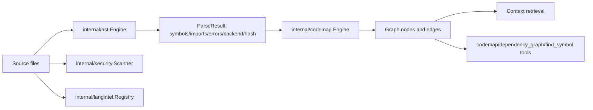

### AST

`internal/ast.Engine` detects language by extension/content, parses files, caches parse results with an LRU cache, records metrics, and reports which backend produced the result. Backends are tree-sitter when CGO/tree-sitter parsing is available and regex fallback otherwise.

`ParseResult` includes:

| Field | Meaning |
|---|---|
| `Path`, `Language` | Source identity |
| `Symbols` | Extracted `pkg/types.Symbol` values |
| `Imports` | Flat module imports |
| `ImportAliases` | Module/symbol/local alias bindings |
| `Errors` | Parser errors |
| `Hash`, `ParsedAt`, `Duration` | Cache and metrics metadata |
| `Backend` | `tree-sitter` or `regex` |

### CodeMap

`internal/codemap.Engine` converts AST parse output into a graph. It adds:

| Node kind | Source |
|---|---|
| `file` | Each parsed file |
| `module` | Imports |
| symbol kinds | Functions, methods, classes, interfaces, types, variables, constants, enums |

Edges include:

| Edge | Meaning |
|---|---|
| `imports` | File imports module |
| `defines` | File defines symbol |
| `method_of` | Method belongs to a type in the same file |

Builds can be sequential or parallel depending on config. Progress callbacks fire periodically so callers can publish indexing progress and observe cancellation. `InvalidateFile` removes file and symbol nodes so future context builds reparse fresh content.

### Security

`internal/security.Scanner` scans paths and content for secrets and vulnerability patterns. It skips files through filter helpers, suppresses known false positives, uses entropy for generic secrets, ignores pure comment lines for vulnerability regexes, skips pattern definition lines, and appends AST-aware findings.

Secret patterns include AWS access keys, GitHub/GitLab tokens, private keys, JWTs, generic API keys, database URLs, Slack tokens, Stripe keys, Anthropic keys, OpenAI keys, and Google API keys.

Vulnerability patterns include potential SQL injection, command injection, insecure eval, insecure deserialization, and SSRF. Findings report severity, CWE, OWASP category, file, line, and snippet.

## Persistence Model

`internal/storage.Store` owns the bbolt database and artifact directory.

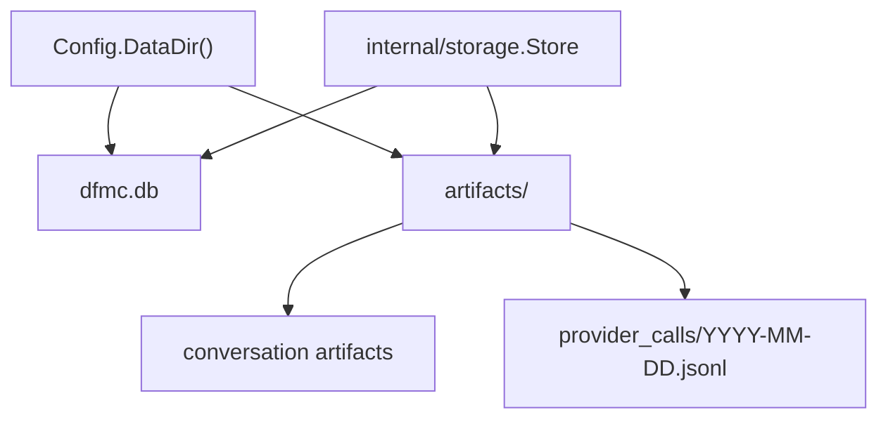

Default buckets created on open:

| Bucket | Purpose |
|---|---|
| `_meta` | Schema metadata |
| `conversations` | Conversation state/log persistence |
| `memory_episodic` | Episodic memory |
| `memory_semantic` | Semantic memory |
| `memory_working` | Working memory |
| `codemap_cache` | Codemap cache |
| `ast_cache` | AST cache |
| `config` | Persisted config data |
| `plugins` | Plugin data |

The schema version is stored in `_meta/schema_version`; current schema version is `1`. Open uses bbolt timeout of 1 second and maps timeout to `ErrStoreLocked` with an operator-friendly message.

### Memory

`internal/memory.Store` uses bbolt buckets for episodic, semantic, and working memory. Working memory tracks recent files, recent symbols, last question, and last answer. `Persist` serializes with `persistMu` to avoid lost-write races, while in-memory fields are guarded by `mu`.

Memory IDs include a timestamp plus a 6-byte random suffix to avoid collisions during concurrent writes.

### Conversations

`internal/conversation.Manager` manages active conversation state, branches, message IDs, save/load/search, and undo/branch operations through sibling files. It uses:

| Mechanism | Behavior |
|---|---|
| `mu` | Guards active conversation and reporter |
| `saveMu` | Serializes blocking and async saves |
| `saveWg` | Drains async saves before storage shutdown |
| Message IDs | Short role-prefixed IDs like `u-3f29a1` |
| Branches | Map of branch name to messages |

Conversation persistence stores artifacts under the storage artifact directory.

### Provider Logs

`internal/providerlog.Logger` persists `provider:complete` events to daily JSONL files under `<artifactsDir>/provider_calls/`. Records contain timestamp, provider, model, token counts, source, duration, error, and prompt/assistant previews.

## Drive and Autonomous Task Execution

`internal/drive.Driver` owns the synchronous plan -> execute -> persist loop. Callers decide whether to block or run it in a goroutine.

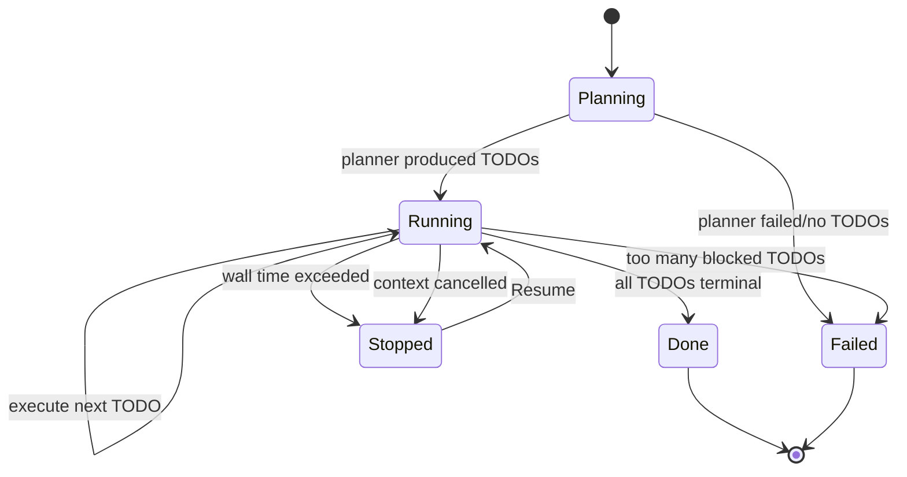

Driver behavior:

| Feature | Implementation |
|---|---|
| Persistence | Every transition writes the `Run` blob when a store is present |
| Events | Publishes `drive:*` events through a caller-provided `Publisher` |
| Cancellation | Active run registry maps run IDs to cancel functions |
| Safety | Panic recovery marks run failed and unregisters active run |
| Auto-approve | Runner-scoped auto approval is activated per run and released with defer |
| Reports | `SetReportDir` enables Markdown rollups for terminal runs |
| Resume | Running/retrying TODOs reset to pending; done/blocked/skipped stay terminal |

The engine's chat path can route multi-step prompts to Drive with a 60 minute wall time, max 5 failed TODOs, max parallel 3, and auto-approval for read/search/web-fetch style tools.

## Supervisor and Planning

`internal/supervisor` and `internal/planning` provide task coordination and conversation splitting support. The engine has Drive adapter code and sub-agent handoff code that allow `delegate_task`, `orchestrate`, and Drive TODO execution to run through the same provider/tool/event infrastructure.

`internal/supervisor/bridge` maps Drive runs into supervisor run shapes without importing engine internals.

## Protocol Surfaces

DFMC follows a TUI-first surface contract. `ui/tui` is the canonical
operator experience for labels, slash verbs, task/workflow views, and
interactive state transitions. `ui/cli` and the React 19 app in
`ui/web/src` should match that contract through shared packages or
shared engine/API semantics rather than copy-pasted output. If a TUI
feature cannot be expressed in another medium, that surface should carry
an explicit redirect/stub and a test so the gap is intentional.

### CLI

`ui/cli.Run` parses global flags and dispatches commands. Global flags include provider/model/profile, verbose, JSON, no-color, project, and data-dir.

Command groups visible in `cli.go`:

| Group | Commands |
|---|---|
| Meta/admin | `help`, `status`, `version`, `init`, `doctor`, `update`, `completion`, `man` |
| Chat | `ask`, `chat`, `tui` |
| Analysis | `analyze`, `map`, `scan`, `context`, `magicdoc` |
| State | `memory`, `conversation`/`conv`, `prompt`, `agents`/`agent`, `drive` |
| Tools | `tool`, `approvals`/`approve`/`permissions`, `hooks` |
| Config/providers | `config`, `provider`, `model`, `providers` |
| Extension | `plugin`, `skill`, `mcp` |
| Skill shortcuts | `review`, `explain`, `refactor`, `debug`, `test`, `doc`, `generate`, `audit`, `onboard` |
| Network | `serve`, `remote` |

Unknown commands that look like typos produce suggestions. Unknown non-typo commands are treated as one-shot questions.

### TUI

`ui/tui` is a Bubble Tea terminal UI. `tui.go` defines the model; `tui_lifecycle.go` constructs and renders it; `tui_run.go` owns the Bubble Tea run lifecycle.

Primary tabs from code:

1. Chat
2. Files
3. Patch
4. Workflow
5. Activity
6. Memory
7. Conversations
8. Providers

Other diagnostics are reachable through overlays, slash commands, and function keys. The model tracks chat stream lifecycle, pending queue, workspace metadata, patch state, file browser state, tool view state, activity stream, diagnostics, agent-loop telemetry, tasks panel, intent state, panel switcher, assistant next actions, approval modal, and render cache.

The Tasks panel's inline list/tree/detail/clear behavior is shared
through `internal/taskview` so TUI slash commands, CLI chat slash
commands, and WebUI task-store views stay aligned.

TUI event flow:

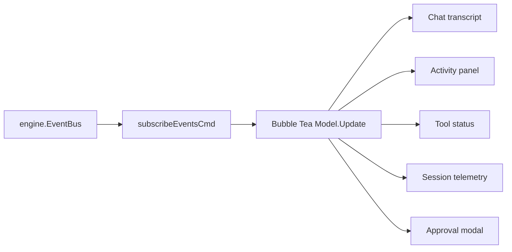

### HTTP/Web

`ui/web.Server` hosts the embedded workbench and JSON/SSE/WebSocket API. `ui/web/server.go` wires routes and middleware; handlers are split by domain.

The workbench source is a React 19/Vite application under `ui/web/src`.
It uses Tailwind CSS v4, shadcn-style local UI primitives, lucide-react
icons, and a responsive dark/light theme while preserving TUI-first
behavioral parity. `npm run build` in `ui/web` emits
`ui/web/static/index.html` plus `ui/web/static/assets/*`; Go embeds the
`static/` directory and serves `/assets/*` from the same embedded
filesystem.

The embedded HTML is `ui/web/static/index.html`. A built artifact also exists under `ui/web/app/dist`, but the Go server embeds `static/index.html`.

Route families:

| Family | Examples |
|---|---|
| Health/status | `/healthz`, `/api/v1/status` |
| Chat | `/api/v1/chat`, `/api/v1/ask`, `/ws`, `/api/v1/ws` |
| Commands/tools | `/api/v1/commands`, `/api/v1/tools`, `/api/v1/tools/{name}` |
| Context/code | `/api/v1/codemap`, `/api/v1/context/*`, `/api/v1/langintel` |
| Providers/skills/agents | `/api/v1/providers`, `/api/v1/skills`, `/api/v1/agents` |
| Memory/conversation | `/api/v1/memory`, `/api/v1/conversation*`, `/api/v1/conversations*` |
| Workspace/files | `/api/v1/workspace/*`, `/api/v1/files`, `/api/v1/files/{path...}` |
| Admin | `/api/v1/scan`, `/api/v1/doctor`, `/api/v1/hooks`, `/api/v1/config` |
| Drive/tasks | `/api/v1/drive*`, `/api/v1/tasks*` |

HTTP hardening in code:

| Mechanism | Behavior |
|---|---|
| Bind normalization | Non-loopback exposure is auth-aware |
| Origin/host controls | Allowed origins and hosts are configurable |
| Bearer auth | `auth=token` uses `DFMC_WEB_TOKEN` or explicit token setup |
| Rate limit | Per-IP limiter: 30 req/sec, burst 60 |
| Body cap | `maxRequestBodyBytes` middleware |
| Content-type enforcement | Rejects non-JSON state-changing requests |
| Security headers | Applied to every handler |
| HTTP server timeouts | Read header 5s, read 30s, write 2m, idle 2m |
| WS limits | Global and per-IP WebSocket connection limiter |

`web.New` installs a web approver. The comment states it is deny-by-default unless `DFMC_APPROVE=yes|no` configures behavior for the process.

### Remote

`dfmc remote start` starts the same embedded HTTP/SSE server on the remote WebSocket/HTTP port from config. The gRPC port is parsed and reported as reserved/not started. Remote defaults to token auth and refuses `--auth=none` on non-loopback hosts unless `--insecure` is passed.

### MCP

`dfmc mcp` serves the DFMC tool registry over newline-delimited JSON-RPC 2.0 on stdio.

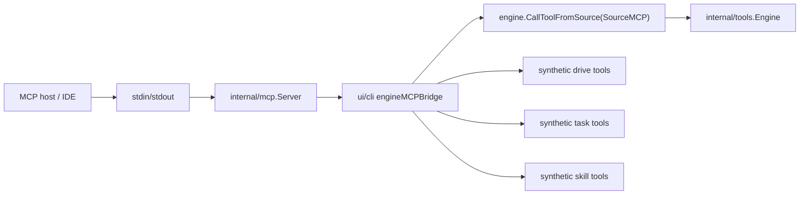

MCP server safeguards:

| Mechanism | Behavior |
|---|---|
| Frame cap | 16 MiB per JSON-RPC frame |
| Framing | Strict newline-delimited frames |
| Batch support | Handles JSON-RPC batch arrays |
| Request IDs | Non-notification calls require non-null unique IDs per connection |
| Writes | Mutex-serialized responses |
| Init | Server tracks initialize state and capabilities in dispatch files |

The engine MCP bridge exposes backend tools, not meta tools. It appends synthetic Drive, task, and skill tools after regular backend tools. Tool calls route through `engine.CallToolFromSource`, so approval gates, hooks, and panic guards still apply.

### External MCP Clients

`internal/mcp.LoadClientsFromConfig` spawns external MCP clients from configured server commands. `MCPToolBridge` indexes tools across clients. Tool name collisions are first-wins, and collisions are logged with both client names.

## Hooks

`internal/hooks.Dispatcher` runs user-configured commands for lifecycle events:

| Event | Purpose |
|---|---|
| `user_prompt_submit` | User submitted a chat turn |
| `pre_tool` | Before tool dispatch |
| `post_tool` | After tool dispatch |
| `session_start` | Engine initialization |
| `session_end` | Graceful shutdown |

Hooks are best-effort and never block the user turn beyond their timeout. They run sequentially for deterministic side effects. Shell hooks are validated, command env is structured as `DFMC_*`, secret-shaped parent env vars are scrubbed in the run path, and observer panics are contained.

The condition grammar supports:

| Expression | Meaning |
|---|---|
| empty | Always match |
| `key == value` | Exact match |
| `key != value` | Negated match |
| `key ~ value` | Substring match |

Unrecognized conditions fall through as match so hook typos do not silently disable hooks.

## Local State in This Workspace

The repository root contains ignored runtime state:

| Path | Observed role |
|---|---|
| `.dfmc/config.yaml` | Project-local DFMC config |
| `.dfmc/conventions.json` | Project conventions placeholder |
| `.dfmc/knowledge.json` | Project knowledge placeholder |
| `.dfmc/prompts/project_prompts.yaml` | Project prompt overrides |
| `.dfmc/reports/*.md` | Drive run reports |
| `.dfmt/config.yaml` | DFMT config |
| `.dfmt/journal.jsonl` | DFMT journal |
| `.dfmt/last-recall.md` | DFMT recall note |
| `.dfmt/content/*.json.gz` | DFMT compressed content store |
| `.claude/`, `.project/` | Local agent/project metadata |

These are ignored by `.gitignore` and are not part of the source build, but they influence local sessions when the application reads project `.dfmc` config/prompts.

## Build, Test, CI, and Release

### Local Build

`Makefile` targets:

| Target | Command |
|---|---|
| `build` | `go build -ldflags "-s -w -X main.version=$(VERSION)" -o bin/dfmc ./cmd/dfmc` |
| `build-cgo` | Same build with `CGO_ENABLED=1` |
| `test` | `go test -count=1 $(GO_PACKAGES)` |
| `test-race` | `CGO_ENABLED=1 go test -race -count=1 $(GO_PACKAGES)` |
| `lint` | `go vet`, `staticcheck`, `golangci-lint` |
| `vuln` | `govulncheck` |
| `security` | `vuln` plus `gosec` |
| `clean` | Windows-oriented bin removal |

### Docker

`Dockerfile` is multi-stage:

1. Builder: `golang:1.26.2-alpine`
2. Installs `gcc`, `musl-dev`, `git`, `make` for CGO/tree-sitter
3. Downloads modules with BuildKit caches
4. Builds `dfmc` with `CGO_ENABLED=1`
5. Runtime: `alpine:3.20`
6. Installs `ca-certificates`, `tzdata`, and `tini`
7. Exposes `7777`, `7778`, and `7779`
8. Embeds an empty `/app/.dfmc/config.yaml`
9. Uses `/sbin/tini -- dfmc` as entrypoint

### GitHub Actions

`.github/workflows/ci.yml`:

| Job | Behavior |
|---|---|
| Test matrix | Ubuntu, macOS, Windows; `go test -count=1 ./...`; build CGO/default and no-CGO; run `dfmc version` and `dfmc doctor` |
| Race | Linux `CGO_ENABLED=1 go test -race -count=1 ./...` |
| Lint/vuln | `gofmt -l .`, `go vet ./...`, `staticcheck ./...`, `govulncheck ./...` |
| Coverage | Informational `go test -covermode=atomic`; uploads `coverage.out` |

Additional workflows exist for release and security.

## Package Map

Internal package file/test counts observed:

| Package | Go files | Tests | Role |
|---|---:|---:|---|
| `internal/applog` | 1 | 0 | JSONL application logging |
| `internal/ast` | 26 | 10 | Parser abstraction, tree-sitter/regex extraction, metrics/cache |
| `internal/bot` | 5 | 3 | Telegram bot bridge |
| `internal/coach` | 2 | 1 | Agent coaching/rule observation |
| `internal/codemap` | 9 | 3 | Symbol/import graph over parsed files |
| `internal/commands` | 6 | 1 | Runtime command registry/catalog |
| `internal/config` | 19 | 4 | Config loading, defaults, validation, models.dev, env/key handling |
| `internal/context` | 29 | 8 | Retrieval, ranking, prompt context, budget trimming |
| `internal/conversation` | 8 | 3 | Conversation state, branches, persistence, search |
| `internal/drive` | 35 | 13 | Plan/execute/persist autonomous run loop |
| `internal/engine` | 161 | 65 | Central coordinator, ask/tool loop, lifecycle, status, approvals |
| `internal/hooks` | 12 | 6 | Lifecycle shell hooks |
| `internal/intent` | 5 | 1 | Fail-open turn classifier/normalizer |
| `internal/langintel` | 10 | 1 | Language-specific guidance registry |
| `internal/mcp` | 11 | 6 | MCP JSON-RPC server/client bridge |
| `internal/memory` | 3 | 2 | Working/episodic/semantic memory |
| `internal/pathsafe` | 2 | 1 | Path safety helpers |
| `internal/planning` | 2 | 1 | Planning/conversation splitting helpers |
| `internal/pluginexec` | 5 | 1 | Plugin execution scaffolding |
| `internal/promptlib` | 12 | 6 | Embedded/override prompt templates |
| `internal/provider` | 53 | 24 | LLM provider abstractions and concrete providers |
| `internal/providerlog` | 2 | 1 | Provider-call JSONL logs |
| `internal/repolint` | 1 | 1 | Repository lint helper |
| `internal/security` | 32 | 13 | Secret/vulnerability scanner |
| `internal/skills` | 15 | 6 | Built-in and file-based skills |
| `internal/storage` | 4 | 1 | bbolt storage and backups/conversation IO |
| `internal/supervisor` | 6 | 2 | Task/run coordination |
| `internal/taskstore` | 4 | 2 | Persistent task CRUD |
| `internal/tokens` | 2 | 1 | Heuristic token counting |
| `internal/toolhistory` | 1 | 0 | Learned tool pattern store |
| `internal/tools` | 149 | 49 | Tool registry and concrete tools |

UI package counts:

| Package | Go files | Tests | Role |
|---|---:|---:|---|
| `ui/cli` | 114 | 35 | CLI command surface, remote client/server, MCP command |
| `ui/tui` | 352 | 87 | Bubble Tea terminal workbench |
| `ui/web` | 43 | 18 | HTTP/SSE/WebSocket workbench API |

## Critical Architectural Invariants

These are direct consequences of the current code:

1. `engine.Init` must run before normal engine operations; command-only degraded startup is allowed for help/version/doctor/completion/man/update paths.
2. Engine shutdown must cancel and wait for background indexing before closing storage or parsers.
3. Tool mutations must pass the tools engine read-before-mutate gate where configured.
4. Tool calls from CLI, TUI, web, MCP, Drive, and agent loops should route through engine/tool lifecycle paths so approval, hooks, panic guard, disabled tools, and event publishing stay consistent.
5. Provider fallbacks resolve as requested provider, primary, fallback list, then offline.
6. Provider HTTP responses are bounded before JSON decoding.
7. Project hooks require both `hooks.allow_project` and secure project config permissions.
8. Web/remote non-loopback unauthenticated exposure is refused unless explicitly marked insecure.
9. MCP non-notification calls require unique non-null request IDs per connection.
10. Conversation async saves must be drained before storage closes.
11. Memory persistence is serialized to avoid lost writes.
12. CodeMap invalidation must happen when files are modified so context retrieval does not serve stale graph nodes.

## Data and Control Flow Summary

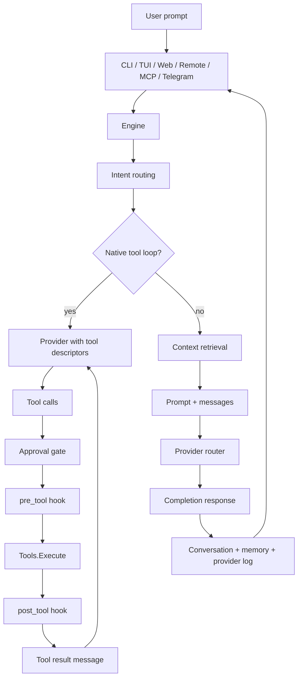

DFMC's architecture is therefore a layered single-process system: many user surfaces converge on one engine; the engine coordinates durable state, context, tools, providers, and events; analysis packages feed context and tools; protocol adapters expose the same engine safely to terminals, browsers, remote clients, Telegram, and MCP hosts.
