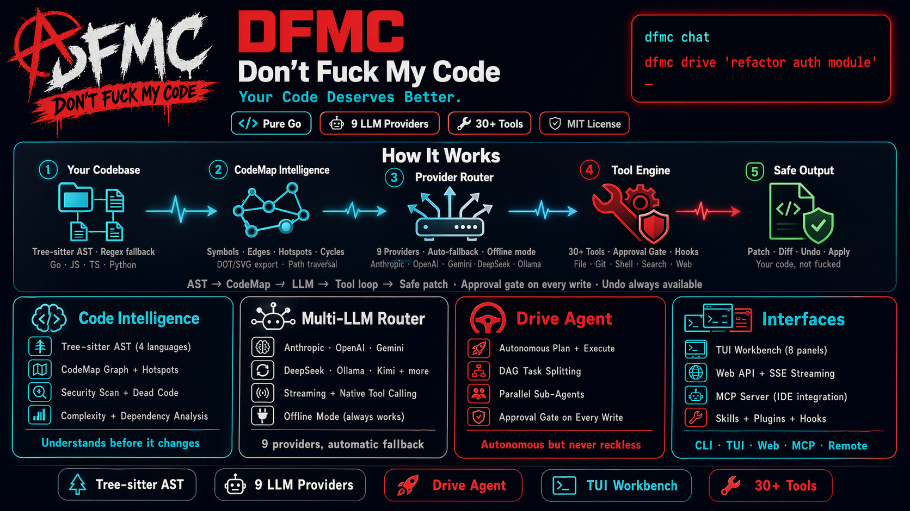

# Don't Fuck My Code (DFMC)

<p align="center">
  
</p>

Your Code Deserves Better.

DFMC is an alpha-stage code intelligence assistant written in Go. It combines local code analysis, a provider router, a guarded local tool engine, persistent project state, and multiple user surfaces: CLI, TUI, HTTP/SSE, remote client, and MCP.

## What Is Implemented

- CLI dispatcher with help, completion, man-page output, diagnostics, config, provider/model shortcuts, and skill shortcuts.
- Config loading from built-in defaults, `~/.dfmc/config.yaml`, project `.dfmc/config.yaml`, project `.env`, process env, and CLI flags.
- Provider profiles seeded from models.dev plus a local `generic` OpenAI-compatible profile.
- Provider router with configured fallback and offline fallback behavior.
- AST and CodeMap analysis with tree-sitter when CGO is available and regex fallback when it is not.
- Static analysis for codemap, security findings, complexity, dead-code candidates, duplication, TODO markers, dependencies, and MagicDoc generation.
- Native tool loop with approval gates, tool history, hooks, sub-agents, delegation, orchestration, and Drive.
- Persistent storage for conversations, memory, tasks, Drive runs, provider logs, and learned tool patterns.
- TUI workbench with Chat, Files, Patch, Workflow, Activity, Memory, Conversations, Providers, and diagnostic overlays.
- HTTP/SSE server plus remote client commands.
- MCP server exposing the internal tool surface.
- Plugin and skill management.
- Optional Telegram bot integration.

## Requirements

- Go `1.25.0` or newer. The repo currently declares `toolchain go1.26.2`.
- Windows, Linux, or macOS.
- A C toolchain if you want full tree-sitter AST support through CGO.

Without CGO the binary still builds, but AST/codemap fidelity falls back to regex behavior.

## Build

```bash
make build
make build-cgo
```

Equivalent direct commands:

```bash
go build -o bin/dfmc ./cmd/dfmc
CGO_ENABLED=1 go build -o bin/dfmc ./cmd/dfmc
```

On Windows PowerShell:

```powershell
go build -o dfmc.exe .\cmd\dfmc\
```

## First Run

```bash
dfmc init
dfmc doctor
dfmc status
dfmc ask "explain this project"
```

`dfmc init` creates project-local state under `.dfmc/`, including `config.yaml`, `knowledge.json`, and `conventions.json`. Startup also auto-initializes missing project state for normal commands when possible.

## Provider Configuration

Default config currently uses:

- primary provider: `minimax`
- fallback providers: `openai`, `deepseek`
- profiles from `ModelsDevSeedProfiles()`
- local `generic` profile pointing at `http://localhost:11434/v1`

Provider API keys are loaded from process env first. Project-root `.env` fills only missing keys and does not override process env.

Code-backed provider key env vars:

| Provider profile | Env var |
| --- | --- |
| `anthropic` | `ANTHROPIC_API_KEY` |
| `openai` | `OPENAI_API_KEY` |
| `google` | `GOOGLE_AI_API_KEY` |
| `deepseek` | `DEEPSEEK_API_KEY` |
| `kimi` | `KIMI_API_KEY` or `MOONSHOT_API_KEY` |
| `minimax` | `MINIMAX_API_KEY` |
| `zai` | `ZAI_API_KEY` |
| `alibaba` | `ALIBABA_API_KEY` |

Useful operational env vars:

- `DFMC_WEB_TOKEN`: bearer token used by `dfmc serve --auth token`
- `DFMC_REMOTE_TOKEN`: bearer token used by `dfmc remote start --auth token` and remote clients
- `DFMC_TELEGRAM_TOKEN`, `DFMC_TELEGRAM_ALLOWED_USERS`, `DFMC_TELEGRAM_SESSION_NAME`: Telegram integration
- `DFMC_APPROVE=yes|no`: non-interactive approval behavior for gated tools
- `DFMC_APPROVE_DESTRUCTIVE=yes`: second knob required to auto-approve write/shell tools
- `DFMC_NO_COLOR` or `NO_COLOR`: disable TUI/CLI color
- `DFMC_UNSAFE_HOOKS=1`: override writable-config hook safety refusal
- `DFMC_PROFILE`: prompt/context profile override
- `VISUAL` or `EDITOR`: editor used by `dfmc config edit`

Persist provider defaults with config paths that exist in code:

```bash
dfmc config set providers.primary minimax
dfmc config set providers.profiles.minimax.model MiniMax-M2.7
```

Top-level shortcuts are session-only for that invocation:

```bash
dfmc providers
dfmc provider minimax
dfmc model MiniMax-M2.7
```

## Core CLI

Query and chat:

```bash
dfmc ask "how does the engine initialize?"
dfmc ask --race --race-providers minimax,openai "compare provider output"
dfmc chat
dfmc tui
```

Analysis:

```bash
dfmc analyze
dfmc analyze --security --dead-code --complexity --duplication --todos
dfmc analyze --full --deps --magicdoc
dfmc scan
dfmc map --format ascii
dfmc map --format dot
dfmc map --format svg
```

Tools:

```bash
dfmc tool list
dfmc tool show read_file
dfmc tool run read_file --path README.md --line_start 1 --line_end 40
dfmc tool run grep_codebase --pattern "func runServe" --max_results 10
dfmc tool run run_command --command go --args "version"
dfmc tool disable web_search
dfmc tool enable web_search
```

Config and context:

```bash
dfmc config list
dfmc config get providers.primary
dfmc config set context.include_tests true
dfmc config sync-models
dfmc config edit

dfmc context budget --query "security audit auth middleware"
dfmc context recommend --query "debug [[file:internal/auth/service.go]]"
dfmc context recent
dfmc context brief --max-words 240
```

Memory and conversations:

```bash
dfmc memory working
dfmc memory list --tier episodic --limit 20
dfmc memory search --query auth --tier semantic
dfmc memory add --tier episodic --key note --value "important detail"
dfmc memory clear --tier semantic

dfmc conversation list
dfmc conversation search middleware
dfmc conversation active
dfmc conversation new
dfmc conversation save
dfmc conversation undo
dfmc conversation load <conversation-id>
dfmc conversation branch list
dfmc conversation branch create experiment
dfmc conversation branch switch experiment
dfmc conversation branch compare main experiment
```

Drive:

```bash
dfmc drive "add input validation to the API layer"
dfmc drive "refactor agent_loop" --max-parallel 4 --route plan=minimax --route code=openai
dfmc drive list
dfmc drive active
dfmc drive show <run-id>
dfmc drive resume <run-id>
dfmc drive stop <run-id>
dfmc drive delete <run-id>
```

Skills and plugins:

```bash
dfmc skill list
dfmc skill info review
dfmc review "find risks in recent changes"

dfmc plugin list
dfmc plugin install --name my-plugin --enable ./path/to/plugin.py
dfmc plugin enable my-plugin
dfmc plugin disable my-plugin
dfmc plugin remove my-plugin
```

Diagnostics and generated references:

```bash
dfmc doctor
dfmc doctor --network --timeout 3s
dfmc doctor --providers-only
dfmc doctor --fix
dfmc update
dfmc completion powershell
dfmc man --format markdown
```

Global flags must come before the command:

```bash
dfmc --json status
dfmc --provider offline ask "summarize local context"
dfmc --data-dir .dfmc-alt doctor
```

## TUI

```bash
dfmc tui
dfmc tui --no-alt-screen
```

Main panels:

- `F1` Chat
- `F2` Files
- `F3` Patch
- `F4` Workflow
- `F5` Activity
- `F6` Memory
- `F7` Conversations
- `F8` Providers

Diagnostic panels:

- `F9` Status
- `F10` CodeMap
- `F11` Tools
- `F12` Security
- `Shift+F1` Prompts
- `Shift+F2` Plans
- `Shift+F3` Context
- `Shift+F4` Orchestrate
- `Shift+F5` Shortcuts
- `Shift+F6` Contexts
- `Shift+F7` ProviderLog
- `Shift+F8` Telegram
- `Ctrl+Alt+T` ToolStatus

Use `Ctrl+B` for the fuzzy panel switcher. Use `Ctrl+G` to jump to Activity. Use `/help` inside Chat for the live slash-command list.

## HTTP And Remote

Serve local HTTP/SSE:

```bash
dfmc serve --host 127.0.0.1 --port 7777
DFMC_WEB_TOKEN=change-me dfmc serve --host 127.0.0.1 --port 7777 --auth token
```

Remote server and client:

```bash
DFMC_REMOTE_TOKEN=change-me dfmc remote start --auth token --ws-port 7779
dfmc remote status --live --url http://127.0.0.1:7779 --token change-me
dfmc remote ask --url http://127.0.0.1:7779 --token change-me --message "explain the router"
dfmc remote tool read_file --url http://127.0.0.1:7779 --token change-me --param path=README.md
```

`remote start` serves the same HTTP/WebSocket API as `serve` on the `--ws-port`. The `--grpc-port` flag is currently reserved and reported as `not_started`.

Main HTTP route groups are registered in `ui/web/server.go`: health, status, commands, ask/chat, codemap, context, providers, tools, skills, agents, analysis, memory, conversation, prompts, MagicDoc, workspace diff/patch, files, scan, doctor, hooks, config, Drive, tasks, `/ws`, and `/api/v1/ws`.

Non-loopback `--auth=none` is refused unless `--insecure` is passed.

## Prompt Library And MagicDoc

```bash
dfmc prompt list
dfmc prompt render --query "security audit auth middleware"
dfmc prompt recommend --query "debug [[file:internal/auth/service.go]]"
dfmc prompt stats

dfmc magicdoc update
dfmc magicdoc show
```

Prompt templates are loaded from built-ins, `~/.dfmc/prompts`, and `.dfmc/prompts`. Supported formats are YAML, JSON, and Markdown with optional frontmatter.

Inline context markers supported by prompt/context code:

```text
[[file:internal/auth/middleware.go]]
[[file:internal/auth/middleware.go#L10-L80]]
```

Fenced code blocks inside the query are also treated as explicit injected context.

## Config Defaults Worth Knowing

Current context defaults in `internal/config/defaults.go`:

```yaml
context:
  max_files: 20
  max_tokens_total: 12000
  max_tokens_per_file: 2000
  max_history_tokens: 24000
  max_history_messages: 120
  compression: standard
  auto_include_files: false
  include_tests: false
  include_docs: true
  symbol_aware: true
  graph_depth: 2
```

Current agent/tool-loop defaults include:

```yaml
agent:
  max_tool_steps: 60
  max_tool_tokens: 250000
  max_tool_result_chars: 3200
  parallel_batch_size: 4
  autonomous_resume: auto
  autonomous_planning: auto
  auto_continue: auto
```

## Hooks And Safety

- Project-local hooks are disabled by default. Enable them only for trusted repos with `hooks.allow_project: true`.
- Hooks receive structured `DFMC_*` payload env vars such as `DFMC_EVENT`, `DFMC_TOOL_NAME`, and `DFMC_TOOL_ARGS`.
- Secret-shaped parent env vars are scrubbed before hook/plugin child processes unless explicitly allowlisted.
- For shell-free hooks, prefer `command` plus `args`.
- Agent-initiated write/shell/network-sensitive operations go through the approval gate.
- Web/remote/MCP surfaces are stricter by default because they cannot always ask interactively.

Example hook:

```yaml
hooks:
  pre_tool:
    - name: audit
      command: go
      args: ["env", "GOOS"]
      shell: false
```

## Project Structure

```text
cmd/dfmc                 binary entrypoint
internal/applog          app logging helpers
internal/ast             tree-sitter and regex AST extraction
internal/bot             Telegram bot integration
internal/coach           agent coaching and trajectory hints
internal/codemap         symbol/dependency graph
internal/commands        command registry metadata
internal/config          config types, defaults, env hydration, validation
internal/context         context selection, prompt budgeting, MagicDoc slices
internal/conversation    JSONL conversations and branches
internal/drive           autonomous plan/execute runner
internal/engine          provider orchestration, agent loop, lifecycle
internal/hooks           lifecycle hooks
internal/intent          intent router
internal/langintel       language knowledge helpers
internal/mcp             MCP server and client bridge
internal/memory          working, episodic, and semantic memory
internal/planning        task split/planning helpers
internal/pluginexec      plugin execution runtime
internal/promptlib       prompt catalog and overlays
internal/provider        provider implementations and router
internal/providerlog     provider-call logging
internal/security        scanners, redaction, env scrubbing
internal/session         session agents
internal/sessionutil     session support helpers
internal/skills          skill registry
internal/storage         bbolt store and backups
internal/supervisor      shared execution/task types
internal/taskstore       task persistence
internal/tokens          token helpers
internal/toolhistory     tool-call history
internal/tools           tool registry and built-in tools
ui/cli                   CLI commands
ui/tui                   Bubble Tea TUI
ui/web                   HTTP/SSE/WebSocket server
pkg/types                shared public types
```

## Development

```bash
make test
make test-race
make lint
make vuln
make security
```

Direct commands:

```bash
go test -count=1 ./...
CGO_ENABLED=1 go test -race -count=1 ./...
go vet ./...
```

## Notes

- Security and dead-code findings are heuristic and intended for triage.
- Only one process can open the project bbolt store at a time.
- The docs should describe code-backed behavior. If behavior changes, update this README from the relevant source files instead of copying old command output.

## License

Apache 2.0 (intended project license).
