# DFMC Architecture

Updated: 2026-05-05

Module: `github.com/dontfuckmycode/dfmc`
Go: 1.25+
Status: alpha, actively developed

DFMC is a single-binary code intelligence assistant. The product shape is:

- CLI, Bubble Tea TUI, embedded Web workbench, Remote clients, and MCP host surface.
- One shared `internal/engine.Engine` that owns lifecycle, provider routing, context, tools, memory, conversations, approvals, hooks, and events.
- Provider-native agent loops for tool-capable models.
- A compact four-meta-tool protocol exposed to models, backed by a larger local tool registry.
- Autonomous Drive runs that plan a DAG of TODOs, execute ready work through bounded sub-agents, persist progress, and resume.
- Local code intelligence through AST, CodeMap, context retrieval, LangIntel, security scanners, and prompt library.

This document is generated from the current repository structure and source files, not from the old architecture document.

## Table Of Contents

1. System map
2. Entrypoints and UI surfaces
3. Engine lifecycle
4. Provider system
5. Native agent loop
6. Tool system
7. Context and prompt stack
8. Drive, Supervisor, Tasks, and sub-agents
9. Persistence, memory, and conversation state
10. MCP and remote operation
11. Web security and approvals
12. Analysis, AST, CodeMap, and security
13. Skills, plugins, hooks, commands
14. Event model and observability
15. Package map
16. Critical invariants

## 1. System Map

```mermaid
flowchart TB
    CLI[ui/cli] --> ENG[internal/engine.Engine]
    TUI[ui/tui] --> ENG
    WEB[ui/web] --> ENG
    REMOTE[dfmc remote] --> WEB
    MCPHOST[MCP host] --> MCP[internal/mcp + cli bridge]
    MCP --> ENG

    ENG --> PROVIDER[internal/provider.Router]
    ENG --> TOOLS[internal/tools.Engine]
    ENG --> CTX[internal/context.Manager]
    ENG --> AST[internal/ast.Engine]
    ENG --> CM[internal/codemap.Engine]
    ENG --> MEM[internal/memory.Store]
    ENG --> CONV[internal/conversation.Manager]
    ENG --> HOOKS[internal/hooks.Dispatcher]
    ENG --> SECURITY[internal/security.Scanner]
    ENG --> INTENT[internal/intent.Router]
    ENG --> BUS[EventBus]

    PROVIDER --> ANTH[Anthropic protocol]
    PROVIDER --> OPENAI[OpenAI compatible protocol]
    PROVIDER --> GOOGLE[Google protocol]
    PROVIDER --> OFFLINE[offline provider]

    TOOLS --> FILES[file/edit/patch/list]
    TOOLS --> SEARCH[grep/glob/find_symbol/codemap/ast_query]
    TOOLS --> EXEC[shell/git/web/gh]
    TOOLS --> PLAN[task_split/orchestrate/delegate_task/todo_write]

    DRIVE[internal/drive.Driver] --> RUNNER[engine driveRunner]
    RUNNER --> PROVIDER
    RUNNER --> SUBAGENT[Engine.RunSubagent]
    SUBAGENT --> TOOLS
    DRIVE --> DSTORE[drive Store bbolt]
    DRIVE --> SUP[internal/supervisor plan helpers]
```



### Highest-Level Flow

1. `cmd/dfmc/main.go` loads config, builds `engine.Engine`, initializes subsystems, then hands control to `ui/cli.Run`.
2. CLI, TUI, Web, Remote, and MCP all call engine methods instead of owning separate business logic.
3. `Engine.Ask` and `Engine.StreamAsk` prepare intent, context, prompt blocks, provider request, and optional native tool loop.
4. Tool-capable providers see only meta tools. Backend tools are discovered and invoked through the meta layer.
5. All tool execution paths must flow through `engine.executeToolWithLifecycle` so approvals, hooks, timeout events, panic guard, and denial logging stay intact.
6. Drive starts with a planner LLM call, persists a run, schedules TODOs, and executes TODOs via sub-agents.

## 2. Entrypoints And UI Surfaces

### Binary Entrypoint

`cmd/dfmc/main.go` owns process startup. `ui/cli/cli.go` owns the command dispatcher.

Key CLI commands currently wired:

- Core: `status`, `version`, `init`, `doctor`, `completion`, `man`, `update`
- LLM: `ask`, `chat`, `review`, `explain`, `refactor`, `debug`, `test`, `doc`, `generate`, `audit`, `onboard`
- Workbench: `tui`, `serve`, `remote`
- Analysis: `analyze`, `map`, `scan`, `context`, `prompt`, `magicdoc`
- Tools and state: `tool`, `memory`, `conversation`, `provider`, `model`, `providers`
- Extensibility: `skill`, `plugin`, `hooks`, `approvals`
- Autonomy: `drive`
- Host integration: `mcp`

Global flags are parsed before the command token. Example: `dfmc --provider openai ask "..."`.

### CLI

Package: `ui/cli`

`cli.go` is intentionally a dispatcher. Domain files include:

- `cli_ask_chat.go`
- `cli_analysis.go`
- `cli_drive.go`
- `cli_mcp.go`, `cli_mcp_drive.go`, `cli_mcp_task.go`
- `cli_remote*.go`
- `cli_plugin*.go`, `cli_skill.go`
- `provider_cli.go`
- `approvals_cli.go`

CLI registers a stdin approver by default so gated tools can ask the user.

### TUI

Package: `ui/tui`

Bubble Tea workbench with Chat, Status, Files, Patch, Setup, Tools, Drive, Tasks, Activity, Memory, and diagnostics surfaces. The TUI subscribes to the engine EventBus and renders:

- provider/model start and completion
- tool calls, tool results, tool reasoning
- Drive run and TODO events
- sub-agent lifecycle
- task/todo status
- intent decisions
- hook reports
- panic and timeout telemetry

State is split by feature files. `panel_states.go` owns grouped panel states; hot paths live in files such as `update.go`, `chat_key.go`, `chat_commands.go`, `engine_events.go`, `drive.go`, `render_workflow.go`, and provider panel files.

### Web

Package: `ui/web`

`dfmc serve` hosts the embedded workbench and JSON/SSE API. `server.go` wires routes and middleware; handlers are split by domain.

Important routes:

- `GET /`, `GET /healthz`
- `POST /api/v1/ask`, `POST /api/v1/chat`
- `GET /api/v1/status`, `/providers`, `/tools`, `/skills`, `/commands`
- `GET /api/v1/codemap`
- `GET /api/v1/context/*`
- `POST /api/v1/analyze`
- `GET /api/v1/memory`
- `GET/POST /api/v1/conversation*`
- `GET /api/v1/workspace/*`, `POST /api/v1/workspace/apply`
- `GET /api/v1/files`, `GET /api/v1/files/{path...}`
- `POST/GET/DELETE /api/v1/drive*`
- `GET/POST/PATCH/DELETE /api/v1/tasks*`
- `GET /ws`, `GET /api/v1/ws`

The embedded workbench lives in `ui/web/static/index.html`.

### Remote

Remote mode is a client surface over a running server. It exposes headless workflows for workspace, context, conversation, drive, prompt, observe, tools, and MagicDoc.

## 3. Engine Lifecycle

Package: `internal/engine`

`engine.go` owns construction, state, lifecycle, and shared subsystem fields. Domain behavior lives in sibling files.

Core fields:

```go
type Engine struct {
    Config       *config.Config
    Storage      *storage.Store
    EventBus     *EventBus
    ProjectRoot  string
    AST          *ast.Engine
    CodeMap      *codemap.Engine
    Context      *ctxmgr.Manager
    Providers    *provider.Router
    Tools        *tools.Engine
    Memory       *memory.Store
    Conversation *conversation.Manager
    Security     *security.Scanner
    LangIntel    *langintel.Registry
    Hooks        *hooks.Dispatcher
    Intent       *intent.Router
}
```

Engine states:

- `StateCreated`
- `StateInitializing`
- `StateReady`
- `StateServing`
- `StateShuttingDown`
- `StateStopped`

Initialization order:

1. Open bbolt storage.
2. Create AST, CodeMap, Context manager.
3. Create tools engine and inject task store, subagent runner, codemap.
4. Load external MCP clients and bridge tools.
5. Wire tool reasoning event publisher.
6. Load memory and conversation manager.
7. Create security scanner and LangIntel registry.
8. Create provider router and attach provider observers.
9. Create background context.
10. Create fail-open intent router.
11. Create hook dispatcher.
12. Resolve project root and start codebase indexer.
13. Fire `session_start`.
14. Publish `engine:ready`.

Shutdown cancels background work, joins indexers, fires `session_end`, persists conversations and memory, closes tools and storage, then publishes `engine:stopped`.

### Engine File Split

- `engine.go`: lifecycle and shared state.
- `engine_ask.go`: `Ask`, `AskRaced`, streaming, history.
- `engine_tools.go`: tool lifecycle, approval, hooks, panic guard.
- `engine_context.go`: context chunks, budgets, recommendations.
- `engine_prompt.go`: system prompt and prompt runtime.
- `engine_intent.go`: pre-ask intent integration.
- `engine_passthrough.go`: status, provider/model, memory, conversation passthroughs.
- `engine_analyze.go`: analysis pipeline.
- `agent_loop_native.go`: provider-native loop.
- `agent_loop_parallel.go`: parallel-safe tool dispatch and loop cache.
- `agent_parking.go`, `agent_parked.go`: park/resume state.
- `subagent.go`, `subagent_profiles.go`: bounded sub-agent execution.
- `drive_adapter.go`: engine adapter for Drive.
- `eventbus.go`: pub/sub.

## 4. Provider System

Package: `internal/provider`

Provider interface:

```go
type Provider interface {
    Name() string
    Model() string
    Models() []string
    Complete(context.Context, CompletionRequest) (*CompletionResponse, error)
    Stream(context.Context, CompletionRequest) (<-chan StreamEvent, error)
    CountTokens(string) int
    MaxContext() int
    Hints() ProviderHints
}
```

Supported implementations:

- Anthropic protocol: `AnthropicProvider`, also used by compatible profiles such as MiniMax when configured as anthropic.
- Google protocol: `GoogleProvider`.
- OpenAI-compatible protocol: OpenAI, DeepSeek, Kimi, Z.AI, Alibaba, generic/Ollama-style endpoints.
- Offline provider: always registered.
- Placeholder provider: used when a profile exists but credentials/base URL are missing.

Router behavior:

- `ResolveOrder(requested)` returns requested -> primary -> fallback list -> offline, with dedupe.
- Tool requests filter out providers that do not support tools, unless explicitly requested.
- Provider calls can walk a model chain from `Models()` / fallback models.
- Throttling retries the same provider/model up to a bounded count and honors `Retry-After`.
- Transient server/network failures move to the next model or provider.
- Context overflow compacts messages and retries the same model once before moving on.
- Circuit breaker state can skip recently unhealthy providers.
- Streaming can publish recovery telemetry when a stream resumes on fallback.
- `CompleteRaced` runs selected providers concurrently and returns the first success.

Provider config is in `providers.profiles.*`. Protocol defaults are inferred by profile name when `protocol` is empty.

## 5. Native Agent Loop

Provider-native loop files: `internal/engine/agent_loop_native.go` and helpers.

The old text bridge is retired. Tool dialogue now uses provider-native tool APIs:

- Anthropic `tool_use`
- OpenAI-compatible `tool_calls`

The model sees a small stable surface:

- `tool_search`
- `tool_help`
- `tool_call`
- `tool_batch_call`

Backend tools remain hidden until discovered and invoked through the meta tools.

Main loop stages:

1. Ensure codemap index exists.
2. Clear stale parked state for fresh asks.
3. Run autonomous planning preflight when enabled.
4. Build context chunks.
5. Build system prompt and cacheable system blocks.
6. Expose meta tool descriptors.
7. Optionally seed kickoff traces and TODOs.
8. Start bounded loop.
9. Provider emits text or tool calls.
10. Engine executes tool calls through `executeToolWithLifecycle`.
11. Tool results are appended back to provider messages.
12. Loop compacts, parks, auto-resumes, or returns final answer.

Important controls under `agent.*`:

- `max_tool_steps`
- `max_tool_tokens`
- `tool_round_soft_cap`
- `tool_round_hard_cap`
- `parallel_batch_size`
- `meta_call_budget`
- `meta_depth_limit`
- `tool_default_timeout_seconds`
- `tool_timeouts`
- `tool_reasoning`
- `autonomous_planning`
- `autonomous_resume`
- `resume_max_multiplier`
- `context_lifecycle.*`
- `range_cache_per_path`
- `retry_window_size`

Parallel dispatch is conservative. Only read-only or engine-state-safe tools are parallelized. Mutating tools force sequential execution. The current safe list includes `read_file`, `list_dir`, `grep_codebase`, `glob`, `find_symbol`, `ast_query`, `web_fetch`, `web_search`, `think`, and `todo_write`.

Loop cache:

- Exact cache key for cacheable reads.
- Range merge for overlapping `read_file` slices.
- Invalidation after writes, edits, and patches.

Parking:

- Step cap, budget exhaustion, shutdown, or handoff can save loop state.
- Autonomous resume can compact and continue inside the same top-level ask.
- Intent routing can route follow-up prompts such as "continue" or "fix it" back to the parked state.

## 6. Tool System

Package: `internal/tools`

`tools.Engine` owns the backend registry. `engine.Engine` wraps it with lifecycle semantics.

Built-in backend tools:

- File: `read_file`, `write_file`, `edit_file`, `apply_patch`, `list_dir`
- Search/nav: `grep_codebase`, `glob`, `find_symbol`, `codemap`, `ast_query`, `semantic_search`
- Project: `project_info`, `dependency_graph`, `test_discovery`
- Shell: `run_command`
- Git/GitHub: `git_status`, `git_diff`, `git_branch`, `git_log`, `git_blame`, `git_commit`, `git_worktree_list`, `git_worktree_add`, `git_worktree_remove`, `gh_pr`
- Web: `web_fetch`, `web_search`
- Reasoning/planning: `think`, `todo_write`, `task_split`, `delegate_task`, `orchestrate`
- Quality: `patch_validation`, `benchmark`
- Refactor helpers: `symbol_rename`, `symbol_move`
- Meta: `tool_search`, `tool_help`, `tool_call`, `tool_batch_call`

Tool execution invariants:

- User and agent calls must route through `engine.executeToolWithLifecycle`.
- Approval is checked before gated execution.
- `pre_tool` and `post_tool` hooks fire here.
- Panic guard turns panics into structured events and tool errors.
- Timeouts publish a structural timeout event.
- `_reason` is stripped from params and republished as `tool:reasoning`.
- Mutating file tools use read-before-mutate guards.
- Per-path locks serialize the read-gate-to-write window.
- Git arguments reject user-supplied flag-looking refs/paths.
- Meta tools cannot dispatch other meta tools.

Read-before-mutation policy:

- `edit_file`: lenient hash drift, because exact-string anchoring catches unsafe edits.
- `write_file` and `apply_patch`: strict snapshot and hash equality.
- New files in `apply_patch` are exempt.

## 7. Context And Prompt Stack

Context package: `internal/context`
Prompt library: `internal/promptlib`

Context retrieval combines:

- CodeMap graph
- AST symbols
- direct file mentions: `[[file:path]]`, `[[file:path#L10-L80]]`
- fenced user context
- project docs and tests depending on config
- query terms and task profile
- history budgets

Default retrieval order taught to the model:

1. `grep_codebase` for cheap text discovery.
2. `codemap` for signatures-only orientation.
3. `find_symbol` for semantic scoped lookup.
4. `read_file` for raw line windows.

Prompt library load order:

1. Embedded defaults from `internal/promptlib/defaults/*.yaml`.
2. Global overrides under `~/.dfmc/prompts`.
3. Project overrides under `.dfmc/prompts`.

The prompt runtime resolves provider/model/tool style/max context and emits system blocks. Providers with prompt caching can use labelled `SystemBlock` values.

MagicDoc:

- `.dfmc/magic/MAGIC_DOC.md` is a compact project brief.
- `dfmc magicdoc update` refreshes it from current repo state.
- It is designed for low-token bootstrap context.

## 8. Drive, Supervisor, Tasks, And Sub-Agents

### Sub-Agents

Sub-agent entrypoint: `Engine.RunSubagent`, implemented through `runSubagentProfiles`.

A sub-agent gets:

- a fresh prompt
- role hint
- runtime context
- allowed tool guidance
- skill texts
- provider/model candidate chain
- separate step and token budget
- parent parked state preservation
- concurrency accounting

Concurrency is capped by `agent.parallel_batch_size`.

Provider fallback for sub-agents:

- Drive and orchestrate can pass profile candidates.
- Each attempt uses the same cloned seed/context.
- Fallback events include candidate chain and reasons.

### Drive

Package: `internal/drive`

Drive is a persistent autonomous plan/execute loop:

1. `Driver.Run` creates a `Run`.
2. Planner call asks a model for a JSON TODO DAG.
3. Planner output is validated, normalized, and capped.
4. Supervisor helpers can add auto-survey and auto-verify TODOs.
5. Scheduler picks ready TODO batches.
6. File-scope conflict checks prevent unsafe parallel writes.
7. Each TODO runs through engine sub-agent execution.
8. Results update TODO status and brief.
9. Run state is persisted after transitions.
10. User can stop or resume by run ID.

Drive data model:

- `Run`: ID, task, status, reason, timestamps, execution plan snapshot, todos.
- `Todo`: ID, parent, kind, title, detail, dependencies, file scope, read-only flag, provider tag, worker class, skills, allowed tools, labels, verification, confidence, status, brief, error, attempts, budget, last context.

Drive statuses:

- Run: `planning`, `running`, `done`, `stopped`, `failed`
- TODO: `pending`, `running`, `done`, `blocked`, `skipped`, `verifying`, `waiting`, `external_review`

Drive config:

- `MaxTodos`, default 20
- `MaxFailedTodos`, default 3
- `MaxWallTime`, default 30 minutes
- `DrainGraceWindow`, default 2 seconds
- `Retries`, default 1
- `MaxParallel`, default 3
- `PlannerModel`
- `Routing` map: provider tag -> provider profile
- `AutoApprove`
- `AutoSurvey`
- `AutoVerify`

Drive routing:

- CLI flag: `--route plan=opus --route code=sonnet --route test=haiku`
- HTTP/MCP field: `routing`
- Scheduler/executor uses `ProviderTag` plus config routing.
- `supervisor/bridge` can select a profile chain from provider config, route rules, tags, worker class, verification, confidence, and file scope.

### Supervisor

Package: `internal/supervisor`

Supervisor is the richer task planning/execution layer used by Drive helpers and task store shapes.

It provides:

- `Task` and `Run` data shapes.
- Worker classes: planner, researcher, coder, reviewer, tester, security, synthesizer, verifier.
- Verification levels: none, light, required, deep.
- `BuildExecutionPlan` for normalized DAG layers, root/leaf detection, lane policy, worker counts.
- Auto survey and auto verification task synthesis.
- `Supervisor` runner with budget pool and worker callback.

Today, Drive uses supervisor planning helpers and shared task shapes. The standalone Supervisor runner exists as a stronger future orchestration kernel and has tests, but Drive's primary hot loop still lives in `internal/drive.Driver`.

### Task Store

Package: `internal/taskstore`

The bbolt task store persists `supervisor.Task` records. It is shared by:

- `todo_write`
- HTTP `/api/v1/tasks/*`
- MCP task API

Important behavior:

- Server-generated task IDs.
- List filters by parent, run, state, label, limit, offset.
- `UpdateTask` is transactional.
- `UpdateTaskCAS` supports optimistic concurrency with `If-Match`.
- Version increments on successful mutation.

## 9. Persistence, Memory, And Conversation State

Package: `internal/storage`

Storage is a bbolt store. Engine owns one storage handle per process. Some commands can run in degraded mode if the store is locked.

Persistent domains:

- Memory: working, episodic, semantic tiers.
- Conversation: JSONL conversations, active conversation, branches, compare/search.
- Drive: `drive-runs` bucket with JSON run records.
- Tasks: `tasks` bucket with `supervisor.Task` records.
- Tool history: tool call records.
- Artifacts as needed by feature packages.

Memory load failures are non-fatal. Engine marks memory degraded, publishes `memory:degraded`, and keeps running with empty memory.

## 10. MCP And Remote Operation

Package: `internal/mcp`

MCP server:

- line-delimited JSON-RPC 2.0
- strict initialize flow
- `tools/list`, `tools/call`
- frame size cap of 16 MiB
- batch request support
- tool bridge to native registry and external MCP clients

Synthetic Drive MCP tools are defined in `ui/cli/cli_mcp_drive.go` and intentionally do not enter `engine.Tools`:

- `dfmc_drive_start`
- `dfmc_drive_status`
- `dfmc_drive_active`
- `dfmc_drive_list`
- `dfmc_drive_stop`
- `dfmc_drive_resume`

This prevents model-inside-model recursion.

External MCP clients can be loaded from config and merged into the local tool surface through the bridge.

Remote mode uses the web server as the control plane and exposes headless workflows through CLI remote commands.

## 11. Web Security And Approvals

Web server hardening:

- `auth=none` forces loopback bind.
- `auth=token` requires bearer token when configured.
- host allowlist middleware.
- origin checks for browser WebSocket/SSE paths.
- `allowed_origins: ["*"]` is treated as unsafe and not accepted for WS origin matching.
- CSP, `X-Content-Type-Options`, `X-Frame-Options`.
- per-IP rate limit.
- request body size cap.
- JSON content-type enforcement for state-changing requests.
- HTTP server timeouts and max header size.
- WebSocket connection caps.

Approvals:

- CLI uses stdin approver.
- TUI replaces it with a modal approver.
- Web uses deny-by-default approver unless explicitly configured.
- Drive can install scoped auto-approval for drive-owned tool calls only.
- Auto-approval restores previous approver by ownership token.

## 12. Analysis, AST, CodeMap, And Security

### AST

Package: `internal/ast`

AST engine uses tree-sitter when CGO is available, with regex fallback when built without CGO. Supported high-fidelity languages include Go, JavaScript, TypeScript, and Python. There are additional extractors and language-aware helpers for several language families.

`dfmc status` and `doctor` surface whether the AST backend is tree-sitter or regex.

### CodeMap

Package: `internal/codemap`

CodeMap builds a symbol/dependency graph on top of AST. It supports:

- symbols and edges
- cycles and hotspots
- path traversal
- graph metrics
- DOT/SVG export
- dependency graph tool integration

### LangIntel

Package: `internal/langintel`

Language knowledge base for Go, TypeScript, Python, Java, C#, PHP, Rust. Used by analysis and recommendation surfaces.

### Security

Package: `internal/security`

Security functionality includes:

- secret/credential pattern scanning
- AST smell scanners for Go, JavaScript, Python, credential patterns
- dependency audit helpers
- safe HTTP client
- env scrub/redaction
- git root and secret file checks

Web and task endpoints include multiple hardening tests in `ui/web/*_test.go`.

## 13. Skills, Plugins, Hooks, Commands

### Skills

Package: `internal/skills`

Skill catalog and built-in shortcuts:

- `review`
- `explain`
- `refactor`
- `debug`
- `test`
- `doc`
- `generate`
- `audit`
- `onboard`

Skills can contribute system instructions and allowed/preferred tool guidance.

### Plugins

Package: `internal/pluginexec`

Plugin runtime includes manager/client/wasm scaffolding and config-backed plugin enable state from CLI commands.

### Hooks

Package: `internal/hooks`

Supported hook events:

- `user_prompt_submit`
- `pre_tool`
- `post_tool`
- `session_start`
- `session_end`

Hooks are best effort and reported through EventBus. They should not block ordinary tool execution beyond their timeout.

### Commands

Package: `internal/commands`

Runtime command registry supports command metadata, help, slash command catalog surfaces, and UI command discovery.

## 14. Event Model And Observability

EventBus event examples:

- Engine: `engine:initializing`, `engine:ready`, `engine:serving`, `engine:shutdown`, `engine:stopped`, `engine:shutdown_error`
- Provider: `provider:complete`, throttle/circuit/stream recovery events through observers
- Agent loop: `agent:loop:start`, `agent:tool:cache_hit`, `agent:loop:*`, `agent:subagent:start`, `agent:subagent:fallback`, `agent:subagent:done`
- Tool: `tool:reasoning`, `tool:error`, `tool:timeout`, `tool:result`
- Context: `context:lifecycle:compacted`, `context:lifecycle:proactive_compacted`
- Drive: `drive:run:start`, `drive:plan:start`, `drive:plan:done`, `drive:todo:start`, `drive:todo:done`, `drive:todo:blocked`, `drive:todo:retry`, `drive:run:done`, `drive:run:stopped`, `drive:run:failed`
- Intent: `intent:decision`
- Hooks: `hook:run`
- Runtime: `runtime:panic`
- Memory: `memory:degraded`

Consumers:

- TUI activity timeline and status panels.
- Web `/ws` stream and workbench refresh.
- CLI Drive progress output.
- Remote observers.

## 15. Package Map

```text
cmd/dfmc                  binary entrypoint
pkg/types                 shared public-ish types and SafeGo observer

internal/engine           central orchestration, agent loop, approvals, drive adapter
internal/config           config load/defaults/env/models.dev/validation
internal/provider         provider interface, router, protocols, retry/circuit/throttle
internal/tools            backend tools, meta tools, mutation guards, tool registry
internal/context          context ranking, compression, snapshots, prompt rendering helpers
internal/promptlib        embedded and override prompt library
internal/ast              tree-sitter and regex AST extraction
internal/codemap          symbol/dependency graph
internal/drive            autonomous plan/execute loop and persistence
internal/supervisor       task model, execution plan, supervisor runner, policies
internal/supervisor/bridge drive/supervisor mapping and routing selection
internal/taskstore        bbolt task persistence
internal/mcp              MCP protocol server, client, bridge
internal/memory           working/episodic/semantic memory
internal/conversation     JSONL conversation persistence and branches
internal/storage          bbolt store and artifacts
internal/security         secret/vuln/dependency scans and safe HTTP helpers
internal/skills           skill catalog and shortcuts
internal/pluginexec       plugin manager/client/WASM runtime
internal/hooks            lifecycle hook dispatcher
internal/intent           fail-open intent classifier/router
internal/coach            trajectory hints
internal/planning         task split heuristics
internal/commands         command registry
internal/langintel        language knowledge bases
internal/tokens           heuristic token counter
internal/toolhistory      tool call logging

ui/cli                    command-line UX
ui/tui                    Bubble Tea terminal workbench
ui/tui/theme              render helpers and themed components
ui/web                    HTTP/SSE/WebSocket workbench

assets                    visual assets
shell                     completions and package formulas
security-report           generated security audit artifacts
.dfmc                     local project state, config, MagicDoc
```

## 16. Critical Invariants

1. Every tool call must go through `engine.executeToolWithLifecycle` unless it is an explicitly documented synthetic MCP Drive tool.
2. Tool-capable agent loops expose meta tools, not the entire backend registry.
3. Meta tools must not dispatch other meta tools.
4. File mutation requires prior read snapshots and per-path locking.
5. Drive synthetic MCP tools must stay outside `engine.Tools` to avoid recursive LLM calls.
6. Intent must remain fail-open.
7. Provider fallback must keep offline last and filter non-tool providers during tool loops.
8. Sub-agent concurrency must remain bounded by config.
9. Drive parallelism must respect `file_scope`; unknown write scope runs alone.
10. Drive and task state must persist after each meaningful transition.
11. Web `auth=none` must never bind publicly.
12. Hooks must be best effort and timeout-bound.
13. Memory failures must degrade, not block startup.
14. Shutdown must cancel/join background work before closing storage.
15. Tests that assert TUI per-tool chip rendering must expand the tool strip first.

## Current Strengths

- Solid central engine with multiple UI surfaces sharing the same runtime.
- Modern provider router with fallback, model chain retry, throttling, circuit state, tool-capability filtering, raced completion, and stream recovery telemetry.
- Provider-native tool loop with compact model-facing tool surface.
- Strong local tool safety story: approvals, hooks, mutation guards, path locks, timeouts, panic handling.
- Drive already has persistent DAG execution, sub-agent dispatch, file-scope parallelism, routing, retries, stop/resume, web/TUI/MCP surfaces.
- Supervisor and task store are in place as the richer orchestration substrate.
- Web surface has unusually broad hardening coverage for a local agent.
- Context, prompt, MagicDoc, CodeMap, AST, and LangIntel provide a real local intelligence foundation.

## Main Architectural Gaps

- Routing rules exist, but the provider router and Drive route selection need a single policy engine that understands cost, latency, quality, context size, tool support, task risk, and user preference.
- Supervisor is not yet the single source of truth for all task execution. Drive uses it for planning helpers, while its own scheduler remains the main runtime.
- `AllowedTools` in Drive/sub-agent prompts is guidance, not a hard sandbox. A strict scoped tool policy layer is needed for higher autonomy.
- Provider/model catalog and benchmark data need to become runtime facts, not mostly config fields.
- Evaluation and regression harnesses for agent quality are missing as a first-class subsystem.
- Long-running observability needs structured traces, cost ledger, and replayable run artifacts.
- Plugin runtime exists but is not yet a full marketplace-grade extension boundary.
- Multi-workspace/git-worktree isolation for parallel agents is partial and should become a first-class execution mode.
