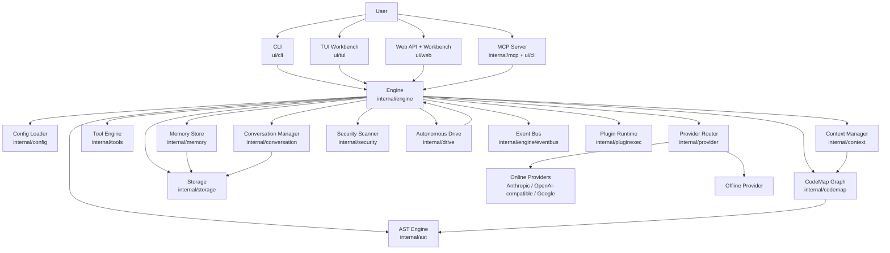
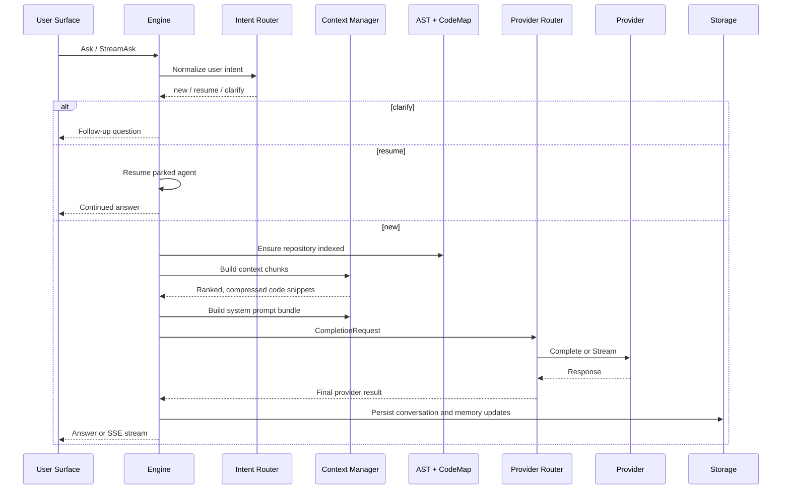
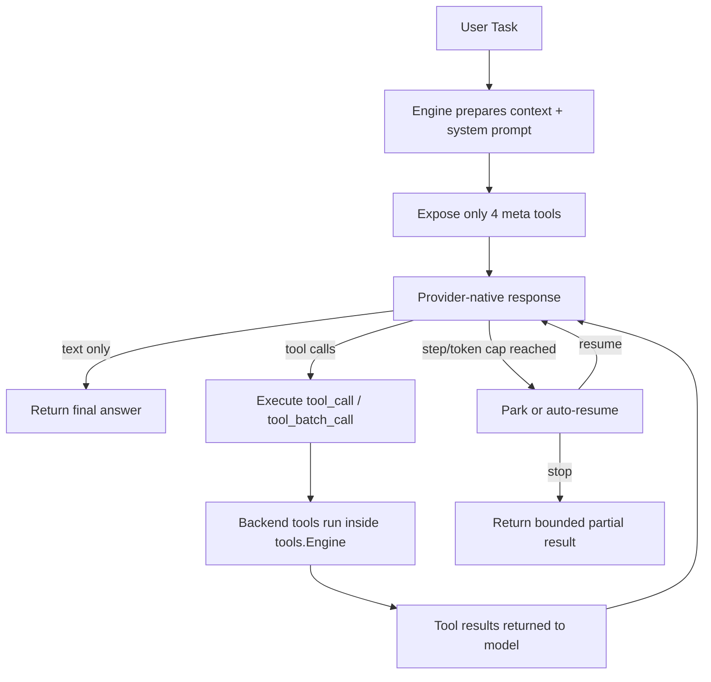
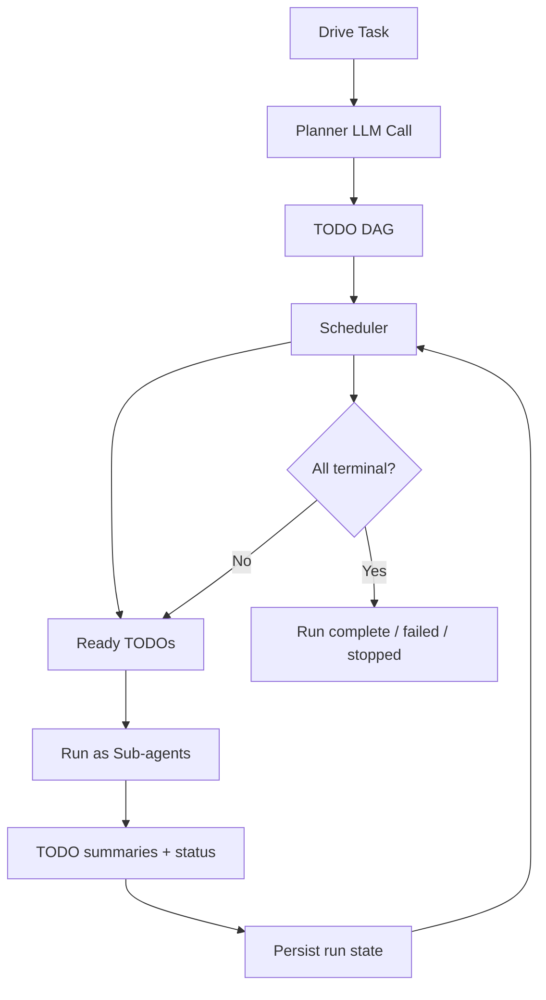

# DFMC Architecture

This document describes how DFMC is structured today, how its major subsystems interact, and how a request moves through the runtime.

## 1. What DFMC Is

DFMC is a single-binary Go application for code intelligence and agentic coding workflows. It combines:

- Local code understanding: AST parsing, codemap generation, context retrieval, heuristic analysis, and security scanning
- LLM orchestration: provider routing, streaming, tool-calling, fallback behavior, and bounded agent loops
- Multiple surfaces on one core: CLI, Bubble Tea TUI, embedded web server, remote client, and MCP server
- Persistent project state: conversations, memory, drive runs, and artifacts stored under `.dfmc/`

At the center of the system is `internal/engine.Engine`. Every major surface delegates to it.

## 2. High-Level Architecture

## 3. Core Design Principles

- One runtime core, many frontends: CLI, TUI, web, remote, and MCP all share the same engine and subsystem model.
- Local-first context: DFMC tries to understand the repository itself before asking an LLM to reason about it.
- Bounded autonomy: tool loops, sub-agents, and drive runs are capped by steps, tokens, and safety checks.
- Graceful degradation: if live providers are unavailable, DFMC can still operate through offline analysis.
- Observable execution: the event bus exposes lifecycle, provider, tool, and drive events to every UI.

## 4. Startup and Lifecycle

The process starts in `cmd/dfmc/main.go`.

### Startup path

1. Load merged configuration via `internal/config.Load()`
2. Construct `engine.Engine`
3. Initialize storage, AST, codemap, context manager, tool registry, memory, conversation manager, security scanner, provider router, hooks, and intent router
4. Resolve the project root
5. Start background indexing of the codebase
6. Publish engine lifecycle events
7. Hand control to the selected UI surface

### Shutdown path

Shutdown is centralized in `Engine.Shutdown()`:

- cancel background tasks
- wait for the indexer to finish
- fire session-end hooks
- persist active conversation and memory
- close tools and storage
- publish shutdown events

This is important because DFMC keeps bbolt-backed state open while the process is running.

## 5. Configuration Model

DFMC merges configuration in this order:

1. Built-in defaults
2. Global config: `~/.dfmc/config.yaml`
3. Project config: `<repo>/.dfmc/config.yaml`
4. Project `.env`
5. Process environment variables
6. CLI overrides

Key configuration areas:

- `providers`: primary/fallback routing and provider profiles
- `context`: retrieval budgets and compression behavior
- `agent`: tool loop budgets, auto-resume, autonomy, and context lifecycle
- `security`: scan behavior and command sandbox controls
- `tools`, `hooks`, `plugins`, `web`, `remote`, `tui`, `intent`, `ast`

## 6. Main Runtime Components

### 6.1 Engine

`internal/engine` is the orchestration hub. It owns subsystem instances and exposes the main runtime operations:

- `Ask`, `AskWithMetadata`, `AskRaced`, `StreamAsk`
- tool execution
- status and config reload
- conversation and memory access
- drive runner creation
- background task and event publishing

The engine is intentionally split into domain-specific files:

- `engine_ask.go`: request flow and streaming
- `engine_context.go`: context budgeting and retrieval status
- `engine_prompt.go`: prompt assembly
- `engine_tools.go`: tool invocation lifecycle
- `engine_analyze.go`: analysis pipeline
- `agent_loop_native.go`: provider-native tool loop
- `subagent.go`, `drive_adapter.go`: delegated execution

### 6.2 AST Engine

`internal/ast` parses source files and extracts:

- language
- symbols
- imports
- parse errors
- backend metadata

The parser is hybrid:

- tree-sitter is used for Go, JavaScript/JSX, TypeScript/TSX, and Python when CGO is enabled
- regex fallback is used when CGO is unavailable or for unsupported languages

Results are cached in an LRU parse cache.

### 6.3 CodeMap

`internal/codemap` builds a project graph on top of AST output.

It models:

- file nodes
- symbol nodes
- module/import edges
- file-to-symbol definition edges

This graph powers:

- symbol lookup
- hotspots
- cycle detection
- context ranking
- codemap rendering tools

### 6.4 Context Manager

`internal/context` builds the code snippets that are sent to the model.

It ranks files using:

- query text matches
- symbol-aware matching
- graph-neighborhood expansion
- hotspot bonuses

Then it compresses selected files into token-budgeted `ContextChunk`s. It also renders the system prompt bundle using the prompt library.

### 6.5 Provider Router

`internal/provider.Router` abstracts all model providers behind one interface:

- Anthropic
- OpenAI
- OpenAI-compatible vendors
- Google
- Offline provider
- Placeholder providers when profiles exist but credentials are missing

Responsibilities:

- resolve provider order
- retry throttled calls
- retry compacted calls after context overflow
- filter non-tool-capable providers out of tool-calling cascades
- stream or complete requests

### 6.6 Tool Engine

`internal/tools.Engine` is the execution backend for all tools.

Backend tool groups include:

- file operations
- code search and semantic lookup
- git operations
- shell/command execution
- web fetch/search
- codemap and AST queries
- patching and editing
- task splitting and orchestration
- delegated sub-agent execution

The model does not see the full backend tool list. Instead, DFMC exposes four meta tools:

- `tool_search`
- `tool_help`
- `tool_call`
- `tool_batch_call`

This keeps prompt size stable even as the backend tool catalog grows.

### 6.7 Memory and Conversations

Persistent and semi-persistent state is split into two layers:

- `internal/conversation`: active and historical conversations, branchable, saved as JSON + JSONL artifacts
- `internal/memory`: working memory in-memory, episodic/semantic memory in bbolt buckets

This lets DFMC preserve interaction history and lightweight project memory across sessions.

### 6.8 Security and Analysis

DFMC has two analysis styles:

- graph/AST-driven structural analysis in `engine_analyze.go`
- heuristic secret and vulnerability scanning in `internal/security`

The scanner looks for:

- hardcoded secrets
- risky patterns such as injection, eval, deserialization, and SSRF indicators
- AST-based security heuristics for supported languages

### 6.9 Drive

`internal/drive` is a higher-level autonomous execution mode.

It adds:

- a planner that converts a task into a TODO DAG
- a scheduler that respects dependencies and file-scope conflicts
- parallel execution of ready TODOs
- persistence for resumable runs
- event emission for all progress

Drive delegates actual execution back into engine sub-agents.

### 6.10 Event Bus

The event bus is the internal observability backbone.

It publishes:

- engine lifecycle events
- provider events
- tool lifecycle and tool reasoning events
- memory/config/hook events
- drive events

Consumers include:

- TUI activity panels
- web `/ws` SSE stream
- remote clients
- any internal subscriber

## 7. Request Lifecycle

### Standard ask/chat flow

### Important details in this flow

- The intent layer can short-circuit work before a full model call.
- Codebase indexing is lazy-safe: if the codemap is empty, the engine builds it before retrieval.
- Prompt assembly is runtime-aware and budget-aware.
- Provider routing can retry after throttling or context overflow.
- Conversation history is trimmed and summarized before each request.

## 8. Native Tool Loop

When the active provider supports tool calling, DFMC can enter a bounded agent loop instead of a single completion.

### Why the meta-tool design matters

- It prevents the system prompt from exploding as tools increase.
- It lets backend tool specs evolve without changing provider protocols.
- It gives DFMC one stable agent-loop contract across Anthropic and OpenAI-style providers.

### Safety controls in the loop

- step limit
- cumulative token limit
- per-tool result truncation
- read-before-mutate safeguards for edits and patches
- approval hooks for gated tools
- optional self-narrated tool reasoning surfaced as events
- parking and resume when budgets are reached

## 9. Autonomous Drive Mode

Drive is a larger-grain orchestration loop built on top of the engine.

Key traits:

- planner is stateless and cheap: one completion, no tool loop
- executor TODOs are real sub-agent runs
- scheduler prevents unsafe parallel overlap using `file_scope`
- runs are resumable from persistent state
- progress is published as `drive:*` events

## 10. UI and Surface Model

### CLI

`ui/cli` is the command router and local operator surface.

It handles:

- one-shot ask/status/analyze/tool commands
- interactive chat
- TUI startup
- web server startup
- remote client commands
- drive lifecycle commands
- plugin and skill management
- MCP stdio mode

### TUI

`ui/tui` is the richest local surface. It is a Bubble Tea application built around the same engine instance.

Main capabilities:

- streaming chat
- status and activity views
- files and patch inspection
- provider/model switching
- tool execution presets
- drive monitoring

### Web

`ui/web` embeds an HTTP API and browser workbench.

It exposes:

- REST-style endpoints for status, prompts, tools, files, memory, conversations, and drive
- SSE chat streaming
- SSE event streaming on `/ws`
- an embedded static workbench UI

### Remote

`dfmc remote ...` is a client layer against a running web server. It does not implement separate business logic; it mirrors server APIs.

### MCP

`dfmc mcp` exposes DFMC as an MCP-compatible stdio server. This lets IDE hosts call DFMC tools, including synthetic drive tools, over JSON-RPC.

## 11. Persistence Model

### On disk

Project-local state lives under `.dfmc/` and bbolt-backed storage.

Persisted artifacts include:

- `dfmc.db`
- conversation state and JSONL logs
- memory buckets
- drive-run records
- generated project artifacts such as magic docs

### Storage responsibilities

`internal/storage` provides:

- database open/close
- bucket initialization
- artifact directory management
- atomic conversation writes
- lock detection when another DFMC process already owns the store

## 12. Extension Model

DFMC supports two extension directions.

### Plugins

Plugins are child processes started by `internal/pluginexec`.

Characteristics:

- line-delimited JSON-RPC over stdin/stdout
- stderr captured for diagnostics
- supports executable or interpreted script plugins
- surfaced mainly through CLI plugin commands

### MCP hosts

External IDE/tooling hosts can use DFMC over MCP rather than embedding DFMC logic directly.

This creates a clean separation:

- DFMC remains the tool runtime
- the host remains the UX shell

## 13. Package-Level Mental Model

If you want to navigate the codebase quickly, think in these layers:

- `cmd/dfmc`: binary entrypoint
- `internal/config`: config and runtime defaults
- `internal/engine`: orchestration hub
- `internal/provider`: model abstraction and routing
- `internal/tools`: actionable runtime tools
- `internal/ast` + `internal/codemap`: repository understanding
- `internal/context` + `internal/promptlib`: prompt and retrieval shaping
- `internal/conversation` + `internal/memory` + `internal/storage`: state
- `internal/drive`: autonomous plan-and-execute mode
- `ui/cli`, `ui/tui`, `ui/web`: operator-facing surfaces

## 14. End-to-End Summary

In practice, DFMC works like this:

1. Load configuration and persistent project state
2. Build a repository model with AST + codemap
3. Accept a request from CLI, TUI, web, remote, or MCP
4. Normalize the request with the intent layer
5. Retrieve budgeted local context
6. Either:
   - send one completion request through the provider router, or
   - enter the bounded native tool loop, or
   - run the higher-level drive planner/scheduler
7. Persist conversation and memory side effects
8. Publish events so every surface stays in sync

That combination gives DFMC its architecture: a local-first code intelligence core, wrapped by a bounded LLM runtime, exposed through several operator interfaces.
