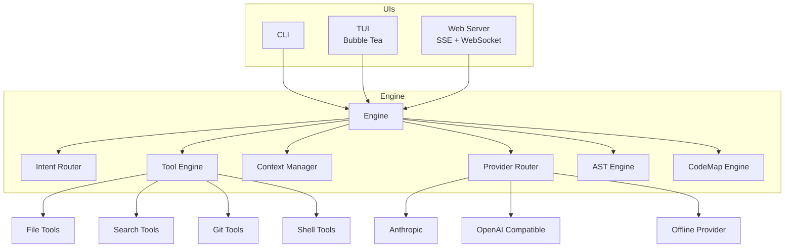
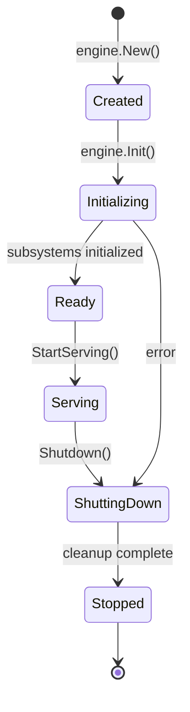
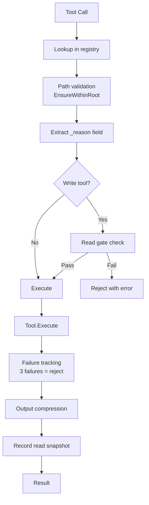
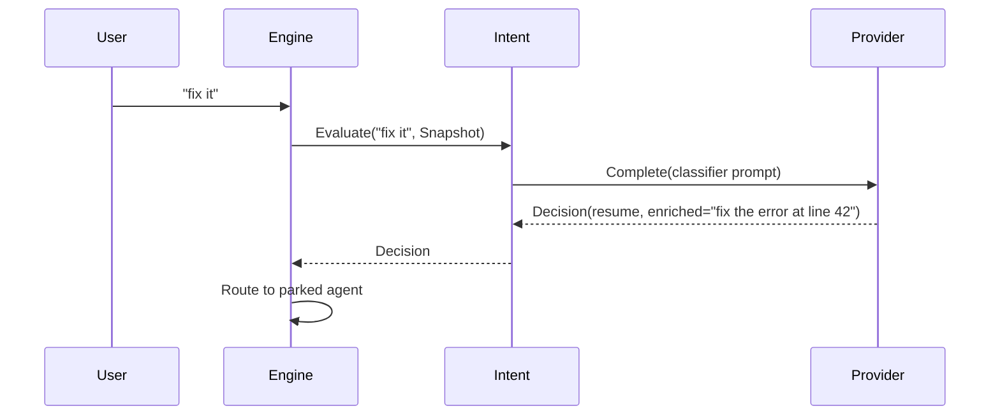
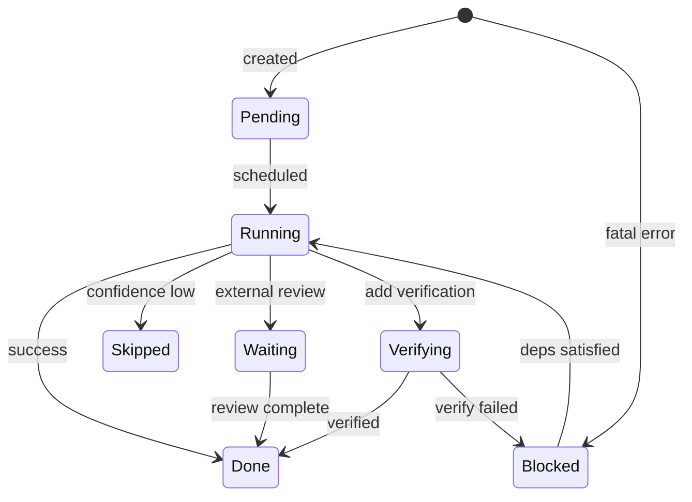
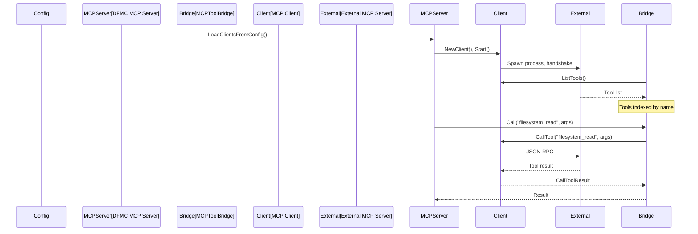
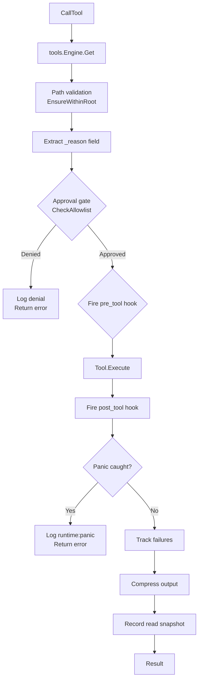
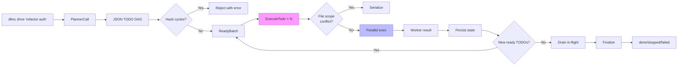
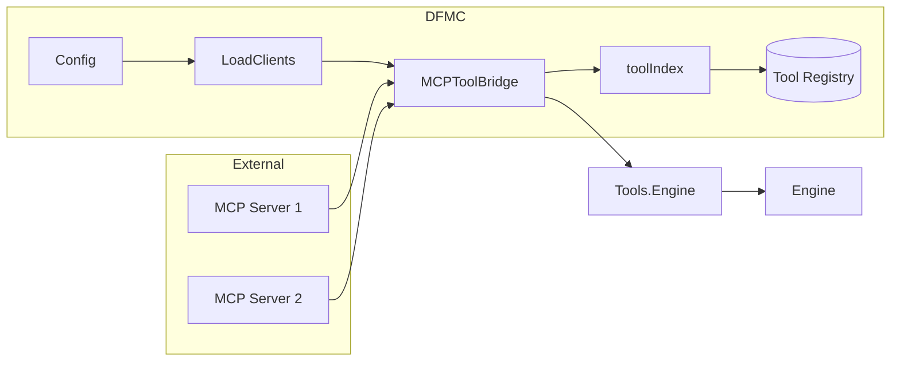
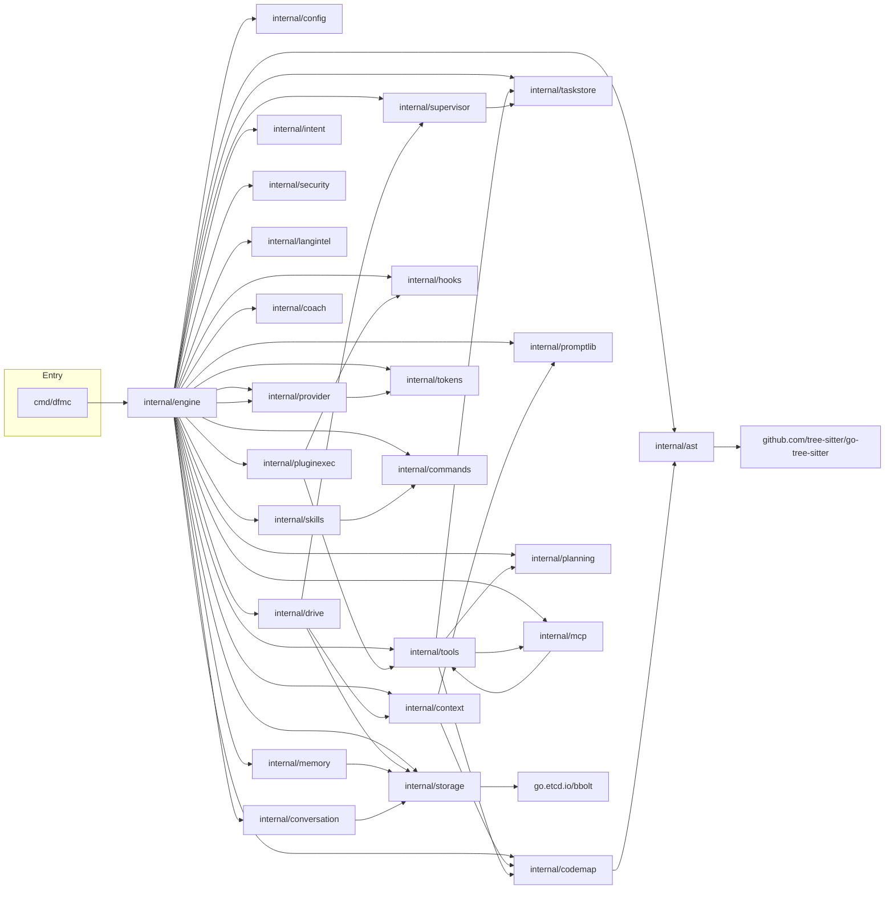

# DFMC Architecture

**Module**: `github.com/dontfuckmycode/dfmc`
**Purpose**: Code intelligence agent combining local AST analysis with multi-provider LLM routing.
**Go version**: 1.25+

---

## Table of Contents

1. [System Overview](#1-system-overview)
2. [Core Engine](#2-core-engine)
3. [Provider System](#3-provider-system)
4. [Tool System](#4-tool-system)
5. [Intent Layer](#5-intent-layer)
6. [Drive System](#6-drive-system)
7. [Context Management](#7-context-management)
8. [Conversation & Memory](#8-conversation--memory)
9. [Storage Layer](#9-storage-layer-bbolt)
10. [MCP Server Architecture](#10-mcp-server-architecture)
11. [UI Layer Architecture](#11-ui-layer-architecture)
12. [Security Architecture](#12-security-architecture)
13. [Data Flow Diagrams](#13-data-flow-diagrams)
14. [Skills System](#14-skills-system)
15. [Planning System](#15-planning-system)
16. [Commands Registry](#16-commands-registry)
17. [LangIntel (Language Intelligence)](#17-langintel-language-intelligence)
18. [Token Counter](#18-token-counter)
19. [Plugin Execution](#19-plugin-execution)
20. [Supervisor](#20-supervisor)
21. [Coach (Trajectory Hints)](#21-coach-trajectory-hints)
22. [Task Store](#22-task-store)
23. [AST Engine](#23-ast-engine)
24. [CodeMap Engine](#24-codemap-engine)
25. [Prompt Library](#25-prompt-library)
26. [Hooks Dispatcher](#26-hooks-dispatcher)
27. [Package Dependency Graph](#27-package-dependency-graph)
28. [File Tree](#28-file-tree)
29. [Key Behavioral Rules](#29-key-behavioral-rules)

---

## 1. System Overview

DFMC ("Don't Fuck My Code") is a code intelligence agent with three UIs (CLI, TUI, Web) that all drive the same `engine.Engine`. It combines AST + codemap + security analysis with an LLM provider router supporting primary + fallback cascade.



### Entry Point

```
cmd/dfmc/main.go
  └── main() → run() → engine.New() → engine.Init() → cli.Run()
```

### Key Dependencies

| Dependency | Purpose |
|------------|---------|
| `github.com/charmbracelet/bubbletea` | TUI framework |
| `github.com/tree-sitter/go-tree-sitter` | AST parsing |
| `go.etcd.io/bbolt` | Embedded database |
| `golang.org/x/net` | WebSocket/HTTP |

---

## 2. Core Engine

**Package**: `internal/engine`

### Primary Files

| File | Responsibility |
|------|----------------|
| `engine.go` | Engine struct, lifecycle, state machine |
| `engine_tools.go` | Tool execution lifecycle, approval gate, hooks |
| `engine_context.go` | Context budgeting, recommendations |
| `engine_prompt.go` | System prompt building |
| `engine_ask.go` | Ask/StreamAsk, history management |
| `engine_passthrough.go` | Status, provider passthrough |
| `engine_analyze.go` | Dead-code, complexity analysis |
| `engine_intent.go` | Intent router glue |
| `engine_events.go` | EventBus subscription helpers |
| `eventbus.go` | Pub/sub for engine events |

### Key Types

```go
type Engine struct {
    Config        *config.Config
    Storage       *storage.Store
    EventBus      *EventBus
    ProjectRoot   string
    AST           *ast.Engine
    CodeMap       *codemap.Engine
    Context       *ctxmgr.Manager
    Providers     *provider.Router
    Tools         *tools.Engine
    Memory        *memory.Store
    Conversation  *conversation.Manager
    Security      *security.Scanner
    LangIntel     *langintel.Registry
    Hooks         *hooks.Dispatcher
    Intent        *intent.Router
    activeSupervisor interface{ AllocTokens(int) int; RestoreTokens(int) }
}

type EngineState int
const (
    StateCreated     EngineState = iota
    StateInitializing
    StateReady
    StateServing
    StateShuttingDown
    StateStopped
)
```

### Engine Lifecycle



**Init sequence**:
1. Storage (bbolt)
2. AST engine
3. Codemap engine
4. Context manager
5. Tools engine
6. Memory store
7. Conversation manager
8. Security scanner
9. Provider router
10. Intent router
11. Hooks dispatcher
12. Background indexer starts

### EventBus

```go
type Event struct {
    Type      string
    Source    string
    Payload   any
    Timestamp time.Time
}
```

**Key event types**:
- `engine:initializing`, `engine:ready`, `engine:serving`, `engine:shutdown`, `engine:stopped`
- `tool:reasoning` — Tool self-narration WHY
- `hook:run` — Hook execution reports
- `drive:*` — Drive system events
- `runtime:panic` — Panic notifications
- `intent:decision` — Intent classification result

### Public API Surface

```go
// Lifecycle
func New(cfg *config.Config) *Engine
func (e *Engine) Init(ctx context.Context) error
func (e *Engine) Shutdown()

// LLM interaction
func (e *Engine) Ask(ctx context.Context, req AskRequest) (*AskResponse, error)
func (e *Engine) AskRaced(ctx context.Context, req AskRequest, timeout time.Duration) (*AskResponse, error)
func (e *Engine) StreamAsk(ctx context.Context, req AskRequest) (<-chan StreamEvent, error)

// Tool operations
func (e *Engine) ListTools() []tools.ToolSpec
func (e *Engine) CallTool(ctx context.Context, name string, params map[string]any) (tools.Result, error)
func (e *Engine) ExecuteTool(ctx context.Context, req ExecuteRequest) (Result, error)

// State inspection
func (e *Engine) Status() EngineState
func (e *Engine) Providers() *provider.Router
func (e *Engine) BuildContextChunks(query string) ([]ctxmgr.ContextChunk, error)
// SnapshotContext() does NOT exist on Engine
```

---

## 3. Provider System

**Package**: `internal/provider`

### Primary Files

| File | Purpose |
|------|---------|
| `interface.go` | Provider interface, request/response types |
| `router.go` | Provider routing, fallback cascade, throttle handling |
| `anthropic.go` | Anthropic API (`/v1/messages` endpoint) |
| `openai_compat.go` | OpenAI-compatible (DeepSeek, ZAI, Ollama, etc.) |
| `google.go` | Google AI API (Gemini) |
| `offline.go` | Offline fallback with built-in analyzers |
| `placeholder.go` | Missing API key placeholder |
| `throttle.go` | Rate limit detection and backoff |

### Provider Interface

```go
type Provider interface {
    Name() string
    Model() string
    Models() []string
    Complete(ctx context.Context, req CompletionRequest) (*CompletionResponse, error)
    Stream(ctx context.Context, req CompletionRequest) (<-chan StreamEvent, error)
    CountTokens(text string) int
    MaxContext() int
    Hints() ProviderHints
}

type CompletionRequest struct {
    Provider     string
    Model        string
    System       string
    SystemBlocks []SystemBlock
    Messages     []Message
    Context      []types.ContextChunk
    Tools        []ToolDescriptor
    ToolChoice   string
}

type CompletionResponse struct {
    Text       string
    Model      string
    Usage      Usage
    ToolCalls  []ToolCall
    StopReason StopReason
}
```

### Provider Hints

```go
type ProviderHints struct {
    ToolStyle     string   // "tool_use" or "function_call"
    Cache         bool     // Supports prompt caching
    LowLatency    bool
    BestFor       []string // e.g., ["fast", "coding", "analysis"]
    MaxContext    int
    DefaultMode  string
    SupportsTools bool
}
```

### Router

```go
type Router struct {
    primary    string
    fallback   []string
    providers  map[string]Provider
    throttleObserver func(ThrottleNotice)
}
```

**Fallback cascade**: Requested provider → Primary → Fallbacks → Offline (always last)

**Throttle handling**:
- Detects `ErrProviderThrottled` and `ThrottledError`
- Respects Retry-After hints
- Exponential backoff (max 3 retries)
- Per-model retry on context overflow with message compaction

### Error Types

```go
var (
    ErrProviderUnavailable = errors.New("provider unavailable")
    ErrProviderNotFound    = errors.New("provider not found")
    ErrNoCapableProvider   = errors.New("no capable provider available")
    ErrContextOverflow     = errors.New("context length exceeded")
    ErrProviderThrottled   = errors.New("provider throttled")
)

type ThrottledError struct {
    Provider   string
    StatusCode int
    RetryAfter time.Duration
    Detail     string
}
```

### Protocol Support

| Protocol | Provider | Notes |
|----------|----------|-------|
| `anthropic` | Anthropic | `/v1/messages` endpoint |
| `openai` | OpenAI | Chat Completions API |
| `openai-compatible` | DeepSeek, ZAI, Kimi, Alibaba, Ollama | Generic fallback |
| `google` | Gemini | Google AI |
| `offline` | Built-in | Analyzer-based responses |
| `placeholder` | None | Missing API key graceful degradation |

### Public API Surface

```go
func NewRouter(cfg *config.Config) *Router
func (r *Router) Get(name string) (Provider, bool)
func (r *Router) Complete(ctx context.Context, req CompletionRequest) (*CompletionResponse, error)
func (r *Router) Stream(ctx context.Context, req CompletionRequest) (<-chan StreamEvent, error)
func (r *Router) CompleteRaced(ctx context.Context, req CompletionRequest, candidates []string) (*CompletionResponse, error)
```

---

## 4. Tool System

**Package**: `internal/tools`

### Primary Files

| File | Purpose |
|------|---------|
| `engine.go` | Tool registry, execution engine, path safety, read gate |
| `spec.go` | ToolSpec definition, JSON schema generation |
| `builtin.go` | Core tools (missingParamError, etc.) |
| `builtin_read.go` | Read operations |
| `builtin_edit.go` | Edit operations |
| `builtin_grep.go` | Grep/search |
| `builtin_list.go` | Directory listing |
| `builtin_specs.go` | Tool specifications |
| `orchestrate.go` | Multi-subtask orchestration |
| `delegate.go` | Sub-agent delegation |
| `meta.go` | Meta tools (tool_search, tool_call, etc.) |
| `apply_patch.go` | Unified diff patches |
| `git.go` | Git operations |

### Tool Interface

```go
type Tool interface {
    Name() string
    Description() string
    Execute(ctx context.Context, req Request) (Result, error)
}

type Request struct {
    ProjectRoot string
    Params      map[string]any
}

type Result struct {
    Success    bool
    Output     string
    Data       map[string]any
    Truncated  bool
    DurationMs int64
}
```

### ToolSpec

```go
type ToolSpec struct {
    Name       string
    Title      string
    Summary    string
    Purpose    string
    Prompt     string
    Args       []Arg
    Returns    string
    Risk       Risk        // read, write, execute
    Tags       []string
    Idempotent bool
    CostHint   string
}

type Arg struct {
    Name        string
    Type        ArgType   // string, integer, number, boolean, object, array
    Description string
    Required    bool
    Default     any
    Enum        []any
    Example     any
}

type Risk string
const (
    RiskRead    Risk = "read"
    RiskWrite   Risk = "write"
    RiskExecute Risk = "execute"
)
```

### Specer Interface

```go
type Specer interface {
    Spec() ToolSpec
}
```

### Built-in Tools

| Tool | Risk | Purpose |
|------|------|---------|
| `read_file` | Read | File contents with line windowing, default 200-line cap |
| `write_file` | Write | Create/overwrite files atomically |
| `edit_file` | Write | Text edits with anchor matching |
| `apply_patch` | Write | Unified diff patches |
| `list_dir` | Read | Directory listing |
| `glob` | Read | File pattern matching |
| `grep_codebase` | Read | Regex search with context |
| `ast_query` | Read | Tree-sitter AST queries |
| `find_symbol` | Read | Symbol search with scope, parent disambiguation |
| `codemap` | Read | Project structure overview (signatures only) |
| `dependency_graph` | Read | Import dependency DOT/SVG export |
| `run_command` | Execute | Shell command execution |
| `git_status` | Read | Git status |
| `git_diff` | Read | Git diff viewer |
| `git_log` | Read | Git history |
| `git_blame` | Read | Git blame |
| `git_branch` | Read | Branch listing |
| `git_commit` | Write | Git commit creation |
| `git_worktree_*` | Write | Worktree management |
| `web_fetch` | Execute | HTTP GET requests |
| `web_search` | Execute | Web search |
| `todo_write` | Write | Task persistence |
| `delegate_task` | Execute | Sub-agent execution |
| `orchestrate` | Execute | Parallel sub-task orchestration |
| `task_split` | Read | Task decomposition |

### Meta Tools

Only 4 meta tools exposed to the model for discovery — keeps the model's tool list short and protocol stable:

| Meta Tool | Purpose |
|-----------|---------|
| `tool_search` | Ranked tool search |
| `tool_help` | Detailed tool documentation |
| `tool_call` | Direct tool invocation |
| `tool_batch_call` | Parallel tool calls |

**Meta-tool boundary rule**: `tool_call`/`tool_batch_call` refuse to dispatch other meta tools. The refusal message guides the model to drop the wrapper.

### Tool Execution Lifecycle



### Read-Before-Mutation Gate

| Mode | Tool | Requirement |
|------|------|-------------|
| `readGateStrict` | `write_file`, `apply_patch` | Prior read + hash match |
| `readGateLenient` | `edit_file` | Prior read only |

### Context-Gathering Layer Order

**Principle**: cheapest → most precise

```
grep_codebase  (text discovery, broad)
    ↓
codemap        (project signatures only)
    ↓
find_symbol    (semantic locate, full scope)
    ↓
read_file      (raw byte/line fetch)
```

### Engine Public API

```go
type Engine struct {
    registry map[string]Tool
    // ...
}

func New(cfg *config.Config) *Engine
func (e *Engine) Register(tool Tool)
func (e *Engine) Get(name string) (Tool, bool)
func (e *Engine) List() []string
func (e *Engine) Specs() []ToolSpec
func (e *Engine) Search(query string, limit int) []ToolSpec
func (e *Engine) Execute(ctx context.Context, name string, req Request) (Result, error)
func (e *Engine) LockPath(abs string) func()  // Per-path mutation serialization
func (e *Engine) EnsureReadBeforeMutation(absPath string) error
func (e *Engine) MetaSpecs(provider string) []ToolSpec   // 4 meta tools
func (e *Engine) BackendSpecs(provider string) []ToolSpec // All backend tools
```

---

## 5. Intent Layer

**Package**: `internal/intent`

### Purpose

Routes user turns to the parked agent (resume), main model (new), or back for clarification. Runs a cheap sub-LLM before every `Ask` using engine state snapshot.

### Primary Files

| File | Purpose |
|------|---------|
| `router.go` | Intent classification router |
| `decision.go` | Decision types |
| `snapshot.go` | State snapshot for classification |
| `prompt.go` | Classifier prompt building |

### Intent Types

```go
type Intent string

const (
    IntentResume  Intent = "resume"   // Continue parked agent
    IntentNew     Intent = "new"      // Fresh question
    IntentClarify Intent = "clarify" // Ambiguous input
)

type Decision struct {
    Intent           Intent
    EnrichedRequest  string    // Rewritten prompt
    Reasoning        string    // Classification trace for UI
    FollowUpQuestion string    // For IntentClarify
    Source           string    // "llm" or "fallback"
    Latency          time.Duration
}
```

### State Snapshot

```go
type Snapshot struct {
    ParkedAgent     bool
    LastTool        string
    LastAssistant   string
    RecentTools     []string
    RecentErrors    []string
    ConversationLen int
    Task            string
}
```

### Design Principles

1. **Fail-open**: Any classifier error falls back to raw input
2. **Cheap**: Uses Haiku-class models, ~$0.001/turn
3. **Authentic transcripts**: Original message stored, only current turn enriched
4. **State plumbed in**: Snapshot built by caller, not introspected



### Public API Surface

```go
func NewRouter(cfg config.IntentConfig, lookup ProviderLookup) *Router
func (r *Router) Evaluate(ctx context.Context, raw string, snap Snapshot) (Decision, error)
func (r *Router) Enabled() bool
func Fallback(raw string) Decision  // Creates pass-through decision
```

---

## 6. Drive System

**Package**: `internal/drive`

### Purpose

Autonomous plan/execute loop: planner LLM breaks task into TODO DAG, scheduler walks ready TODOs through sub-agent surface.

### Primary Files

| File | Purpose |
|------|---------|
| `driver.go` | Main driver loop, worker goroutines |
| `runner.go` | Runner interface for engine integration |
| `types.go` | Todo, Run, Config types |
| `planner.go` | LLM-based TODO planning |
| `scheduler.go` | TODO execution scheduling, conflict detection |
| `persistence.go` | bbolt persistence |
| `registry.go` | In-memory run registry |
| `verification.go` | TODO verification |
| `expansion.go` | Auto-survey/verify augmentation |
| `supervision.go` | Sub-agent supervision |
| `events.go` | Event type constants |

### Todo Type

```go
type Todo struct {
    ID            string
    ParentID      string
    Origin        string
    Kind          string
    Title         string
    Detail        string
    DependsOn     []string
    FileScope     []string    // For conflict detection
    ReadOnly      bool
    ProviderTag   string      // "code", "review", "test", "plan", "research"
    WorkerClass   string      // "coder", "reviewer"
    Skills        []string
    AllowedTools  []string
    Labels        []string
    Verification  string
    Confidence    float64
    Status        TodoStatus
    Brief         string
    Error         string
    BlockedReason BlockReason
    Attempts      int
    StartedAt     time.Time
    EndedAt       time.Time
    LastContext   *ctxmgr.ContextSnapshot
}
```

### Todo Status Lifecycle



### Drive Configuration

```go
type Config struct {
    MaxTodos          int
    MaxFailedTodos    int             // Default: 3
    MaxWallTime      time.Duration    // Default: 30 min
    DrainGraceWindow  time.Duration   // Default: 2 sec
    Retries          int              // Per-TODO retries
    PlannerModel     string          // Override planner model
    MaxParallel      int             // Default: 3
    Routing          map[string]string // ProviderTag → profile
    AutoApprove      []string        // Tools to auto-approve
    AutoVerify       bool            // Add verification TODO
    AutoSurvey       bool            // Add survey TODO
}
```

### Runner Interface

```go
type Runner interface {
    PlannerCall(ctx context.Context, req PlannerRequest) (PlannerResponse, error)
    ExecuteTodo(ctx context.Context, req ExecuteTodoRequest) (ExecuteTodoResponse, error)
    BeginAutoApprove(tools []string) func() // Returns release function
}
```

### File Scope Conflict Detection

TODOs declare `FileScope` arrays. Scheduler prevents parallel TODOs from conflicting:
- Read-only TODOs can run freely
- Mutating TODOs with overlapping scopes serialize

### Event Types

```go
const (
    EventRunStart    Event = "drive:run:start"
    EventRunDone     Event = "drive:run:done"
    EventRunFailed   Event = "drive:run:failed"
    EventRunStopped  Event = "drive:run:stopped"
    EventRunWarning  Event = "drive:run:warning"
    EventPlanStart   Event = "drive:plan:start"
    EventPlanDone    Event = "drive:plan:done"
    EventPlanFailed  Event = "drive:plan:failed"
    EventPlanAugment Event = "drive:plan:augment"
    EventTodoStart   Event = "drive:todo:start"
    EventTodoDone    Event = "drive:todo:done"
    EventTodoBlocked Event = "drive:todo:blocked"
    EventTodoSkipped Event = "drive:todo:skipped"
)
```

### Drive Flow

```mermaid
flowchart TD
    Start[User: dfmc drive "task"] --> Plan[PlannerCall → LLM]
    Plan --> TODOs[TODO list]
    TODOs --> Augment{AutoVerify?<br/>AutoSurvey?}
    Augment -->|Yes| AddSurvey[Add survey TODO]
    Augment -->|Yes| AddVerify[Add verify TODO]
    AddSurvey --> ReadyBatch[Scheduler.ReadyBatch]
    AddVerify --> ReadyBatch
    Augment -->|No| ReadyBatch
    ReadyBatch --> Execute[ExecuteTodo → RunSubagent]
    Execute --> Complete{TODO done?}
    Complete -->|Yes| Persist[Persist state]
    Complete -->|No| Blocked[Mark blocked]
    Persist --> Publish[Publish events]
    Blocked --> CheckDeps{Dependencies satisfied?}
    CheckDeps -->|Yes| ReadyBatch
    CheckDeps -->|No| Blocked
    Publish --> NewReady{New ready TODOs?}
    NewReady -->|Yes| ReadyBatch
    NewReady -->|No| Drain[Drain phase]
    Drain --> Finalize[Finalize run]
    Finalize --> Done[done/stopped/failed]
```

### Public API Surface

```go
func NewDriver(runner Runner, store *Store, publisher eventPublisher, cfg Config) *Driver
func (d *Driver) Run(ctx context.Context, task string) *Run
func (d *Driver) RunPrepared(ctx context.Context, run *Run) *Run
func (d *Driver) Resume(ctx context.Context, runID string) *Run
func (d *Driver) Cancel(runID string) bool  // Process-wide cancellation
func (d *Driver) ListActive() []ActiveRun
func (d *Driver) IsActive(runID string) bool
```

### Persistence

```go
func NewStore(db *bbolt.DB) *Store
func (s *Store) Save(run *Run) error
func (s *Store) Load(runID string) (*Run, error)
func (s *Store) List() ([]Summary, error)
func (s *Store) Delete(runID string) error
```

---

## 7. Context Management

**Package**: `internal/context`

### Purpose

Ranks and compresses file snippets under a token budget before LLM sees them. Core design principle: **every token sent is justified**.

### Primary Files

| File | Purpose |
|------|---------|
| `manager.go` | Context manager, retrieval pipeline |
| `snapshot.go` | Context snapshot for drive reuse |

### Retrieval Strategy

```go
type RetrievalStrategy string

const (
    StrategyGeneral   RetrievalStrategy = "general"
    StrategySecurity RetrievalStrategy = "security"
    StrategyDebug     RetrievalStrategy = "debug"
    StrategyReview    RetrievalStrategy = "review"
    StrategyRefactor  RetrievalStrategy = "refactor"
)
```

### Build Options

```go
type BuildOptions struct {
    MaxFiles         int
    MaxTokensTotal   int
    MaxTokensPerFile int
    Compression      string
    IncludeTests     bool
    IncludeDocs      bool
    SymbolAware      bool    // Use codemap symbol resolution
    GraphDepth       int     // Import graph traversal depth
    Strategy         RetrievalStrategy
}
```

### Context Chunk

```go
type ContextChunk struct {
    Path        string
    Language    string
    Content     string
    LineStart   int
    LineEnd     int
    TokenCount  int
    Score       float64
    Compression string
    Source      string  // "query_match", "symbol_match", "graph_neighborhood", "hotspot"
}
```

### Retrieval Pipeline

```
Query tokenization
    ↓
File scoring (path/name substring +2.0, symbol matches +4.0)
    ↓
Symbol-aware pass (resolve identifiers, boost defining files)
    ↓
Graph expansion (walk import graph, inverse-scale by hop distance)
    ↓
Hotspot boosting (add frequently-edited files)
    ↓
Ranking (sort by score, select top N)
    ↓
Chunking (build chunks within token budget)
```

### Public API Surface

```go
func New(codemap *codemap.Engine) *Manager
func (m *Manager) Build(query string, maxFiles int) ([]ContextChunk, error)
func (m *Manager) BuildWithOptions(query string, opts BuildOptions) ([]ContextChunk, error)
func (m *Manager) BuildSystemPrompt(projectRoot, query string, chunks []ContextChunk, tools []string) string
func (m *Manager) BuildSystemPromptBundle(projectRoot, query string, chunks []ContextChunk, tools []string, runtime PromptRuntime) *promptlib.PromptBundle
func (m *Manager) Invalidate(path string)  // File change notification
```

---

## 8. Conversation & Memory

### Conversation Package

**Package**: `internal/conversation`

```go
type Conversation struct {
    ID        string
    Provider  string
    Model     string
    StartedAt time.Time
    Branch    string
    Branches  map[string][]types.Message
    Metadata  map[string]string
}

type Manager struct {
    mu     sync.RWMutex
    saveMu sync.Mutex
    store  *storage.Store
    active *Conversation
}
```

**Features**:
- **Branching**: Create/switch branches for parallel exploration
- **Undo**: Remove last user/assistant pair
- **Persistence**: JSON state + JSONL message log
- **Search**: Full-text search across conversations

### Memory Package

**Package**: `internal/memory`

```go
type Store struct {
    mu      sync.RWMutex
    storage *storage.Store
    working WorkingMemory
}

type WorkingMemory struct {
    RecentFiles   []string
    RecentSymbols []string
    LastQuestion  string
    LastAnswer    string
}

type MemoryEntry struct {
    ID         string
    Project    string
    Tier       MemoryTier  // "working", "episodic", "semantic"
    Category   string
    Key        string
    Value      string
    Confidence float64
    CreatedAt  time.Time
}
```

**Memory Tiers**:
1. **Working** — In-memory only (recent files, symbols)
2. **Episodic** — bbolt-persisted interaction history
3. **Semantic** — bbolt-persisted structured knowledge

### Conversation Public API

```go
func New(store *storage.Store) *Manager
func (m *Manager) Start(provider, model string) *Conversation
func (m *Manager) Active() *Conversation
func (m *Manager) AddMessage(role string, content string)
func (m *Manager) UndoLast() (int, error)
func (m *Manager) BranchCreate(name string)
func (m *Manager) BranchSwitch(name string)
func (m *Manager) BranchList() []string
func (m *Manager) SaveActive() error
func (m *Manager) Load(id string) (*Conversation, error)
func (m *Manager) List() ([]Summary, error)
func (m *Manager) Search(query string) ([]SearchResult, error)
```

### Memory Public API

```go
func New(storage *storage.Store) *Store
func (s *Store) Working() WorkingMemory
func (s *Store) TouchFile(path string)
func (s *Store) TouchSymbol(path, name string)
func (s *Store) SetWorkingQuestionAnswer(q, a string)
func (s *Store) Add(entry MemoryEntry) error
func (s *Store) List(tier MemoryTier, category string) ([]MemoryEntry, error)
func (s *Store) Search(query string) ([]MemoryEntry, error)
func (s *Store) Clear(tier MemoryTier) error
```

---

## 9. Storage Layer (bbolt)

**Package**: `internal/storage`

### Purpose

bbolt-backed persistent storage for conversations, memory, codemap cache, AST cache, config, and plugins.

### Actual Buckets (store.go:21-29)

```go
var defaultBuckets = []string{
    "conversations",
    "memory_episodic",
    "memory_semantic",
    "codemap_cache",
    "ast_cache",
    "config",
    "plugins",
}
```

**Corrections vs docs**: `drive_runs` and `tasks` are NOT in the main store's buckets. They are stored separately: `drive.NewStore()` uses its own bbolt instance; `taskstore.NewStore()` uses its own bbolt instance. The `plugins` bucket is documented but `drive_runs`/`tasks` are extra in docs.

### Store

```go
type Store struct {
    db          *bbolt.DB
    dataDir     string
    artifactDir string
}

func Open(dataDir string) (*Store, error)
func (s *Store) Close() error
func (s *Store) DB() *bbolt.DB
```

### Conversation Persistence

```go
func (s *Store) SaveConversationLog(convID string, messages []types.Message) error
func (s *Store) LoadConversationLog(convID string) ([]types.Message, error)
func (s *Store) SaveConversationState(convID string, state any) error
func (s *Store) LoadConversationState(convID string, dst any) error
```

### Backup

```go
func (s *Store) BackupTo(dst string) error
func ListBackups(dir string) ([]BackupInfo, error)
func TrimBackups(dir string, keep int) (int, error)
```

### Security

- **Atomic writes**: Temp file + rename pattern
- **Path traversal protection**: Validated IDs
- **ErrStoreLocked**: Second process startup blocked gracefully

### Public API Surface

```go
func Open(dataDir string) (*Store, error)
func (s *Store) Close() error
func (s *Store) DB() *bbolt.DB
func (s *Store) SaveConversationLog(convID string, messages []types.Message) error
func (s *Store) LoadConversationLog(convID string) ([]types.Message, error)
func (s *Store) BackupTo(dst string) error
```

---

## 10. MCP Server Architecture

**Package**: `internal/mcp`

### Purpose

MCP server exposes DFMC tools to external IDE hosts (Claude Desktop, Cursor, VSCode) and bridges external MCP tools into DFMC's tool engine.

### Primary Files

| File | Purpose |
|------|---------|
| `protocol.go` | JSON-RPC 2.0 types |
| `server.go` | Server implementation (stdio loop) |
| `bridge.go` | Tool bridge adapter |
| `client.go` | Client for external MCP servers |

### Protocol Types

```go
// JSON-RPC 2.0
type Request struct {
    JSONRPC string
    ID      json.RawMessage
    Method  string
    Params  json.RawMessage
}

type Response struct {
    JSONRPC string
    ID      json.RawMessage
    Result  any
    Error   *RPCError
}

// MCP Specific
type InitializeParams struct {
    ProtocolVersion string
    ClientInfo      ClientInfo
    Capabilities    json.RawMessage
}

type ToolDescriptor struct {
    Name        string
    Description string
    InputSchema map[string]any
}

type CallToolParams struct {
    Name      string
    Arguments json.RawMessage
}
```

### Tool Bridge

```go
type ToolBridge interface {
    List() []ToolDescriptor
    Call(ctx context.Context, name string, arguments []byte) (CallToolResult, error)
}

type MCPToolBridge struct {
    clients   []*Client
    toolIndex map[string]*Client
}

func (b *MCPToolBridge) List() []ToolDescriptor
func (b *MCPToolBridge) Call(ctx context.Context, name string, args []byte) (CallToolResult, error)
```

### Server Supported Methods

| Method | Purpose |
|--------|---------|
| `initialize` | Handshake |
| `notifications/initialized` | Client ready |
| `ping` | Keepalive |
| `tools/list` | List available tools |
| `tools/call` | Execute a tool |

### External MCP Tool Flow



### Drive MCP Tools

Six synthetic Drive tools exposed via MCP (not routed through `engine.CallTool` to prevent recursive LLM steps):

| Tool | Purpose |
|------|---------|
| `dfmc_drive_start` | Start new run |
| `dfmc_drive_status` | Check run status |
| `dfmc_drive_active` | List active runs |
| `dfmc_drive_list` | List all runs |
| `dfmc_drive_stop` | Stop a run |
| `dfmc_drive_resume` | Resume a run |

---

## 11. UI Layer Architecture

### CLI Package

**Package**: `ui/cli`

| File | Purpose |
|------|---------|
| `cli.go` | Main dispatcher, global flags |
| `cli_ask_chat.go` | Ask/Chat/TUI commands |
| `cli_analysis.go` | Analyze/Map/Tool/Scan commands |
| `cli_drive.go` | Drive commands |
| `cli_config.go` | Config management |
| `cli_admin.go` | Admin commands |
| `cli_remote.go` | Remote client commands |
| `cli_plugin_skill.go` | Plugin/skill management |
| `approver.go` | Approval handling |

**Command dispatch**: Global flags must come BEFORE subcommand (`dfmc --provider offline review ...`).

### TUI Package

**Package**: `ui/tui`

| File | Purpose |
|------|---------|
| `tui.go` | Bubble Tea model, root view |
| `update.go` | Reducer, keyboard router |
| `chat_key.go` | Chat composer keyboard router |
| `chat_commands.go` | Slash command dispatcher |
| `engine_events.go` | Engine event handler |
| `intent.go` | Intent decision badge |
| `drive.go` | Drive Cockpit panel |
| `panel_states.go` | Panel state structs |
| `theme.go` | Rendering, styling |
| `paste_test.go` | Paste behavior test matrix |

**Key architectural notes**:
- Panel state lives in `panel_states.go` — not flat fields on Model
- Paste block system with bracketed paste mode detection
- Tool strip collapsed by default (one-line summary)
- Sub-agent badge for `delegate_task`/`orchestrate` chips

### Web Package

**Package**: `ui/web`

| File | Purpose |
|------|---------|
| `server.go` | HTTP server, routing setup |
| `server_chat.go` | Chat/ask handlers |
| `server_ws.go` | WebSocket handler |
| `server_status.go` | Status endpoints |
| `server_drive.go` | Drive API |
| `server_conversation.go` | Conversation CRUD |
| `server_tools_skills.go` | Tool/skill listing |
| `server_workspace.go` | File/patch operations |
| `server_files.go` | File operations |
| `server_context.go` | Context management |
| `server_admin.go` | Admin (scan/doctor/hooks/config) |
| `server_task.go` | Task store CRUD |

### Web Routes

| Method | Path | Purpose |
|--------|------|---------|
| `GET` | `/` | Workbench HTML |
| `GET` | `/healthz` | Health check |
| `GET` | `/api/v1/status` | Engine status |
| `POST` | `/api/v1/chat` | Chat message (SSE) |
| `POST` | `/api/v1/ask` | Single-turn ask |
| `GET` | `/api/v1/providers` | Provider list |
| `GET` | `/api/v1/tools` | Tool registry |
| `POST` | `/api/v1/tools/:name` | Tool execution |
| `GET` | `/api/v1/conversation` | Active conversation |
| `POST` | `/api/v1/conversation/new` | Start conversation |
| `POST` | `/api/v1/drive` | Start drive run |
| `GET` | `/api/v1/drive/:id` | Drive status |
| `GET` | `/ws` | SSE stream |

---

## 12. Security Architecture

**Package**: `internal/security`

### Scanner

```go
type Scanner struct{}

func New() *Scanner
func (s *Scanner) Scan(path string) ([]Finding, error)
func (s *Scanner) ScanContent(path string, content []byte) ([]Finding, error)
```

### Secret Detection

Patterns for:
- API keys (`*_API_KEY`, `*_TOKEN`)
- Connection strings
- Private keys
- Bearer tokens

### Path Safety

```go
func EnsureWithinRoot(root, path string) (string, error)
```

- **Syntactic check**: No `..` escaping
- **Symbolic check**: Resolved symlinks must stay within root

### Environment Scrubbing

```go
func ScrubEnv(env []string, passthrough []string) []string
```

Removes secret-shaped keys from inherited environment for MCP subprocesses.

### Hook Security

- Config file permission checking (warns if group/world-writable)
- Prevents hook injection via shared config (VULN-036)

---

## 13. Data Flow Diagrams

### Ask Flow

```mermaid
sequenceDiagram
    participant User
    participant Intent
    participant Engine
    participant Context
    participant Provider
    participant Tools
    participant Conversation
    participant Memory

    User->>Intent: "fix the login bug"
    Intent->>Intent: Evaluate(raw, Snapshot)
    Intent-->>Engine: Decision(resume/new/clarify)

    alt Resume
        Engine->>Engine: Route to parked agent
    else New / Clarify
        Engine->>Context: BuildSystemPromptBundle()
        Context-->>Engine: System prompt + chunks

        loop Tool Loop
            Engine->>Provider: Complete()
            Provider-->>Engine: Response + tool_calls

            alt Has tool_calls
                Engine->>Tools: ExecuteTool()
                Tools->>Engine: Result
                Engine->>Conversation: AddMessage()
            else No tool_calls
                break Stop reason != tool_use
            end
        end

        Engine->>Conversation: AddMessage()
        Engine->>Memory: TouchFile/TouchSymbol
    end

    Engine-->>User: Final response
```

### Tool Execution Flow (via executeToolWithLifecycle)



### Drive Flow



### MCP External Tool Bridge



---

## 14. Skills System

**Package**: `internal/skills`

### Purpose

Skill registry and discovery — maps free-text queries and detected tasks to skill prompts that augment the system prompt. Skills are builtin (defined inline via `builtinCatalog()` in `catalog.go`) or project-local (`.dfmc/skills/*.md`). **There is NO `defaults/` directory.**

### Primary Files

| File | Purpose |
|------|---------|
| `catalog.go` | Skill discovery, lookup, query decoration, builtin definitions |

### Actual Skill Struct

```go
// Actual (catalog.go:15-28)
type Skill struct {
    Name        string
    Description string
    Path        string  // Absolute path to skill file
    Source      string  // "builtin" or "project"
    Builtin     bool
    Prompt      string
    System      string  // Merged into system prompt (≠ SystemInstruction documented)
    Task        string  // Task kinds that activate this skill
    Role        string
    Profile     string  // Provider profile hint
    Preferred   []string  // ≠ PreferredTools documented
    Allowed     []string  // ≠ AllowedTools documented
}
```

**Field mappings (docs vs actual)**: `SystemInstruction` → `System`, `PreferredTools` → `Preferred`, `AllowedTools` → `Allowed`. **Missing** in actual: `Stage`, `Kinds`, `Languages`, `Hidden`. **Extra** in actual: `Path`, `Source`, `Builtin`, `Task`, `Profile`.

type Selection struct {
    Skills    []Skill
    Primary   *Skill
    Secondary []Skill
}

### Discovery

```go
func Discover(projectRoot string) []Skill
func Lookup(projectRoot, name string) (Skill, bool)
func SkillForName(projectRoot, name string) (Skill, bool)
func ResolveForQuery(projectRoot, query, detectedTask string) Selection
```

### Actual Built-in Skills (9 total, defined inline via builtinCatalog())

| Skill | Purpose |
|-------|---------|
| `review` | Code review checklist |
| `explain` | Explain code behavior |
| `refactor` | Refactoring patterns |
| `debug` | Debugging strategies |
| `test` | Test strategy |
| `doc` | Documentation generation |
| `generate` | Code generation |
| `audit` | Security/quality audit |
| `onboard` | Project onboarding |

**Not implemented** (documented but missing): `agent`, `ast`, `auth`, `bugs`, `cli`, `code-review`, `commit`, `context`, `git`, `golang-pro`, `prompt`, `security`, `shell`, `sqlite`, `thinking`, `typescript`, `write`

### Query Decoration

```go
func DecorateQuery(name, input string) string    // Inject skill markers
func StripMarkers(query string) string          // Remove markers from input
func RenderSystemText(skill Skill) string       // Render skill → system prompt text
```

### SKILL.md Format

Project-local skills use YAML frontmatter + markdown body:

```yaml
---
name: my-custom-skill
description: Handles legacy module migration
stage: once
role: senior-engineer
allowed_tools: [read_file, grep_codebase, edit_file]
kinds: [refactor, migrate]
---
System-level guidance goes here as markdown.
```

### Public API Surface

```go
func Discover(projectRoot string) []Skill
func Lookup(projectRoot, name string) (Skill, bool)
func SkillForName(projectRoot, name string) (Skill, bool)
func ResolveForQuery(projectRoot, query, detectedTask string) Selection
func DecorateQuery(name, input string) string
func StripMarkers(query string) string
func RenderSystemText(skill Skill) string
```

---

## 15. Planning System

**Package**: `internal/planning`

### Purpose

Deterministic task decomposition — splits a free-text query into structured subtasks without LLM involvement. Used by the `task_split` tool and orchestration layer.

### Splitting Strategies

| Strategy | Trigger | Example |
|----------|---------|---------|
| **Numbered** | Leading `1.`/`2.`/`3.` pattern | `1. Fix A\n2. Fix B\n3. Fix C` → 3 subtasks |
| **Stages** | `then`, `next`, `finally`, `after that` | `Fix A, then fix B` → 2 subtasks |
| **Conjunctions** | 2+ `, and` / `as well as` | `fix A, and fix B, and fix C` → 3 subtasks |

Priority: numbered > stages > conjunctions. Single-item results return `nil`.

### Types

```go
type Subtask struct {
    Title       string
    Description string
    Hint        string  // "numbered", "stage", "conjunction"
}

type Plan struct {
    Tasks []Subtask
}
```

### Public API Surface

```go
func SplitTask(query string) Plan
```

---

## 16. Commands Registry

**Package**: `internal/commands`

### Purpose

Shared metadata registry for all CLI/TUI/web commands — used for `dfmc help` output, `/api/v1/commands` response, and tab-completion. Single source of truth avoids duplication across UIs.

### Types

```go
type Surface uint8
const (
    SurfaceCLI Surface = iota
    SurfaceTUI
    SurfaceWeb
    SurfaceAll = 0xFF
)

type Category string
const (
    CategoryMeta       Category = "meta"
    CategoryCode      Category = "code"
    CategoryAnalyze   Category = "analyze"
    CategoryDrive     Category = "drive"
    CategoryConfig    Category = "config"
    CategoryAdmin     Category = "admin"
    CategoryExtension Category = "extension"
)

type Subcommand struct {
    Name        string
    Aliases     []string
    Args        string
    Description string
}

type Command struct {
    Name          string
    Aliases       []string
    Category      Category
    Summary       string
    Stage         string  // "alpha", "beta", "stable"
    Surfaces      Surface
    Subcommands   []Subcommand
    HelpLong      string
    ExtraSections map[string]string
}

type Registry struct {
    commands []Command
}
```

### Public API Surface

```go
func DefaultRegistry() *Registry
func NewRegistry() *Registry
func (r *Registry) Register(cmd Command) error
func (r *Registry) Lookup(name string) (Command, bool)
func (r *Registry) ForSurface(s Surface) []Command
func (r *Registry) ListByCategory() []CategoryGroup
func (r *Registry) RenderHelp(surface Surface) string
func (r *Registry) Names() []string
```

---

## 17. LangIntel (Language Intelligence)

**Package**: `internal/langintel`

### Purpose

Per-language knowledge bases (best practices, bug patterns, idioms) surfaced to the model during review/refactor tasks. Keeps language-specific heuristics out of the core engine.

### Types

```go
type Practice struct {
    ID       string
    Language string
    Kinds    []string
    Summary  string
    Body     string
}

type BugPattern struct {
    ID       string
    Language string
    Summary  string
    Pattern  string  // regex or AST selector
    Fix      string
    Severity string
}

type SecurityRule struct {
    ID          string
    Language    string
    CWE         string  // CWE identifier
    Summary     string
    Description string
    Fix         string
}

type Idiom struct {
    ID       string
    Language string
    Pattern  string
    Rewrite  string
    Kinds    []string
}

type Registry struct {
    byLang map[string]*langKB
}
```

### Public API Surface

```go
func NewRegistry() *Registry
func (r *Registry) ForLang(language string) *langKB
func (r *Registry) BestPracticesFor(language, kind string) []Practice
func (r *Registry) BugPatternsFor(language string) []BugPattern
func (r *Registry) SecurityRulesFor(language string) []SecurityRule
func (r *Registry) IdiomsFor(language, kind string) []Idiom
func (r *Registry) Merge(other *Registry)
func NormalizeLang(l string) string  // "ts"/"typescript" → "typescript"
```

---

## 18. Token Counter

**Package**: `internal/tokens`

### Purpose

Token estimation and budget management. Plumbed through providers so the same counter works regardless of the underlying API.

### Types

```go
type Counter interface {
    Count(content string) int
    CountMessages(msgs []Message) int
}

type Message struct {
    Role    string
    Content string
}

type HeuristicCounter struct {
    // Uses character-count heuristics per content type
}
```

### Heuristic Estimation

| Content Type | Approximation |
|-------------|---------------|
| Source code | `len(chars) * 0.35 / 4` tokens |
| JSON | `len(chars) * 0.5 / 4` tokens |
| Prose | `len(chars) * 0.25 / 4` tokens |

### Public API Surface

```go
func Estimate(text string) int
func EstimateMessages(msgs []Message) int
func Default() Counter
func SetDefault(c Counter)
func TrimToBudget(content string, maxTokens int, suffix string) string
```

---

## 19. Plugin Execution

**Package**: `internal/pluginexec`

### Purpose

Spawns and manages plugin subprocesses (native executables and WASM modules). Plugins expose capabilities back to the engine via RPC.

### Client (RPC)

```go
type Spec struct {
    Name    string
    Command string
    Args    []string
    Env     map[string]string
    Dir     string
}

type Client struct {
    // JSON-RPC 2.0 over stdin/stdout
}

func Spawn(ctx context.Context, spec Spec) (*Client, error)
func (c *Client) Call(method string, params any) (any, error)
func (c *Client) Close() error
```

### Manager

```go
type Manager struct {
    toolRegistry   *tools.Engine
    hookRegistry   *hooks.Dispatcher
    skillInstaller SkillInstaller
    onClose       func()
}

func NewManager() *Manager
func (m *Manager) Spawn(ctx context.Context, spec Spec) (*Client, error)
func (m *Manager) CloseAll()
func (m *Manager) List() []string
func (m *Manager) Call(pluginName, method string, params any) (any, error)
```

### WASM Support

```go
type WasmSpec struct {
    Name   string
    Module []byte
}

type WasmModule struct {
    // WASM module handle
}

func WasmLoader(ctx context.Context, spec WasmSpec) (*WasmModule, error)
```

### Public API Surface

```go
func Spawn(ctx context.Context, spec Spec) (*Client, error)
func NewManager() *Manager
func (m *Manager) Spawn(ctx context.Context, spec Spec) (*Client, error)
func (m *Manager) CloseAll()
func (m *Manager) List() []string
func (m *Manager) Call(pluginName, method string, params any) (any, error)
func WasmLoader(ctx context.Context, spec WasmSpec) (*WasmModule, error)
```

---

## 20. Supervisor

**Package**: `internal/supervisor`

### Purpose

Task orchestration coordinator used by Drive. Manages parallel execution, budget pools, retry policies, and persistence for a run's task DAG.

### Task State

```go
type TaskState string
const (
    TaskPending         TaskState = "pending"    // ≠ TaskStatePending documented
    TaskRunning         TaskState = "running"
    TaskDone            TaskState = "done"
    TaskBlocked         TaskState = "blocked"
    TaskSkipped         TaskState = "skipped"
    TaskVerifying       TaskState = "verifying"  // MISSING from docs
    TaskWaiting         TaskState = "waiting"
    TaskExternalReview TaskState = "external_review"
    // TaskFailed is NOT a separate state; failed tasks have TaskState="failed"
)

type WorkerClass string
const (
    WorkerPlanner     WorkerClass = "planner"    // MISSING from docs
    WorkerResearcher  WorkerClass = "researcher"  // ≠ "researcher" typo in docs
    WorkerCoder       WorkerClass = "coder"
    WorkerReviewer    WorkerClass = "reviewer"
    WorkerTester      WorkerClass = "tester"
    WorkerSecurity    WorkerClass = "security"   // MISSING from docs
    WorkerSynthesizer WorkerClass = "synthesizer" // MISSING from docs
    WorkerVerifier    WorkerClass = "verifier"    // MISSING from docs
)
```

### Actual Task Type (supervisor/types.go:48-76)

```go
type Task struct {
    ID            string
    ParentID      string
    Origin        string
    RunID         string             // MISSING from docs
    Title         string
    Detail        string
    State         TaskState
    DependsOn     []string
    FileScope     []string
    ReadOnly      bool
    ProviderTag   string
    WorkerClass   WorkerClass
    Skills        []string
    AllowedTools  []string
    Labels        []string
    Verification  VerificationStatus  // ≠ string documented
    Confidence    float64
    Summary       string             // ≠ string in docs
    Error         string
    BlockedReason string             // ≠ BlockedReason in docs
    Attempts      int
    StartedAt     time.Time
    EndedAt       time.Time
    LastContext   *ctxmgr.ContextSnapshot  // MISSING from docs
    // Budget field DOES NOT EXIST (documented but missing)
}
```

type Run struct {
    ID        string
    Task      string             // ≠ ID/Plan documented
    Status    string
    Reason    string
    CreatedAt time.Time
    EndedAt   time.Time
    Tasks     []Task             // ≠ Run has Plan/Budget in docs
}

type BudgetPool struct {
    Total    int
    Used     int
    Fragment int
}
```

### Retry Policy

```go
type FailureClass uint8
const (
    FailureRetryable  FailureClass = iota  // transient (network, timeout)
    FailurePermanent                        // bad tool use, bad params
    FailureEscalate                         // out of budget, deadlock
)

type RetryPolicy struct {
    MaxAttempts int
    BaseBackoff time.Duration
    MaxBackoff  time.Duration
}

func ClassifyFailure(err error, toolName string) FailureClass
func (p RetryPolicy) ShouldRetry(err error, attempt int) bool
func (p RetryPolicy) BackoffFor(attempt int) time.Duration
```

### Execution Plan

```go
type ExecutionOptions struct {
    MaxWorkers  int
    AutoSurvey bool
    AutoVerify bool
}

type PlannedTask struct {
    Task       *Task
    Layer      int
    LanePolicy string  // "parallel", "serial"
}

type ExecutionPlan struct {
    RunID          string
    Task           string
    Status         string
    Reason         string
    Tasks          []PlannedTask
    Layers         [][]string  // DAG layers: [][]string (≠ int documented)
    MaxParallel    int
    Roots          []string
    Leaves         []string
    WorkerCounts   map[string]int
    LaneCaps       map[string]int
    LaneOrder      []string
    SurveyID       string
    VerificationID string
}

func BuildExecutionPlan(run Run, opts ExecutionOptions) ExecutionPlan
```

### Supervisor

```go
type Supervisor struct {
    run    *Run
    plan   *ExecutionPlan
    budget *BudgetPool
}

func NewSupervisor(run *Run, plan *ExecutionPlan, budget *BudgetPool) *Supervisor
func (s *Supervisor) Status() SupervisorStatus
```

### Persistence

```go
type Embedder interface {
    Embed() []byte
}

func Save(emb Embedder, runID string, fields *supervisorFields, baseJSON []byte) error
func LoadSupervisorFields(runJSON []byte) *supervisorFields
```

### Public API Surface

```go
func NewSupervisor(run *Run, plan *ExecutionPlan, budget *BudgetPool) *Supervisor
func (s *Supervisor) Status() SupervisorStatus
func BuildExecutionPlan(run Run, opts ExecutionOptions) ExecutionPlan
func ClassifyFailure(err error, toolName string) FailureClass
func Save(emb Embedder, runID string, fields *supervisorFields, baseJSON []byte) error
func LoadSupervisorFields(runJSON []byte) *supervisorFields
```

---

## 21. Coach (Trajectory Hints)

**Package**: `internal/coach`

### Purpose

Generates up to 2 short "you might be going in circles" hints from recent tool-call traces. Provider-agnostic. Adapted for the native tool loop via `agent_coach.go`.

### Actual Types (coach.go)

```go
// Severity values (≠ "hint"/"warning" documented)
const (
    SeverityInfo      Severity = "info"
    SeverityWarn      Severity = "warn"
    SeverityCelebrate Severity = "celebrate"
)

type Note struct {
    Text     string    // ≠ Message documented
    Severity Severity
    Origin   string    // EXTRA (not documented)
    Action   string    // EXTRA (not documented)
}

type Snapshot struct {
    Question        string
    Answer          string
    ToolSteps       int
    ToolsUsed       []string  // ≠ ToolCounts documented
    FailedTools     []string  // ≠ RecentFailures documented
    Mutations       []string
    Parked          bool       // ≠ ParkedLoops documented
    ParkReason      string
    Provider        string
    Model           string
    TokensUsed      int
    ElapsedMs       int64
    TrajectoryHints []string
    ContextFiles    int
    ContextSources  map[string]int
    // ≠ BudgetExhausted, RetrievalMisses, HotspotFiles documented
}

type Observer interface {
    Observe(Snapshot) []Note  // Returns []Note directly (≠ void Observe + separate Notes())
}
```

**Field mappings (docs vs actual)**: `Message` → `Text`, `Tool` → `Origin`, `Timestamp` → omitted. **Missing**: `SeverityHint`, `SeverityWarning`, `Tool`, `Timestamp`, `ParkedLoops`, `BudgetExhausted`, `ToolCounts`, `RecentFailures`, `RetrievalMisses`, `HotspotFiles`. **Extra**: `Origin`, `Action`, plus many Snapshot fields not in docs.

### Built-in Rules

| Rule | Severity | Trigger |
|------|----------|---------|
| `ParkedLoop` | warn | Agent parked without progress |
| `ParkedBudget` | warn | Budget exhausted while parked |
| `MutationWithoutValidation` | warn | File edit without prior read |
| `RepeatedFailure` | warn | Same tool failed 3+ times |
| `PseudoToolCall` | info | `tool_call` wrapper detected |
| `RetrievalSymbolMiss` | info | `find_symbol` found nothing useful |
| `HeavyTurn` | info | Many tool calls in one turn (>10) |
| `CleanPass` | celebrate | All tool calls succeeded first try |
| `NoActionTaken` | info | Model said "no action needed" |

### Public API Surface

```go
func NewRuleObserver() *RuleObserver
func (o *RuleObserver) Observe(snap Snapshot) []Note  // Returns notes directly
```

---

## 22. Task Store

**Package**: `internal/taskstore`

### Purpose

bbolt-backed task persistence for `TodoWriteTool`, HTTP task API, and MCP task API. Shares the `supervisor.Task` shape with Drive.

### Store

```go
type Store struct {
    tdb *bbolt.DB
}

func NewStore(db *bbolt.DB) *Store
func (s *Store) SaveTask(t *supervisor.Task) error
func (s *Store) LoadTask(id string) (*supervisor.Task, error)
func (s *Store) UpdateTask(id string, fn func(*supervisor.Task) error) error
func (s *Store) DeleteTask(id string) error
func (s *Store) ListTasks(opts ListOptions) ([]*supervisor.Task, error)
func (s *Store) ListChildren(parentID string) ([]*supervisor.Task, error)

type ListOptions struct {
    ParentID string
    RunID    string
    State    string
    Label    string
    Limit    int
    Offset   int
}
```

### Public API Surface

```go
func NewStore(db *bbolt.DB) *Store
func (s *Store) SaveTask(t *supervisor.Task) error
func (s *Store) LoadTask(id string) (*supervisor.Task, error)
func (s *Store) UpdateTask(id string, fn func(*supervisor.Task) error) error
func (s *Store) DeleteTask(id string) error
func (s *Store) ListTasks(opts ListOptions) ([]*supervisor.Task, error)
func (s *Store) ListChildren(parentID string) ([]*supervisor.Task, error)
```

---

## 23. AST Engine

**Package**: `internal/ast`

### Purpose

Abstract syntax tree parsing using tree-sitter (CGO-enabled) with regex fallback. Used for symbol extraction, AST queries, and codemap building.

### Backend Selection

```
CGO_ENABLED=1 → tree-sitter backend
CGO_ENABLED=0 → regex stub (silent fallback)
```

Check with `dfmc doctor` or `dfmc status` — `ast_backend: regex` means tree-sitter is unavailable.

### Engine

```go
type Engine struct {
    // backend: *backendCGO or *backendStub
}

func New(cfg *config.Config) *Engine
func (e *Engine) ParseFile(path string) (*ParseResult, error)
func (e *Engine) Query(path, query string) ([]Match, error)
func (e *Engine) DetectLanguage(path string) string
```

### Public API Surface

```go
func New(cfg *config.Config) *Engine
func (e *Engine) ParseFile(path string) (*ParseResult, error)
func (e *Engine) Query(path, query string) ([]Match, error)
func (e *Engine) DetectLanguage(path string) string
```

---

## 24. CodeMap Engine

**Package**: `internal/codemap`

### Purpose

Symbol and dependency graph built on top of AST. Supports hotspots, path traversal, cycles, and DOT/SVG export.

### Public API Surface

```go
func New(ast *ast.Engine, storage *storage.Store) *Engine
func (e *Engine) Build(path string) error
func (e *Engine) Symbols(path string) ([]types.Symbol, error)
func (e *Engine) Dependencies(path string) ([]string, error)
func (e *Engine) Hotspots(limit int) ([]types.Symbol, error)
func (e *Engine) DOT() (string, error)
func (e *Engine) SVG() (string, error)
func (e *Engine) FindPath(from, to string) []string  // shortest path
```

---

## 25. Prompt Library

**Package**: `internal/promptlib`

### Purpose

Template-based prompt composition loaded from YAML/JSON/MD files. Composition via `compose: replace | append`. Task/role/language axes pick overlays.

### Template

```go
type Template struct {
    ID          string `json:"id" yaml:"id"`
    Type        string `json:"type" yaml:"type"`
    Task        string `json:"task" yaml:"task"`
    Language    string `json:"language" yaml:"language"`
    Profile     string `json:"profile" yaml:"profile"`
    Role        string `json:"role" yaml:"role"`
    Compose     string `json:"compose,omitempty" yaml:"compose"`
    Priority    int    `json:"priority" yaml:"priority"`
    Description string `json:"description" yaml:"description"`
    Body        string `json:"body" yaml:"body"`
}

type RenderRequest struct {
    Type     string
    Task     string
    Language string
    Profile  string
    Role     string
    Vars     map[string]string
}

type Library struct {
    templates   []Template
    loadedRoots map[string]struct{}
}
```

### Load Order

1. `internal/promptlib/defaults/*.yaml` (embedded)
2. `~/.dfmc/prompts/` (global overrides)
3. `.dfmc/prompts/` (project overrides)

### Public API Surface

```go
func New() *Library
func (l *Library) Render(req RenderRequest) (string, error)
func (l *Library) RenderBundle(req RenderRequest) *PromptBundle
func (l *Library) LoadFrom(root string) error
func (l *Library) TemplateCount() int
```

---

## 26. Hooks Dispatcher

**Package**: `internal/hooks`

### Purpose

Dispatches user-configured shell commands on lifecycle events. Best-effort: hook failures never block tool calls or user turns.

### Event Types

| Event | When |
|-------|------|
| `session_start` | Engine initialized |
| `session_end` | Engine shutdown |
| `user_prompt_submit` | Before each user turn is sent to LLM |
| `pre_tool` | Before each tool execution |
| `post_tool` | After each tool execution (success or failure) |

### Actual Dispatcher (hooks.go)

```go
type Dispatcher struct {
    entries   map[Event][]compiledHook  // ≠ hooks []Hook
    observer  Observer
    defaultTO time.Duration
}

// compiledHook is internal — there is NO public Hook struct
type compiledHook struct {
    name      string
    command   string
    args      []string
    condition string
    timeout   time.Duration
    useShell  bool
}

// HookInventoryEntry is the ONLY public hook-adjacent type
type HookInventoryEntry struct {
    Name    string
    Event   Event
    Command string
    Args    []string
    Enabled bool
}

// New builds a dispatcher from config (not Register)
func New(cfg config.HooksConfig, observer Observer) *Dispatcher

// Fire signature (≠ string/[]HookResult documented)
func (d *Dispatcher) Fire(ctx context.Context, event Event, payload Payload) int

func (d *Dispatcher) Inventory() map[Event][]HookInventoryEntry
```

**Corrections**: `Register(hook Hook)` does NOT exist — hooks added via `New(cfg, observer)`. `Fire` takes `(ctx, Event, Payload)` not `(string, map[string]string)`. Return type is `int` not `[]HookResult`. `HookResult` is actually `Report`. Public type is `HookInventoryEntry` not `Hook`.

### Public API Surface

```go
func New(cfg config.HooksConfig, observer Observer) *Dispatcher
func (d *Dispatcher) Fire(ctx context.Context, event Event, payload Payload) int
func (d *Dispatcher) Inventory() map[Event][]HookInventoryEntry
```

Note: `CheckConfigPermissions` is a standalone function, not a Dispatcher method.

---

## 27. Package Dependency Graph



---

## 28. File Tree

```
cmd/dfmc/
    main.go                          # Entry point

internal/
    ast/
        engine.go                   # AST engine
        backend_cgo.go             # tree-sitter bindings
        backend_stub.go            # regex fallback
        go_extract.go              # Go regex extractor
        detect.go                  # Language detection

    coach/
        coach.go                   # Trajectory hint rules
        coach_test.go

    codemap/
        engine.go                  # Symbol/dependency graph
        algorithms.go              # Hotspot detection, graph traversal
        metrics.go

    commands/
        registry.go               # Command metadata registry
        defaults.go               # Default registrations
        help.go

    config/
        config.go                # Config loading/merging
        defaults.go              # Built-in defaults
        validator.go            # Config validation
        provider_advisories.go   # Per-provider hints

    context/
        manager.go               # Context retrieval pipeline
        snapshot.go             # Context snapshot for drive

    conversation/
        manager.go              # Conversation management

    drive/
        driver.go               # Main loop, worker goroutines
        runner.go              # Runner interface
        types.go               # Todo, Run, Config
        planner.go             # LLM TODO planning
        scheduler.go           # TODO scheduling, conflict detection
        persistence.go         # bbolt persistence
        registry.go           # In-memory run registry
        verification.go        # TODO verification
        expansion.go           # Auto-survey/verify
        supervision.go         # Sub-agent supervision
        events.go             # Event type constants
        errors.go

    engine/
        engine.go              # Engine struct, lifecycle
        engine_tools.go       # Tool execution, approval gate
        engine_context.go     # Context budget/recommendations
        engine_prompt.go      # System prompt building
        engine_ask.go         # Ask/StreamAsk, history
        engine_passthrough.go # Status passthrough
        engine_analyze.go     # Dead-code, complexity analysis
        engine_intent.go      # Intent router glue
        engine_events.go      # EventBus subscription helpers
        engine_drive.go      # Drive adapter
        eventbus.go          # Pub/sub
        todos.go             # Todo state helpers
        duplication.go        # Dedup helpers
        agent_coach.go       # Coach adapter
        agent_parking.go     # Park-and-resume
        agent_loop_native.go # Native tool loop
        agent_loop_parallel.go # Parallel sub-agent
        tool_output_compress.go # Output compression

    hooks/
        hooks.go              # Dispatcher
        inventory.go          # Hook inventory
        hooks_pgid_unix.go    # Unix permission checking
        hooks_pgid_windows.go
        hooks_pgid_other.go

    intent/
        router.go             # Intent classification
        decision.go           # Decision types
        snapshot.go          # State snapshot
        prompt.go           # Classifier prompt

    langintel/
        registry.go          # Knowledge base registry
        types.go             # Practice, BugPattern, etc.
        go_kb.go            # Go-specific knowledge

    mcp/
        protocol.go          # JSON-RPC 2.0 types
        server.go            # MCP server (stdio loop)
        bridge.go            # Tool bridge
        client.go            # External MCP client

    memory/
        store.go            # Working/episodic/semantic tiers

    planning/
        splitter.go          # Deterministic task decomposition

    pluginexec/
        client.go           # RPC client, subprocess
        manager.go          # Plugin lifecycle manager
        wasm.go            # WASM loader

    promptlib/
        promptlib.go       # Template library
        defaults/         # Embedded default templates

    provider/
        interface.go       # Provider interface
        router.go        # Provider routing
        anthropic.go     # Anthropic API
        openai_compat.go  # OpenAI-compatible
        google.go        # Google AI
        offline.go       # Offline fallback
        placeholder.go  # Missing API key
        throttle.go      # Rate limit handling

    security/
        scanner.go       # Security scanner
        astscan.go       # AST-based scanning
        astscan_javascript.go
        astscan_python.go
        gitroot.go      # Git repo detection

    skills/
        catalog.go     # Skill discovery/lookup
        defaults/      # Builtin skill definitions

    storage/
        store.go       # bbolt store
        backup.go

    supervisor/
        coordinator.go  # Main supervisor
        executor.go    # ExecutionPlan builder
        persistence.go # Save/restore
        policies.go   # Failure classification
        types.go     # Task, Run types
        bridge/policy.go # Drive bridge policy

    taskstore/
        store.go       # bbolt-backed task store
        id.go

    tokens/
        counter.go   # Token estimation

    tools/
        engine.go          # Tool registry + execution
        spec.go           # ToolSpec + schema generation
        builtin.go        # Core tool helpers
        builtin_read.go
        builtin_edit.go
        builtin_grep.go
        builtin_list.go
        builtin_specs.go
        orchestrate.go   # Multi-subtask orchestration
        orchestrate_dag.go
        delegate.go     # Sub-agent delegation
        meta.go         # Meta tools
        apply_patch.go  # Diff patching
        git.go          # Git operations
        web.go          # Web fetch/search

ui/
    cli/
        cli.go           # Main dispatcher
        cli_ask_chat.go
        cli_analysis.go
        cli_drive.go
        cli_config.go
        cli_admin.go
        cli_remote.go
        cli_plugin_skill.go
        approver.go
        cli_output.go
        cli_utils.go

    tui/
        tui.go          # Bubble Tea model
        update.go      # Reducer
        chat_key.go    # Chat composer keyboard
        chat_commands.go # Slash commands
        engine_events.go # Engine event handler
        intent.go      # Intent badge
        drive.go       # Drive Cockpit
        panel_states.go # Panel state structs
        theme.go       # Rendering
        approver.go    # Approval modal
        transcript.go  # Message rendering

    web/
        server.go      # HTTP server + routing
        server_chat.go
        server_ws.go
        server_status.go
        server_drive.go
        server_conversation.go
        server_tools_skills.go
        server_workspace.go
        server_files.go
        server_context.go
        server_admin.go
        server_task.go
        static/
            index.html  # Workbench HTML

pkg/
    types/
        types.go      # Shared types
        errors.go
```

---

## 29. Key Behavioral Rules

### 1. Tool execution MUST go through `executeToolWithLifecycle`

Every tool call — user-initiated (`CallTool`) and agent-initiated (agent loop, subagent) — must route through `engine.executeToolWithLifecycle` in `engine_tools.go`. This is the only place the approval gate, pre/post hooks, and panic guard fire. Bypassing it silently disables all three.

**Exception**: MCP Drive tools route through `driveMCPHandler` to prevent recursive LLM steps.

### 2. The intent layer is fail-open by design

`Intent.Evaluate` must never hard-fail. Any classifier error falls back to `Fallback(raw)`, returning the raw prompt unchanged. Tests that assert routing decisions must call `Intent.Evaluate` directly, not through the engine path which swallows classifier errors silently.

### 3. `read_file` truncation is not a regression signal

`truncated: true` means "the file extends past what you got." It cannot distinguish "caller passed a narrow range" from "default 200-line cap kicked in" because `normalizeToolParams` injects the default range BEFORE Execute runs. Tests asserting truncation behavior must pass a known-wide range on a file larger than that range.

### 4. Global CLI flags must come BEFORE subcommand

`parseGlobalFlags` in `cli.go` stops at the first non-flag token. `dfmc --provider offline review ...` passes `--provider offline` correctly; `dfmc review --provider offline ...` does not.

### 5. CGO_ENABLED=1 is required for tree-sitter AST

With `CGO_ENABLED=0` the build succeeds but AST silently falls back to the regex extractor. `dfmc doctor` and `dfmc status` report `ast_backend: regex` when this happens.

### 6. Two DFMC processes on same project = ErrStoreLocked

bbolt only allows one writer at a time. The second process hits `ErrStoreLocked`. `dfmc doctor` is whitelisted for degraded startup so it still runs without the store.

### 7. New files exempt from read-before-mutation gate

`apply_patch` and `write_file` require a prior `read_file` snapshot for existing files, but new files in diffs are exempt. Only modifies and deletes check the gate.

### 8. tool_call / tool_batch_call refuse nested meta tools

Placing `tool_search`/`tool_help`/`tool_call`/`tool_batch_call` inside another meta tool's `calls[]` is rejected. The refusal message names the right action so the model recovers in one round.

### 9. Autonomous resume auto-compacts history

When `autonomous_resume: "auto"` (default), hitting `max_tool_tokens` mid-task transparently force-compacts history and re-enters. The user sees one continuous answer. Set to `"off"` to revert to park-and-wait behavior.

### 10. TUI tool-strip collapsed by default

Per-message tool chip blocks are collapsed to one-line summaries by default. Tests asserting per-chip rendering MUST set `m.ui.toolStripExpanded = true` before calling `renderChatView`.
