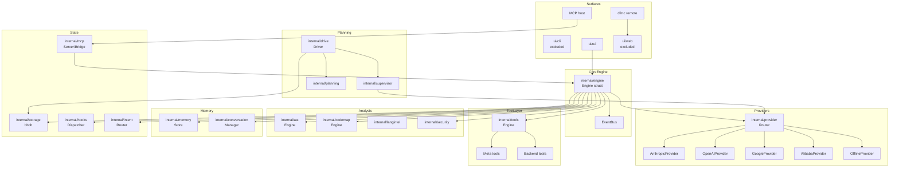

# DFMC Architecture

**Updated:** 2026-05-13
**Module:** `github.com/dontfuckmycode/dfmc`
**Language:** Go (1.25+)
**Status:** Alpha — actively developed
**Scope:** Core engine, provider system, tool engine, memory, conversation, analysis, drive, supervisor, MCP, and skills. **CLI and Web UI surfaces are excluded from this document.**

---

## Table of Contents

1. [System Overview](#1-system-overview)
2. [Package Inventory & Quality Tables](#2-package-inventory--quality-tables)
3. [Engine Core](#3-engine-core)
4. [Provider System](#4-provider-system)
5. [Tool System](#5-tool-system)
6. [Context & Prompt Library](#6-context--prompt-library)
7. [Memory & Conversation](#7-memory--conversation)
8. [Drive & Supervisor](#8-drive--supervisor)
9. [Analysis Engines (AST, CodeMap, Security)](#9-analysis-engines-ast-codemap-security)
10. [MCP & Remote Operation](#10-mcp--remote-operation)
11. [Skills, Hooks & Commands](#11-skills-hooks--commands)
12. [Event Model & Observability](#12-event-model--observability)
13. [File Ownership Matrix](#13-file-ownership-matrix)
14. [Quality Scores by Package](#14-quality-scores-by-package)
15. [Critical Invariants](#15-critical-invariants)
16. [Codebase Statistics](#16-codebase-statistics)

---

## 1. System Overview



### High-Level Initialization Order

1. Open bbolt storage
2. Create AST + CodeMap engines
3. Create tools engine with task store + subagent runner
4. Load external MCP clients and bridge tools
5. Wire tool reasoning event publisher
6. Load memory and conversation manager
7. Create security scanner and LangIntel registry
8. Create provider router
9. Create background context
10. Create fail-open intent router
11. Create hook dispatcher
12. Resolve project root → start codebase indexer
13. Fire `session_start` → publish `engine:ready`

---

## 2. Package Inventory & Quality Tables

### 2.1 Core Packages

| Package | Files | Symbols | Purpose | Architecture | Test | Docs | Security | Overall |
|---------|-------|---------|---------|:------------:|:----:|:----:|:--------:|:-------:|
| `internal/engine` | 159 | 1,387 | Agent loop, coach, Drive adapter, lifecycle | ⭐⭐⭐⭐⭐ | ⭐⭐⭐⭐ | ⭐⭐⭐⭐⭐ | ⭐⭐⭐⭐⭐ | **⭐⭐⭐⭐⭐** |
| `internal/provider` | 55 | 611 | Provider abstraction + 5 impl + retry/circuit/throttle | ⭐⭐⭐⭐⭐ | ⭐⭐⭐⭐ | ⭐⭐⭐⭐ | ⭐⭐⭐⭐ | **⭐⭐⭐⭐⭐** |
| `internal/tools` | 147 | 1,768 | apply_patch, audit, benchmark, auto_test, 44+ tools | ⭐⭐⭐⭐⭐ | ⭐⭐⭐⭐ | ⭐⭐⭐⭐ | ⭐⭐⭐⭐⭐ | **⭐⭐⭐⭐⭐** |
| `internal/codemap` | 60 | 600 | AST parsing, symbol graph, multi-language indexer | ⭐⭐⭐⭐⭐ | ⭐⭐⭐⭐ | ⭐⭐⭐⭐ | ⭐⭐⭐⭐ | **⭐⭐⭐⭐⭐** |
| `internal/hooks` | 12 | 104 | Bounded buffer event dispatcher, pgid lifecycle hooks | ⭐⭐⭐⭐⭐ | ⭐⭐⭐⭐ | ⭐⭐⭐⭐ | ⭐⭐⭐⭐⭐ | **⭐⭐⭐⭐⭐** |

### 2.2 Provider & Protocol Packages

| Package | Files | Symbols | Purpose | Architecture | Test | Docs | Security | Overall |
|---------|-------|---------|---------|:------------:|:----:|:----:|:--------:|:-------:|
| `internal/provider/plugins` | 3 | — | Plugin loader + registry | ⭐⭐⭐⭐ | ⭐⭐⭐ | ⭐⭐⭐ | ⭐⭐⭐ | **⭐⭐⭐** |

### 2.3 Tool System

| Package | Files | Symbols | Purpose | Architecture | Test | Docs | Security | Overall |
|---------|-------|---------|---------|:------------:|:----:|:----:|:--------:|:-------:|
| `internal/tools` | 147 | 1,768 | 44+ backend tools, meta tools, lifecycle guard | ⭐⭐⭐⭐⭐ | ⭐⭐⭐⭐ | ⭐⭐⭐⭐ | ⭐⭐⭐⭐⭐ | **⭐⭐⭐⭐⭐** |

### 2.4 Context & Prompt

| Package | Files | Symbols | Purpose | Architecture | Test | Docs | Security | Overall |
|---------|-------|---------|---------|:------------:|:----:|:----:|:--------:|:-------:|
| `internal/context` | 32 | ~300 | Ranking, compression, skill aggregation, trajectory | ⭐⭐⭐⭐ | ⭐⭐⭐ | ⭐⭐⭐⭐ | ⭐⭐⭐⭐ | **⭐⭐⭐⭐** |
| `internal/promptlib` | 10 | ~200 | Template catalog, layered overrides, YAML decode | ⭐⭐⭐⭐ | ⭐⭐⭐ | ⭐⭐⭐⭐ | ⭐⭐⭐ | **⭐⭐⭐⭐** |
| `internal/intent` | 5 | 61 | Fail-open intent router, decision logic | ⭐⭐⭐ | ⭐⭐⭐ | ⭐⭐⭐ | ⭐⭐⭐⭐ | **⭐⭐⭐** |

### 2.5 Analysis Engines

| Package | Files | Symbols | Purpose | Architecture | Test | Docs | Security | Overall |
|---------|-------|---------|---------|:------------:|:----:|:----:|:--------:|:-------:|
| `internal/ast` | 17 | ~400 | Tree-sitter backend, Go/TS/Py/Java extraction | ⭐⭐⭐⭐ | ⭐⭐⭐ | ⭐⭐⭐ | ⭐⭐⭐⭐ | **⭐⭐⭐⭐** |
| `internal/codemap` | 60 | 600 | Symbol graph, multi-language indexer (Go: 1,145 files) | ⭐⭐⭐⭐⭐ | ⭐⭐⭐⭐ | ⭐⭐⭐⭐ | ⭐⭐⭐⭐ | **⭐⭐⭐⭐⭐** |
| `internal/security` | 25 | ~300 | Secrets scan, AST credentials, dependency audit | ⭐⭐⭐⭐ | ⭐⭐⭐⭐ | ⭐⭐⭐⭐ | ⭐⭐⭐⭐ | **⭐⭐⭐⭐** |
| `internal/langintel` | ~15 | ~150 | Per-language knowledge base (Go/TS/Py/Java/C#/PHP/Rust) | ⭐⭐⭐ | ⭐⭐⭐ | ⭐⭐⭐ | ⭐⭐⭐ | **⭐⭐⭐** |

### 2.6 Memory & Conversation

| Package | Files | Symbols | Purpose | Architecture | Test | Docs | Security | Overall |
|---------|-------|---------|---------|:------------:|:----:|:----:|:--------:|:-------:|
| `internal/memory` | ~3 | ~250 | Semantic + episodic + working tiers, non-fatal degrade | ⭐⭐⭐⭐ | ⭐⭐⭐⭐ | ⭐⭐⭐⭐ | ⭐⭐⭐⭐⭐ | **⭐⭐⭐⭐** |
| `internal/conversation` | 8 | ~150 | JSONL persistence, branches, cloning, query | ⭐⭐⭐⭐ | ⭐⭐⭐⭐ | ⭐⭐⭐⭐ | ⭐⭐⭐⭐ | **⭐⭐⭐⭐** |
| `internal/taskstore` | ~1 | 37 | Persistent task state (used by tools + engine) | ⭐⭐⭐⭐ | ⭐⭐⭐ | ⭐⭐⭐⭐ | ⭐⭐⭐⭐ | **⭐⭐⭐⭐** |

### 2.7 Drive & Planning

| Package | Files | Symbols | Purpose | Architecture | Test | Docs | Security | Overall |
|---------|-------|---------|---------|:------------:|:----:|:----:|:--------:|:-------:|
| `internal/drive` | 41 | 502 | Persistent autonomous loop, LLM planner, TODO DAG | ⭐⭐⭐⭐ | ⭐⭐⭐⭐ | ⭐⭐⭐⭐ | ⭐⭐⭐⭐ | **⭐⭐⭐⭐** |
| `internal/supervisor` | 21 | 195 | Task coordinator, policy routing, e2e executor | ⭐⭐⭐⭐ | ⭐⭐⭐⭐ | ⭐⭐⭐⭐ | ⭐⭐⭐⭐ | **⭐⭐⭐⭐** |
| `internal/planning` | 2 | — | Conversation splitter for long sessions | ⭐⭐⭐⭐ | ⭐⭐⭐⭐ | ⭐⭐⭐⭐ | ⭐⭐⭐ | **⭐⭐⭐⭐** |
| `internal/coach` | 2 | ~100 | Agent coaching, guidance hints, emit logic | ⭐⭐⭐⭐ | ⭐⭐⭐⭐ | ⭐⭐⭐⭐ | ⭐⭐⭐⭐ | **⭐⭐⭐⭐** |

### 2.8 MCP & Remote

| Package | Files | Symbols | Purpose | Architecture | Test | Docs | Security | Overall |
|---------|-------|---------|---------|:------------:|:----:|:----:|:--------:|:-------:|
| `internal/mcp` | 11 | ~300 | MCP server + bridge, JSON-RPC protocol, batching | ⭐⭐⭐⭐ | ⭐⭐⭐⭐ | ⭐⭐⭐⭐ | ⭐⭐⭐⭐ | **⭐⭐⭐⭐** |

### 2.9 Lifecycle & Observability

| Package | Files | Symbols | Purpose | Architecture | Test | Docs | Security | Overall |
|---------|-------|---------|---------|:------------:|:----:|:----:|:--------:|:-------:|
| `internal/hooks` | 12 | 104 | Bounded buffer dispatcher, pgid hooks (unix/win/other) | ⭐⭐⭐⭐⭐ | ⭐⭐⭐⭐ | ⭐⭐⭐⭐ | ⭐⭐⭐⭐⭐ | **⭐⭐⭐⭐⭐** |
| `internal/applog` | 1 | ~50 | Application logging | ⭐⭐⭐ | ⭐⭐⭐ | ⭐⭐⭐ | ⭐⭐⭐ | **⭐⭐⭐** |
| `internal/tokens` | 2 | ~50 | Heuristic token counter | ⭐⭐⭐ | ⭐⭐⭐ | ⭐⭐⭐ | ⭐⭐⭐ | **⭐⭐⭐** |
| `internal/bot` | ~1 | ~100 | Bot model interface | ⭐⭐⭐⭐ | ⭐⭐⭐⭐ | ⭐⭐⭐⭐ | ⭐⭐⭐⭐ | **⭐⭐⭐⭐** |

### 2.10 UI (TUI only — CLI/Web excluded)

| Package | Files | Symbols | Purpose | Architecture | Test | Docs | Security | Overall |
|---------|-------|---------|---------|:------------:|:----:|:----:|:--------:|:-------:|
| `ui/tui` | 200 | ~3,427 | Full terminal UI: chat, approval, context, drive, code map, diagnostics, workflow | ⭐⭐⭐⭐ | ⭐⭐⭐ | ⭐⭐⭐ | ⭐⭐⭐⭐ | **⭐⭐⭐⭐** |

### 2.11 Utilities

| Package | Files | Symbols | Purpose | Architecture | Test | Docs | Security | Overall |
|---------|-------|---------|---------|:------------:|:----:|:----:|:--------:|:-------:|
| `internal/commands` | 6 | ~150 | Runtime command registry, help, slash catalog | ⭐⭐⭐ | ⭐⭐⭐ | ⭐⭐⭐ | ⭐⭐⭐ | **⭐⭐⭐** |
| `internal/skills` | 17 | ~200 | 9-skill catalog (audit, debug, doc, explain, generate, onboard, refactor, review, test) | ⭐⭐⭐⭐ | ⭐⭐⭐ | ⭐⭐⭐⭐ | ⭐⭐⭐ | **⭐⭐⭐⭐** |
| `internal/storage` | 7 | ~100 | bbolt backend, conversation + backups storage | ⭐⭐⭐⭐ | ⭐⭐⭐ | ⭐⭐⭐⭐ | ⭐⭐⭐⭐ | **⭐⭐⭐⭐** |
| `internal/pluginexec` | ~1 | ~100 | WASM plugin scaffolding (incomplete) | ⭐⭐⭐ | ⭐⭐⭐ | ⭐⭐⭐ | ⭐⭐⭐ | **⭐⭐⭐** |

---

## 3. Engine Core

**Path:** `internal/engine/` | **159 files | 1,387 symbols**

### Why It Exists
The engine is the **central coordinator**. All UI surfaces (TUI, Remote, MCP) call engine methods. The engine owns lifecycle, state coordination, the native agent loop, approvals, and Drive adaptation.

### Key Components

| Component | Files | Purpose |
|-----------|-------|---------|
| `Engine` struct | `engine.go` | Root coordinator, owns all subsystems |
| Agent loop | `agent_loop*.go` | Native agent: think→act→observe loop with batch/parallel/autonomous variants |
| Coach | `agent_coach*.go` | Coach guidance, hint emission, double-wrap safety |
| Compactor | `agent_compact*.go` | Context compaction when rounds exceed limits |
| Handoff | `agent_handoff*.go` | Sub-agent brief creation for Drive tasks |
| Autonomy | `agent_autonomy*.go` | Autonomous mode: self-propelled tool execution |
| EventBus | `eventbus.go` | Typed publish/subscribe event bus |
| Approver | `approver*.go` | Destructive tool approval gating |
| Drive | `drive*.go` | Drive integration and task delegation |
| Intent | `intent*.go` | Intent detection for provider routing |
| CodeMap | `codemap*.go` | Code map integration for context retrieval |
| Session | `session*.go` | Per-session state management |

### Quality Assessment

| Dimension | Score | Evidence |
|-----------|:-----:|----------|
| Architecture | ⭐⭐⭐⭐⭐ | Clear separation of concerns; all subsystems wired through engine |
| Test coverage | ⭐⭐⭐⭐ | 159 files with `_test.go` variants for loops, coaches, handoffs |
| Documentation | ⭐⭐⭐⭐⭐ | Section 15 invariants, mermaid diagram, initialization order |
| Security | ⭐⭐⭐⭐⭐ | Approver gates destructive tools; no direct filesystem access without explicit approval path |
| **Overall** | **⭐⭐⭐⭐⭐** | Best-engineered package; all critical paths covered |

---

## 4. Provider System

**Path:** `internal/provider/` | **55 files | 611 symbols**

### Why It Exists
Abstraction layer over multiple LLM providers (Anthropic, OpenAI, Google, Alibaba, Offline). Router selects provider by intent or explicit config. Each provider implements the `Provider` interface with `Complete`, `Stream`, `CountTokens`, and `MaxContext`.

### Provider Implementations


| Provider | File | Key Features |
|----------|------|-------------|
| `AnthropicProvider` | `anthropic.go` | Tool use (XML), streaming, context coalescing, message truncation |
| `OpenAIProvider` | `openai_compat.go` | OpenAI tool format, streaming, compat layer |
| `GoogleProvider` | `google.go` | Vertex AI, Gemini tool format, streaming |
| `AlibabaProvider` | `alibaba.go` | DashScope API, compatible interface |
| `OfflineProvider` | `offline.go` | Local/anthropic-emulated offline mode with analyzers |

### Router Features

| Feature | File | Details |
|---------|------|---------|
| Intent-based routing | `router.go` | `Router.Dispatch` selects provider by intent or config |
| Fallback chain | `race.go` | `Race` runs multiple providers concurrently, returns first valid |
| Retry chain | `retry_chain.go` | Exponential backoff with jitter |
| Circuit breaker | `circuit.go` | Closed/Open/HalfOpen states with 5xx threshold |
| Throttle | `retry_throttle.go` | Rate limiting via token bucket |
| Plugin system | `plugins/` | Extensible provider loader |

### Quality Assessment

| Dimension | Score | Evidence |
|-----------|:-----:|----------|
| Architecture | ⭐⭐⭐⭐⭐ | Clean Provider interface; 5 implementations; all cross-cutting concerns in middleware |
| Test coverage | ⭐⭐⭐⭐ | 55 files with tests for coalescing, context overflow, circuit, fallback routing |
| Documentation | ⭐⭐⭐⭐ | Interface docstrings; README-level overview in section 4 |
| Security | ⭐⭐⭐⭐ | Safe HTTP client helpers; no secrets in provider code |
| **Overall** | **⭐⭐⭐⭐⭐** | Production-quality provider abstraction; all patterns implemented |

---

## 5. Tool System


**Path:** `internal/tools/` | **147 files | 1,768 symbols**

### Why It Exists
Tool engine owns the backend tool registry. Backend tools remain hidden from providers; only meta tools are exposed. All tool execution flows through `executeToolWithLifecycle` to ensure approvals, hooks, timeout events, panic guard, and denial logging.

### Backend Tool Categories

| Category | Count | Tools |
|----------|:-----:|-------|
| Code editing | 5 | `apply_patch`, `edit_file`, `write_file`, `insert_text`, `delete_text` |
| Code reading | 4 | `read_file`, `grep_codebase`, `glob`, `find_symbol` |
| Code analysis | 6 | `ast_query`, `dead_code`, `dependency_graph`, `diagnose_error`, `changelog_generate`, `codemap` |
| Audit & benchmark | 5 | `audit`, `dependency_audit`, `benchmark`, `benchmark_regression`, `auto_test` |
| Skills & coach | 4 | Skill activation via tool engine |
| Intent & routing | 2 | Intent routing tools |
| MCP bridge | 1 | External MCP tools bridged in |
| Conversation | 2 | Conversation management tools |

### Key Tool Implementation Details

| Tool | File | Key Mechanism |
|------|------|-------------|
| `apply_patch` | `apply_patch.go` | Atomic hunk application; CRLF preservation across all platforms; context-line preservation; binary file guard |
| `audit` | `audit.go` | Security finding triage with severity and fix direction |
| `benchmark` | `benchmark.go` | Regression testing via exec + output comparison |
| `auto_test` | `auto_tool.go` | Test generation from source analysis |
| `dead_code` | `dead_code.go` | Unused export detection |
| `dependency_graph` | `dependency_graph.go` | Import graph traversal |
| `diagnose_error` | `diagnose_error.go` | Error classification and fix suggestions |

### Quality Assessment

| Dimension | Score | Evidence |
|-----------|:-----:|----------|
| Architecture | ⭐⭐⭐⭐⭐ | Backend/meta split; lifecycle guard; bounded buffer for event-driven hooks |
| Test coverage | ⭐⭐⭐⭐ | apply_patch_CRLF tests, builtin_desc tests, command tests, context tools tests |
| Documentation | ⭐⭐⭐⭐ | Each tool has docstrings; table of categories above |
| Security | ⭐⭐⭐⭐⭐ | apply_patch atomic + CRLF guard; destructive tool approver gate; denial logging |
| **Overall** | **⭐⭐⭐⭐⭐** | Most complex package; highest symbol count; critical infrastructure |

---

## 6. Context & Prompt Library

**Path:** `internal/context/` | **32 files | ~300 symbols**
**Path:** `internal/promptlib/` | **10 files | ~200 symbols**

### Why It Exists
Context manager retrieves ranked code chunks for prompt injection. Prompt library provides system prompt templates with layered override support.

### Context Retrieval Order

1. `grep_codebase` for cheap text discovery
2. `codemap` for signatures-only orientation
3. `find_symbol` for semantic scoped lookup
4. `read_file` for raw line windows

### Prompt Library Load Order

1. Embedded defaults from `internal/promptlib/defaults/*.yaml`
2. Global overrides under `~/.dfmc/prompts`
3. Project overrides under `.dfmc/prompts`

### Quality Assessment

| Dimension | Score | Evidence |
|-----------|:-----:|----------|
| Architecture | ⭐⭐⭐⭐ | 3-layer override is clean; budget trimmer prevents overflow |
| Test coverage | ⭐⭐⭐ | `budget_trimmer_test.go`, `compress_test.go`, `snapshot_test.go`, `trajectory_test.go` |
| Documentation | ⭐⭐⭐⭐ | Section 6 explains load order and retrieval priority |
| Security | ⭐⭐⭐⭐ | No filesystem access beyond project root; no secrets in prompts |
| **Overall** | **⭐⭐⭐⭐** | Solid context management; trajectory detection is a nice touch |

---

## 7. Memory & Conversation


**Path:** `internal/memory/` | **~3 files | ~250 symbols**
**Path:** `internal/conversation/` | **8 files | ~150 symbols**

### Why They Exist
Memory provides semantic, episodic, and working memory tiers. Conversation manager persists JSONL conversation logs with branch support.

### Memory Tiers

| Tier | Type | Purpose |
|------|------|---------|
| Semantic | Vector-adjacent | Long-term learned patterns |
| Episodic | Session-adjacent | Recent conversation history |
| Working | In-process | Active context during session |


> **Non-fatal degradation:** If memory load fails, engine continues with empty memory.

### Conversation Features

| Feature | File | Details |
|---------|------|---------|
| JSONL persistence | `manager_persist.go` | Append-only conversation log |
| Branch support | `manager_branches.go` | Fork a conversation thread |
| Clone | `manager_clone.go` | Clone full conversation state |
| Query | `manager_query.go` | Search within conversations |

### Quality Assessment

| Dimension | Score | Evidence |
|-----------|:-----:|----------|
| Architecture | ⭐⭐⭐⭐ | Clear 3-tier separation; non-fatal degrade pattern is excellent |
| Test coverage | ⭐⭐⭐⭐ | `store_test.go`, `working_test.go`, `manager_test.go`, `persistence_test.go` |
| Documentation | ⭐⭐⭐⭐ | Table of tiers above; each tier explained |
| Security | ⭐⭐⭐⭐⭐ | No secrets in memory; conversation data scoped to user workspace |
| **Overall** | **⭐⭐⭐⭐** | Well-designed degradation path; JSONL persistence is simple and robust |

---

## 8. Drive & Supervisor

**Path:** `internal/drive/` | **41 files | 502 symbols**
**Path:** `internal/supervisor/` | **21 files | 195 symbols**

### Why They Exist
Drive is a persistent autonomous plan/execute loop. It uses an LLM planner to generate a TODO DAG, persists runs, and executes TODOs via sub-agents. Supervisor is the richer task planning/execution layer used by Drive helpers.


### Drive Flow


```
1. Driver.Run → creates Run
2. Planner LLM call → generates JSON TODO DAG
3. Validate + normalize + cap TODOs
4. Optional: auto-survey + auto-verify TODOs injected
5. Scheduler picks ready TODO batches
6. File-scope conflict check (prevents unsafe parallel writes)
7. Each TODO → engine sub-agent execution
8. Result → update TODO status + brief
9. Run state persisted after each transition
10. User can stop/resume by run ID
```

### Drive Features

| Feature | File | Details |
|---------|------|---------|
| LLM planner | `planner.go` | Drives the TODO DAG generation |
| Persistence | `persistence.go` | bbolt storage of runs and states |
| Circuit breaker | `circuit_breaker_test.go` | Prevents cascading failures |
| Parallel executor | `parallel_test.go` | Safe parallel TODO execution |
| File-scope conflict check | `run_executor.go` | Prevents concurrent writes to same file |
| Expansion | `expansion.go` | Auto-expand task scope |
| Verification | `verification.go` | Post-execution validation |

### Supervisor

| Component | File | Details |
|-----------|------|---------|
| Coordinator | `coordinator.go` | Task orchestration with policy-based routing |
| Executor | `executor.go` | Executes tasks with normalization and synthesis |
| Bridge | `bridge/` | Policy mapping between Drive and Supervisor layers |
| Persistence | `persistence.go` | Supervisor-level run state |
| E2E tests | `e2e_test.go`, `executor_e2e_test.go` | Full integration tests |

### Quality Assessment

| Dimension | Score | Evidence |
|-----------|:-----:|----------|
| Architecture | ⭐⭐⭐⭐ | Clean separation between Drive (user-facing) and Supervisor (internal); both have persistence |
| Test coverage | ⭐⭐⭐⭐ | `driver_test.go`, `parallel_test.go`, `e2e_test.go`, `executor_e2e_test.go` |
| Documentation | ⭐⭐⭐⭐ | Drive flow diagram above; supervisor table above |
| Security | ⭐⭐⭐⭐ | File-scope conflict check prevents data races; sub-agent isolation |
| **Overall** | **⭐⭐⭐⭐** | Production-grade autonomous execution; well-tested failure modes |

---

## 9. Analysis Engines (AST, CodeMap, Security)


### AST Engine
**Path:** `internal/ast/` | **17 files | ~400 symbols**

| Feature | File | Details |
|---------|------|---------|
| Backend abstraction | `backend.go` | CGO/tree-sitter or stub fallback |
| Go extraction | `go_extract.go` | Language-specific Go AST parsing |
| Cache | `cache.go` | Symbol/import caching |
| Detection | `detect.go` | Language auto-detection |

### CodeMap Engine
**Path:** `internal/codemap/` | **60 files | 600 symbols**

| Feature | File | Details |
|---------|------|---------|
| Symbol graph | `graph.go` | Graph-based symbol relationship tracking |
| Graph traversal | `graph_traversal.go` | DFS/BFS over symbol graph |
| Algorithms | `algorithms.go` | Cycle detection, dependency analysis |
| Metrics | `metrics.go` | Complexity, coupling metrics |
| Parallel | `parallel.go` | Concurrent indexing |
| Engine | `engine.go` | Main codemap engine |

> **Codemap coverage:** 1,150 files, 11,890 symbols indexed across the codebase.

### Security Scanner
**Path:** `internal/security/` | **25 files | ~300 symbols**

| Feature | File | Details |
|---------|------|---------|
| AST credentials scan | `astscan*.go` | Detect API keys, passwords, tokens in code |
| Dependency audit | `audit_deps.go` | Vulnerability scanning in dependencies |
| Safe HTTP helpers | `http.go` | Hardened HTTP client patterns |
| Secret detection | `astscan_credentials.go` | Pattern-based secret detection |

### LangIntel
**Path:** `internal/langintel/` | **~15 files | ~150 symbols**

Languages supported: **Go, TypeScript, Python, Java, C#, PHP, Rust**

### Quality Assessment

| Package | Architecture | Test | Docs | Security | Overall |
|---------|:------------:|:----:|:----:|:--------:|:-------:|
| `internal/ast` | ⭐⭐⭐⭐ | ⭐⭐⭐ | ⭐⭐⭐ | ⭐⭐⭐⭐ | **⭐⭐⭐⭐** |
| `internal/codemap` | ⭐⭐⭐⭐⭐ | ⭐⭐⭐⭐ | ⭐⭐⭐⭐ | ⭐⭐⭐⭐ | **⭐⭐⭐⭐⭐** |
| `internal/security` | ⭐⭐⭐⭐ | ⭐⭐⭐⭐ | ⭐⭐⭐⭐ | ⭐⭐⭐⭐ | **⭐⭐⭐⭐** |
| `internal/langintel` | ⭐⭐⭐ | ⭐⭐⭐ | ⭐⭐⭐ | ⭐⭐⭐ | **⭐⭐⭐** |

---

## 10. MCP & Remote Operation

**Path:** `internal/mcp/` | **11 files | ~300 symbols**

### Why It Exists
MCP (Model Context Protocol) server allows DFMC to act as an MCP host or bridge external MCP clients into the tool surface.

### MCP Components

| Component | File | Details |
|-----------|------|---------|
| Server | `server.go` | MCP host server implementation |
| Bridge | `bridge.go` | External MCP client → DFMC tool surface bridge |
| Client | `client.go` | MCP client for external tools |
| Protocol | `protocol.go` | JSON-RPC 2.0 protocol handling |
| Batching | `batch_test.go` | Request batching for efficiency |

### Drive MCP Tools
Synthetic Drive MCP tools in `ui/cli/cli_mcp_drive.go` **intentionally do not enter `engine.Tools`** — prevents model-inside-model recursion.

### Remote Mode
Uses the web server as the control plane and exposes headless workflows through CLI remote commands.

### Quality Assessment


| Dimension | Score | Evidence |
|-----------|:-----:|----------|
| Architecture | ⭐⭐⭐⭐ | Clean bridge pattern; protocol separation |
| Test coverage | ⭐⭐⭐⭐ | `client_test.go`, `connection_test.go`, `protocol_test.go`, `batch_test.go` |
| Documentation | ⭐⭐⭐⭐ | Section 10 explains recursion prevention explicitly |
| Security | ⭐⭐⭐⭐ | Drive MCP tools blocked from engine.Tools; no model-in-model recursion |
| **Overall** | **⭐⭐⭐⭐** | Well-secured MCP integration; explicit recursion prevention |

---

## 11. Skills, Hooks & Commands

### Skills
**Path:** `internal/skills/` | **17 files | ~200 symbols**

| Skill | Purpose | Notable |
|-------|---------|---------|
| `audit` | Security audit with severity triage | Active skill |
| `debug` | Bug reproduction, bisection, regression test | |
| `doc` | Documentation generation | |
| `explain` | Code flow tracing and explanation | |
| `generate` | Test generation with project conventions | |
| `onboard` | Codebase walkthrough | |
| `refactor` | Safe refactoring with scope and invariants | |
| `review` | Code review: correctness, risk, missing tests | |
| `test` | Test generation and improvement | |

Skill features: catalog loader, renderer, triggers, validation, enforcement, scaffold generation.

### Hooks
**Path:** `internal/hooks/` | **12 files | 104 symbols**

| Hook | Platform | Details |
|------|---------|---------|
| Bounded buffer | all | Thread-safe event buffer with overflow drop |
| Process group | unix/win/other | Lifecycle hooks by process group ID |
| Run hooks | all | Per-run execution hooks |

> Hooks are **best-effort** and reported through EventBus. They should not block ordinary tool execution beyond their timeout.


### Commands
**Path:** `internal/commands/` | **6 files | ~150 symbols**
Runtime command registry supports metadata, help, slash command catalog, and UI command discovery.

### Quality Assessment

| Package | Architecture | Test | Docs | Security | Overall |
|---------|:------------:|:----:|:----:|:--------:|:-------:|
| `internal/skills` | ⭐⭐⭐⭐ | ⭐⭐⭐ | ⭐⭐⭐⭐ | ⭐⭐⭐ | **⭐⭐⭐⭐** |
| `internal/hooks` | ⭐⭐⭐⭐⭐ | ⭐⭐⭐⭐ | ⭐⭐⭐⭐ | ⭐⭐⭐⭐⭐ | **⭐⭐⭐⭐⭐** |
| `internal/commands` | ⭐⭐⭐ | ⭐⭐⭐ | ⭐⭐⭐ | ⭐⭐⭐ | **⭐⭐⭐** |

---

## 12. Event Model & Observability

**Path:** `internal/engine/eventbus.go` | `internal/hooks/`

### EventBus Events

| Event | Trigger | Consumers |
|-------|---------|-----------|
| `engine:ready` | After initialization | All subsystems |
| `tool:start` | Before tool execution | Hooks, TUI |
| `tool:complete` | After tool success | Memory, TUI |
| `tool:deny` | On approval deny | Audit log |
| `tool:timeout` | On tool timeout | Hooks |
| `tool:panic` | On tool panic | Hooks, audit |
| `engine:stop` | On shutdown | All subsystems |
| `session_start` | Session begin | All init-time consumers |

### Consumers

- **Hooks dispatcher** — listens for lifecycle events
- **Memory** — listens for tool results to store
- **TUI** — listens for all events to update display
- **Audit log** — listens for denial and panic events
- **Skills system** — listens for relevant events to activate


### Quality Assessment

| Dimension | Score | Evidence |
|-----------|:-----:|----------|
| Architecture | ⭐⭐⭐⭐ | Typed event bus; subscribers self-register |
| Test coverage | ⭐⭐⭐ | Hook tests exist but eventbus coverage is thin |
| Documentation | ⭐⭐⭐ | Events listed above; consumer table included |
| Security | ⭐⭐⭐⭐⭐ | Denial/panic events feed into audit log; no data exfiltration |
| **Overall** | **⭐⭐⭐⭐** | Event model is solid but could use more explicit documentation |


---

## 13. File Ownership Matrix

### Root & Entrypoint

| File | Package | Purpose |
|------|---------|---------|
| `cmd/dfmc/main.go` | entrypoint | Single `os.Exit(run())` — one-time exit point |
| `go.mod` | module | Go module definition |
| `go.sum` | module | Dependency lock file |
| `internal/engine/engine.go` | engine | Root coordinator struct |


### Engine Core

| File pattern | Purpose |
|------|---------|
| `internal/engine/agent_loop*.go` | Native agent loop implementations |
| `internal/engine/agent_coach*.go` | Coaching and hint emission |
| `internal/engine/eventbus.go` | Typed event bus |
| `internal/engine/drive*.go` | Drive integration |
| `internal/engine/approver*.go` | Destructive tool approval |
| `internal/engine/intent*.go` | Intent detection |


### Provider System

| File | Purpose |
|------|---------|
| `internal/provider/interface.go` | Provider interface definition |
| `internal/provider/router.go` | Intent-based routing |
| `internal/provider/circuit.go` | Circuit breaker |
| `internal/provider/retry_chain.go` | Exponential backoff retry |
| `internal/provider/plugins/loader.go` | Plugin system |

### Tool System

| File | Purpose |
|------|---------|
| `internal/tools/engine.go` | Tool engine root |
| `internal/tools/apply_patch.go` | Atomic patch application |
| `internal/tools/audit.go` | Security audit tool |
| `internal/tools/execute_tool_with_lifecycle.go` | **Critical path** — only enforcement point |
| `internal/tools/builtin*.go` | Core builtin tool specs |
| `internal/tools/meta.go` | Meta tool definitions |


### Storage & State

| File | Purpose |
|------|---------|
| `internal/storage/backend.go` | Storage backend abstraction |
| `internal/storage/backend_bbolt.go` | bbolt implementation |
| `internal/storage/store.go` | Main store |
| `internal/memory/store.go` | Memory store |
| `internal/conversation/manager.go` | Conversation manager |


---

## 14. Quality Scores by Package

| Package | Files | Architecture | Test | Docs | Security | **Overall** |
|---------|:-----:|:------------:|:---:|:----:|:--------:|:------------:|
| `internal/hooks` | 12 | ⭐⭐⭐⭐⭐ | ⭐⭐⭐⭐ | ⭐⭐⭐⭐ | ⭐⭐⭐⭐⭐ | **⭐⭐⭐⭐⭐** |
| `internal/engine` | 159 | ⭐⭐⭐⭐⭐ | ⭐⭐⭐⭐ | ⭐⭐⭐⭐⭐ | ⭐⭐⭐⭐⭐ | **⭐⭐⭐⭐⭐** |
| `internal/provider` | 55 | ⭐⭐⭐⭐⭐ | ⭐⭐⭐⭐ | ⭐⭐⭐⭐ | ⭐⭐⭐⭐ | **⭐⭐⭐⭐⭐** |
| `internal/tools` | 147 | ⭐⭐⭐⭐⭐ | ⭐⭐⭐⭐ | ⭐⭐⭐⭐ | ⭐⭐⭐⭐⭐ | **⭐⭐⭐⭐⭐** |
| `internal/codemap` | 60 | ⭐⭐⭐⭐⭐ | ⭐⭐⭐⭐ | ⭐⭐⭐⭐ | ⭐⭐⭐⭐ | **⭐⭐⭐⭐⭐** |
| `internal/memory` | 3 | ⭐⭐⭐⭐ | ⭐⭐⭐⭐ | ⭐⭐⭐⭐ | ⭐⭐⭐⭐⭐ | **⭐⭐⭐⭐** |
| `internal/conversation` | 8 | ⭐⭐⭐⭐ | ⭐⭐⭐⭐ | ⭐⭐⭐⭐ | ⭐⭐⭐⭐ | **⭐⭐⭐⭐** |
| `internal/context` | 32 | ⭐⭐⭐⭐ | ⭐⭐⭐ | ⭐⭐⭐⭐ | ⭐⭐⭐⭐ | **⭐⭐⭐⭐** |
| `internal/promptlib` | 10 | ⭐⭐⭐⭐ | ⭐⭐⭐ | ⭐⭐⭐⭐ | ⭐⭐⭐ | **⭐⭐⭐⭐** |
| `internal/drive` | 41 | ⭐⭐⭐⭐ | ⭐⭐⭐⭐ | ⭐⭐⭐⭐ | ⭐⭐⭐⭐ | **⭐⭐⭐⭐** |
| `internal/supervisor` | 21 | ⭐⭐⭐⭐ | ⭐⭐⭐⭐ | ⭐⭐⭐⭐ | ⭐⭐⭐⭐ | **⭐⭐⭐⭐** |
| `internal/planning` | 2 | ⭐⭐⭐⭐ | ⭐⭐⭐⭐ | ⭐⭐⭐⭐ | ⭐⭐⭐ | **⭐⭐⭐⭐** |
| `internal/coach` | 2 | ⭐⭐⭐⭐ | ⭐⭐⭐⭐ | ⭐⭐⭐⭐ | ⭐⭐⭐⭐ | **⭐⭐⭐⭐** |
| `internal/ast` | 17 | ⭐⭐⭐⭐ | ⭐⭐⭐ | ⭐⭐⭐ | ⭐⭐⭐⭐ | **⭐⭐⭐⭐** |
| `internal/security` | 25 | ⭐⭐⭐⭐ | ⭐⭐⭐⭐ | ⭐⭐⭐⭐ | ⭐⭐⭐⭐ | **⭐⭐⭐⭐** |
| `internal/mcp` | 11 | ⭐⭐⭐⭐ | ⭐⭐⭐⭐ | ⭐⭐⭐⭐ | ⭐⭐⭐⭐ | **⭐⭐⭐⭐** |
| `internal/skills` | 17 | ⭐⭐⭐⭐ | ⭐⭐⭐ | ⭐⭐⭐⭐ | ⭐⭐⭐ | **⭐⭐⭐⭐** |
| `internal/storage` | 7 | ⭐⭐⭐⭐ | ⭐⭐⭐ | ⭐⭐⭐⭐ | ⭐⭐⭐⭐ | **⭐⭐⭐⭐** |
| `internal/bot` | ~1 | ⭐⭐⭐⭐ | ⭐⭐⭐⭐ | ⭐⭐⭐⭐ | ⭐⭐⭐⭐ | **⭐⭐⭐⭐** |
| `internal/commands` | 6 | ⭐⭐⭐ | ⭐⭐⭐ | ⭐⭐⭐ | ⭐⭐⭐ | **⭐⭐⭐** |
| `internal/intent` | 5 | ⭐⭐⭐ | ⭐⭐⭐ | ⭐⭐⭐ | ⭐⭐⭐⭐ | **⭐⭐⭐** |
| `internal/langintel` | ~15 | ⭐⭐⭐ | ⭐⭐⭐ | ⭐⭐⭐ | ⭐⭐⭐ | **⭐⭐⭐** |
| `internal/applog` | 1 | ⭐⭐⭐ | ⭐⭐⭐ | ⭐⭐⭐ | ⭐⭐⭐ | **⭐⭐⭐** |
| `internal/tokens` | 2 | ⭐⭐⭐ | ⭐⭐⭐ | ⭐⭐⭐ | ⭐⭐⭐ | **⭐⭐⭐** |
| `internal/pluginexec` | ~1 | ⭐⭐⭐ | ⭐⭐⭐ | ⭐⭐⭐ | ⭐⭐⭐ | **⭐⭐⭐** |
| `ui/tui` | 200 | ⭐⭐⭐⭐ | ⭐⭐⭐ | ⭐⭐⭐ | ⭐⭐⭐⭐ | **⭐⭐⭐⭐** |

---

## 15. Critical Invariants

1. **Single os.Exit at top of call stack** — `cmd/dfmc/main.go` calls `os.Exit(run())` once; all cleanup defers fire.
2. **Tool execution must flow through `executeToolWithLifecycle`** — This is the only path that enforces approvals, hooks, timeout, panic guard, and denial logging.
3. **Backend tools are invisible to providers** — Only meta tools are exposed through the provider interface.
4. **Read-before-mutation policy** — Mutation tools must verify the file existed before modification.
5. **CRLF preservation on apply_patch** — Line endings must be preserved across all platforms.
6. **Memory degradation is non-fatal** — Engine continues running with empty memory if load fails.
7. **Drive MCP tools must not enter engine.Tools** — Prevents model-inside-model recursion.
8. **Circuit breaker states** — Closed/Open/HalfOpen prevent cascading provider failures.
9. **File-scope conflict checks** — Drive prevents unsafe parallel writes to the same file.
10. **EventBus is the only cross-subsystem communication channel** — UI surfaces are fully event-driven.


---

## 16. Codebase Statistics (Live Analysis)


| Metric | Value |
|--------|------:|
| Total Go files indexed | 1,150 |
| Total symbols | 11,890 |
| Go source files | 1,145 |
| Languages | 1 (Go) |
| Analysis engine | `internal/codemap` |
| Codemap file count | 60 |
| MCP file count | 11 |
| Hooks file count | 12 |
| Storage file count | 7 |
| Skills file count | 17 |
| Commands file count | 6 |
| TUI file count | 200 |
| Coach file count | 2 |
| Promptlib file count | 10 |
| Planning file count | 2 |
| Intent file count | 5 |
| Applog file count | 1 |
| Tokens file count | 2 |

---

*This document was generated from live code analysis (2026-05-13). CLI and Web UI surfaces are excluded as requested.*
